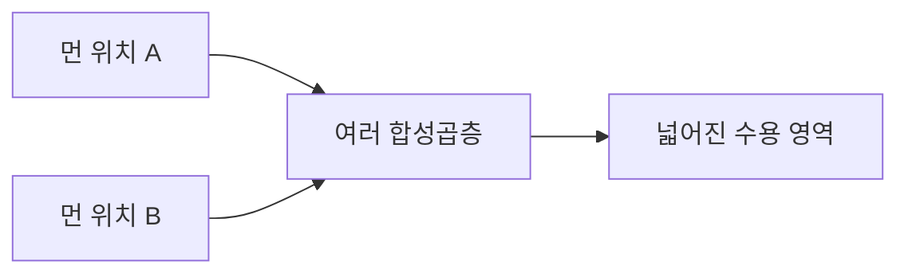
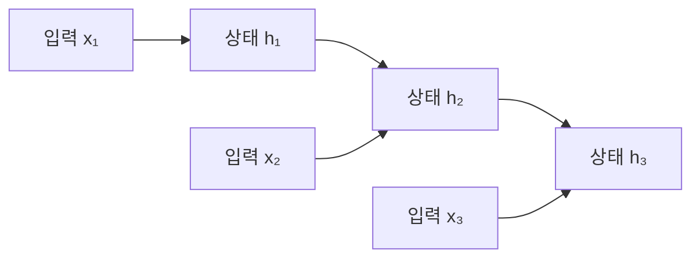
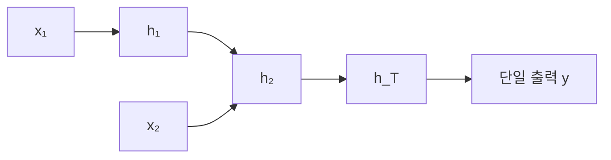
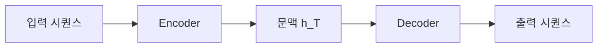
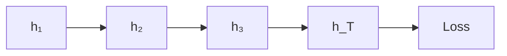
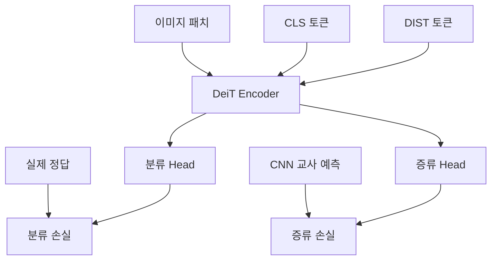
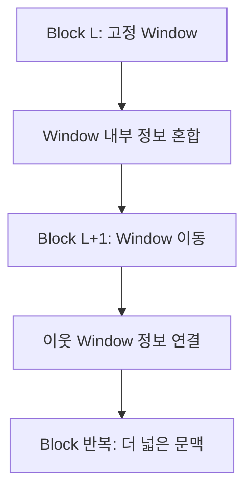

# CNN의 기본 구조: FCN과 합성곱 레이어

## 1. CNN은 왜 이미지 처리에 사용되는가?

CNN(Convolutional Neural Network)은 이미지처럼 **공간적인 구조를 가진 데이터**를 처리하는 데 특화된 신경망이다.

이미지는 단순한 숫자 모음이 아니라, 서로 가까이 있는 픽셀들이 함께 모여 선·모서리·무늬·형태 등의 의미를 만든다. CNN은 이러한 이미지의 특성을 보존한 채, 작은 영역부터 살펴보며 특징을 추출한다.

CNN은 다음과 같은 이미지 기반 산업 현장에서 활용된다.

- 금형 표면의 스크래치 검출
- 식품·의약품의 이물질 검출
- PCB의 냉땜, 플럭스 잔여물, 미세 균열 등 불량 판정

육안으로 구분하기 어려운 미세한 패턴도 충분한 데이터를 통해 학습하면 자동으로 검출할 수 있다.

> [!summary] 핵심
> CNN은 이미지 전체를 한꺼번에 숫자 벡터로 처리하지 않고, 이미지의 공간 구조를 유지하면서 국소적인 특징을 찾아낸다.

---

## 2. 완전 연결층(Fully Connected Layer)

완전 연결층은 입력값을 받아 새로운 출력값으로 변환하는 신경망의 기본 모듈이다. 이전 층의 **모든 입력값이 다음 층의 모든 출력값에 연결**되어 있기 때문에 완전 연결층이라고 부른다.

### FCN을 이용한 이미지 분류 예시

크기가 `32×32`이고 RGB 채널이 3개인 이미지가 있다고 가정한다.

이미지의 전체 원소 수는 다음과 같다.

$$
32 \times 32 \times 3 = 3072
$$

완전 연결층에 이미지를 입력하려면 먼저 이미지의 모든 픽셀을 나열하여 1차원 벡터로 만든다. 이를 **Flatten**이라고 한다.

$$
(3, 32, 32) \xrightarrow{\text{Flatten}} (3072)
$$

이 입력을 10개의 범주로 분류하려면, 출력은 10개의 값을 가진 벡터가 된다.

$$
(3072) \xrightarrow{W} (10)
$$

가중치 행렬 $W$의 크기는 다음과 같다.

$$
W \in \mathbb{R}^{10 \times 3072}
$$

각 출력값은 3,072개의 모든 입력값으로부터 영향을 받는다.

$$
y = Wx+b
$$

- $x$: 3,072개의 픽셀값으로 구성된 입력 벡터
- $W$: 학습을 통해 결정되는 가중치 행렬
- $b$: 출력마다 더해지는 편향
- $y$: 10개 범주에 대응하는 출력값

가중치와 편향까지 포함한 전체 파라미터 수는 다음과 같다.

$$
10 \times 3072 + 10 = 30{,}730
$$

### 이미지 처리에서 완전 연결 방식의 한계

Flatten을 수행하면 이미지에 있던 가로·세로·채널 구조가 1차원으로 펼쳐진다. 따라서 어떤 픽셀들이 서로 가까이 있었는지를 신경망의 구조 자체로는 알 수 없게 된다.

또한 이미지 크기가 커지면 연결해야 하는 가중치의 수도 급격히 증가한다.

예를 들어 완전 연결층은 다음 두 픽셀을 구조적으로 구분하지 않는다.

- 서로 바로 옆에 있는 픽셀
- 이미지의 양 끝에 떨어져 있는 픽셀

두 경우 모두 단지 입력 벡터 안의 서로 다른 값으로 취급된다.

> [!important] 완전 연결층의 핵심 한계
> 이미지의 공간 구조가 사라지고, 모든 입력과 출력을 연결하기 때문에 파라미터가 많아진다.

---

## 3. 합성곱 레이어(Convolution Layer)

합성곱 레이어는 입력 이미지의 작은 영역에 필터를 적용하여 **특징 맵(Feature Map)**을 추출하는 모듈이다.

완전 연결층이 이미지를 1차원으로 펼친 후 모든 픽셀을 한꺼번에 처리한다면, 합성곱 레이어는 이미지의 3차원 구조를 유지하면서 작은 영역씩 살펴본다.

### 합성곱 연산의 큰 그림

합성곱 연산은 다음 순서로 진행된다.

1. 이미지의 일부 영역을 필터가 덮는다.
2. 필터의 각 가중치와 대응하는 이미지 값을 곱한다.
3. 곱한 값을 모두 더하고 편향을 더한다.
4. 계산 결과 하나를 출력 맵의 해당 위치에 기록한다.
5. 필터를 옆으로 이동하며 같은 연산을 반복한다.

즉, 하나의 필터를 이미지 전체에 걸쳐 이동시키면서 각 위치에서 내적을 수행한다.

---

## 4. 필터의 채널 수가 입력과 같아야 하는 이유

입력 이미지의 크기를 채널 우선 방식으로 다음과 같이 표현해 보자.

$$
(3,32,32)
$$

- 채널: 3개(R, G, B)
- 높이: 32
- 너비: 32

이 이미지에 공간 크기가 `5×5`인 필터를 적용한다면 필터의 전체 크기는 다음과 같다.

$$
(3,5,5)
$$

필터의 채널 수가 3인 이유는 이미지의 특정 `5×5` 영역을 처리할 때, 그 영역의 R·G·B 값을 모두 함께 계산해야 하기 때문이다.

따라서 필터의 채널 깊이는 반드시 입력의 채널 수와 같아야 한다.

$$
\text{입력 채널 수} = \text{필터 채널 수}
$$

> [!note] 주의
> `3×32×32`, `3×5×5`에서 슬라이드는 `(채널, 높이, 너비)` 순서로 차원을 표기하고 있다.

---

## 5. 한 위치에서의 합성곱 연산

`3×5×5` 필터가 이미지의 특정 영역을 덮으면, 필터가 덮는 입력 영역의 크기도 `3×5×5`가 된다.

따라서 연산에 사용되는 값의 개수는 다음과 같다.

$$
3 \times 5 \times 5 = 75
$$

입력 영역과 필터의 같은 위치에 있는 값끼리 곱한 뒤 모두 더하고, 마지막으로 편향을 더한다.

$$
z = w^Tx+b
$$

- $x$: 필터가 현재 덮고 있는 이미지 영역
- $w$: 필터의 가중치
- $b$: 필터의 편향
- $z$: 현재 위치에서 계산된 하나의 출력값

이 결과값 하나가 출력 특징 맵의 한 칸에 기록된다.

이후 같은 필터를 옆으로 이동하여 동일한 연산을 반복하면, 이미지의 각 위치에서 해당 필터가 찾으려는 특징이 얼마나 강하게 나타났는지를 표현하는 특징 맵이 만들어진다.

---

## 6. 동일한 필터를 반복해서 사용하는 이유

완전 연결층은 위치마다 서로 다른 가중치를 사용하지만, 합성곱 레이어는 **하나의 필터를 이미지 전체 위치에서 공유하여 사용**한다.

이를 **가중치 공유(Weight Sharing)**라고 한다.

예를 들어 세로 방향의 선을 찾는 필터가 있다면, 세로선이 이미지의 왼쪽에 있든 오른쪽에 있든 같은 필터로 탐지할 수 있다.

이 방식은 다음과 같은 장점이 있다.

- 이미지의 어느 위치에 있는 특징도 같은 기준으로 탐지할 수 있다.
- 위치마다 별도의 가중치를 만들 필요가 없어 파라미터 수가 감소한다.
- 이미지의 공간적인 구조를 유지할 수 있다.

> [!summary] 직관적 이해
> 필터는 이미지 위를 움직이는 작은 탐지기와 같다.  
> 하나의 탐지기를 이미지 전체에 반복해서 사용하면서 특정 무늬나 형태가 있는 위치를 찾는다.

---

## 7. 박스 필터 예시

박스 필터는 주변 픽셀값의 평균을 구하는 필터다.

`3×3` 박스 필터는 다음과 같이 모든 원소가 $\frac{1}{9}$인 형태를 가진다.

$$
\frac{1}{9}
\begin{bmatrix}
1 & 1 & 1\\
1 & 1 & 1\\
1 & 1 & 1
\end{bmatrix}
$$

필터가 덮은 `3×3` 영역의 픽셀값과 필터값을 각각 곱하고 모두 더하면, 해당 영역의 평균값이 구해진다.

$$
\text{출력값}
=
\frac{x_1+x_2+\cdots+x_9}{9}
$$

이 결과를 필터가 덮은 영역의 중심에 대응하는 출력 위치에 기록하고, 필터를 이동하면서 같은 계산을 반복한다.

박스 필터를 적용하면 주변 픽셀값들이 평균화되기 때문에 이미지가 부드럽고 흐릿해지는 효과가 발생한다.

다만 박스 필터는 사람이 미리 값을 정한 필터이다. 일반적인 CNN에서는 필터의 값이 고정되어 있지 않고, 학습 과정에서 손실을 줄이는 방향으로 결정된다.

---

## 8. 특징 맵의 공간 크기

`32×32` 이미지에 `5×5` 필터를 적용하되, 한 칸씩 이동하고 이미지 바깥에 별도의 값을 추가하지 않는다고 가정한다.

필터의 왼쪽 위 모서리가 놓일 수 있는 위치의 수는 다음과 같다.

$$
32-5+1=28
$$

따라서 출력 특징 맵의 공간 크기는 다음과 같다.

$$
28 \times 28
$$

일반화하면 다음과 같다.

$$
\text{출력 크기}
=
\text{입력 크기}
-
\text{필터 크기}
+1
$$

이 공식은 다음 조건을 가정한다.

- 스트라이드(필터 이동 간격): 1
- 패딩: 없음

즉, `3×32×32` 입력에 필터 하나를 적용하면 다음과 같은 특징 맵 하나가 나온다.

$$
(3,32,32)
\xrightarrow{\text{3×5×5 필터 1개}}
(1,28,28)
$$

출력의 채널 수가 1인 이유는 필터 하나가 특징 맵 하나를 만들기 때문이다.

### 패딩(Padding)

패딩을 사용하지 않으면 필터가 이미지 내부에 완전히 들어가는 위치에서만 계산할 수 있으므로, 합성곱을 거칠 때마다 특징 맵의 높이와 너비가 줄어든다.

**패딩**은 합성곱을 수행하기 전에 입력 이미지의 가장자리에 값을 덧붙이는 방법이다. 가장 흔한 방식은 가장자리를 0으로 채우는 **제로 패딩(Zero Padding)**이며, 상황에 따라 가장 가까운 경계값을 복제하는 패딩 등을 사용할 수도 있다.

패딩의 주요 목적은 다음과 같다.

- 합성곱 이후에도 입력과 출력의 공간 해상도를 같게 유지한다.
- 이미지 가장자리의 픽셀도 중앙 픽셀처럼 충분히 연산에 참여하게 한다.
- 합성곱 레이어가 깊어질수록 특징 맵이 지나치게 빠르게 작아지는 것을 막는다.

스트라이드가 1이고 크기가 홀수인 필터를 사용할 때, 입력과 출력의 크기를 같게 만들려면 양쪽에 다음만큼 패딩한다.

$$
P=\frac{K-1}{2}
$$

예를 들어 `32×32` 입력에 `5×5` 필터를 사용할 때 양쪽에 2칸씩 패딩하면 다음과 같이 공간 크기가 유지된다.

$$
32+2(2)-5+1=32
$$

패딩과 스트라이드까지 포함한 일반적인 출력 크기는 다음과 같다.

$$
H'=\left\lfloor\frac{H+2P_h-K_h}{S_h}\right\rfloor+1
$$

$$
W'=\left\lfloor\frac{W+2P_w-K_w}{S_w}\right\rfloor+1
$$

- $H,W$: 입력의 높이와 너비
- $K_h,K_w$: 필터의 높이와 너비
- $P_h,P_w$: 패딩 크기
- $S_h,S_w$: 스트라이드
- $H',W'$: 출력의 높이와 너비

### 출력 크기 공식이 만들어지는 이유

높이 방향만 먼저 생각하면 이해하기 쉽다.

1. 입력 높이 $H$의 위와 아래에 각각 $P_h$칸을 패딩하면, 필터가 움직일 수 있는 전체 길이는 $H+2P_h$가 된다.
2. 높이가 $K_h$인 필터를 한 번 놓으면 $K_h$칸을 차지하므로, 필터 왼쪽 위의 시작점이 이동할 수 있는 최대 거리는 $H+2P_h-K_h$이다.
3. 필터의 시작점은 $0,S_h,2S_h,\ldots$처럼 $S_h$칸 간격으로 이동한다. 따라서 이동 횟수는 $\left\lfloor\frac{H+2P_h-K_h}{S_h}\right\rfloor$이다.
4. 최초 위치인 0번째 배치도 출력 하나를 만들기 때문에 마지막에 1을 더한다.

따라서 다음 식을 얻는다.

$$
H'=\left\lfloor\frac{H+2P_h-K_h}{S_h}\right\rfloor+1
$$

너비 방향도 같은 원리이므로 $W'$도 동일한 형태로 계산한다. 내림 기호가 필요한 이유는 마지막에 필터가 입력 영역을 완전히 덮지 못하고 일부만 걸치는 위치는 사용하지 않기 때문이다.

> [!example] 출력 크기 계산 예시
> 입력이 `(N, 3, 32, 32)`이고 커널 크기 $K=5$, 스트라이드 $S=1$, 패딩 $P=0$, 필터 수가 6개라면
> $$
> H'=W'=\left\lfloor\frac{32-5}{1}\right\rfloor+1=28
> $$
> 이므로 출력 형태는 `(N, 6, 28, 28)`이다. 패딩만 $P=2$로 바꾸면
> $$
> H'=W'=\left\lfloor\frac{32+2(2)-5}{1}\right\rfloor+1=32
> $$
> 가 되어 공간 크기가 유지된다. **필터 수 6은 출력 채널 수를 결정하며, 공간 크기 공식에는 들어가지 않는다.**

#### 팽창 합성곱까지 포함한 일반식

팽창률(Dilation)이 $D$이면 커널 원소 사이가 벌어지므로 실제로 입력에서 차지하는 유효 커널 크기는 다음과 같다.

$$
K_{\mathrm{eff}}=D(K-1)+1
$$

따라서 한 축의 완전한 일반식은 다음과 같다.

$$
H'=\left\lfloor
\frac{H+2P_h-D_h(K_h-1)-1}{S_h}
\right\rfloor+1
$$

일반 합성곱은 $D_h=1$이므로 앞의 식으로 돌아간다. 위 식은 위·아래 또는 좌·우에 같은 양을 넣는 대칭 패딩을 가정한다. 비대칭 패딩이라면 $2P_h$ 대신 $P_{top}+P_{bottom}$을 사용한다.

---

## 9. 여러 필터를 사용하는 경우

CNN은 하나의 특징만 찾는 것이 아니므로 여러 개의 필터를 함께 사용한다.

예를 들어 `3×5×5` 크기의 필터가 6개 있다면, 각 필터는 서로 다른 특징을 학습할 수 있다.

- 세로 방향의 선
- 가로 방향의 선
- 특정 방향의 모서리
- 색상의 변화
- 특정 질감이나 무늬

각 필터가 하나의 `28×28` 특징 맵을 생성하므로, 필터 6개의 출력은 다음과 같다.

$$
(3,32,32)
\xrightarrow{\text{3×5×5 필터 6개}}
(6,28,28)
$$

즉, 합성곱 레이어의 출력 채널 수는 사용한 필터의 개수와 같다.

$$
\text{출력 채널 수}=\text{필터 수}
$$

이때 학습해야 하는 파라미터의 수는 다음과 같다.

$$
6 \times (3 \times 5 \times 5 + 1)
=456
$$

각 필터마다 75개의 가중치와 1개의 편향이 있기 때문이다.

### 합성곱 파라미터 수의 일반식과 이유

일반 합성곱 레이어의 가중치 텐서 형태는 다음과 같다.

$$
W\in\mathbb{R}^{C_{out}\times C_{in}\times K_h\times K_w}
$$

- 출력 채널 하나를 만드는 필터 하나는 입력의 모든 채널을 함께 보므로 $C_{in}K_hK_w$개의 가중치를 갖는다.
- 이런 필터가 출력 채널 수와 같은 $C_{out}$개 존재한다.
- 편향을 사용한다면 출력 채널마다 하나씩, 총 $C_{out}$개가 추가된다.

따라서 일반 합성곱의 학습 파라미터 수는 다음과 같다.

$$
\boxed{
\text{Params}
=C_{out}(C_{in}K_hK_w+1)
}
$$

여기서 `+1`은 필터 하나당 편향 하나를 뜻한다. 편향을 사용하지 않는 레이어라면 다음과 같다.

$$
\text{Params}=C_{out}C_{in}K_hK_w
$$

> [!important] 왜 입력 해상도 $H,W$는 파라미터 수에 포함되지 않는가?
> 같은 필터 가중치를 모든 공간 위치에서 반복해서 사용하는 **가중치 공유** 때문이다. 입력이 커지면 필터를 적용하는 위치와 연산량은 늘지만, 학습할 필터 자체의 개수는 변하지 않는다. 따라서 출력 해상도는 달라져도 파라미터 수는 그대로다.

앞의 예에서는 $C_{in}=3$, $C_{out}=6$, $K_h=K_w=5$이므로 다음과 같다.

$$
\text{Params}=6(3\times5\times5+1)=456
$$

패딩을 0에서 2로 바꾸면 출력 공간 크기는 `28×28`에서 `32×32`로 바뀌지만, 필터의 형태와 개수는 같으므로 파라미터 수는 여전히 456개다.

#### 그룹 합성곱의 파라미터 수

그룹 수가 $G$이면 각 필터는 전체 입력 채널이 아니라 $C_{in}/G$개의 채널만 본다. 따라서 다음과 같다.

$$
\boxed{
\text{Params}_{group}
=C_{out}\left(\frac{C_{in}}{G}K_hK_w+1\right)
}
$$

- 일반 합성곱: $G=1$
- 깊이별 합성곱: 보통 $G=C_{in}$이며, 채널 배율이 1이면 $C_{out}=C_{in}$
- `Conv → BatchNorm` 구조에서 합성곱의 `bias=False`로 두는 경우에는 위 식의 `+1`을 제외한다. BatchNorm의 이동 파라미터가 편향 역할을 대신할 수 있기 때문이다.

### 필터별 편향(Bias)

합성곱 레이어는 각 필터마다 하나의 편향을 가진다. 필터가 6개라면 편향도 6개이며, 편향 벡터의 크기는 `(6)` 또는 `(6×1)`로 표현할 수 있다.

각 편향은 해당 필터가 만든 특징 맵의 모든 위치에 동일하게 더해진다. 따라서 특정 위치마다 편향을 따로 두는 것이 아니라, **출력 채널 하나당 편향 하나**를 공유한다.

$$
z_{c,i,j}
=
\sum w_c \cdot x_{i,j}+b_c
$$

- $c$: 출력 채널, 즉 필터 번호
- $i,j$: 특징 맵의 공간적 위치
- $b_c$: $c$번째 필터의 편향

---

## 10. 배치 단위 합성곱의 차원

실제 학습에서는 이미지 한 장이 아니라 여러 장을 묶은 **배치(Batch)**를 한 번에 처리한다.

입력 배치의 형태는 다음과 같다.

$$
X \in \mathbb{R}^{N \times C_{in} \times H \times W}
$$

- $N$: 한 배치에 포함된 이미지 수
- $C_{in}$: 입력 채널 수
- $H,W$: 입력 이미지의 높이와 너비

합성곱 필터 전체의 형태는 다음과 같다.

$$
W \in \mathbb{R}^{C_{out} \times C_{in} \times K_h \times K_w}
$$

- $C_{out}$: 필터 수이자 출력 채널 수
- $C_{in}$: 각 필터가 처리해야 하는 입력 채널 수
- $K_h,K_w$: 필터의 높이와 너비

편향은 출력 채널마다 하나씩 존재한다.

$$
b \in \mathbb{R}^{C_{out}}
$$

합성곱 연산의 출력 형태는 다음과 같다.

$$
Y \in \mathbb{R}^{N \times C_{out} \times H' \times W'}
$$

배치에 이미지가 몇 장 들어 있더라도 같은 필터들이 모든 이미지에 적용된다. 따라서 합성곱 연산은 입력 채널 $C_{in}$을 종합하여, 필터 수만큼의 새로운 출력 채널 $C_{out}$을 만든다고 볼 수 있다.

> [!summary] 차원의 흐름
> $$
> (N,C_{in},H,W)
> \xrightarrow[
> b:(C_{out})
> ]{
> W:(C_{out},C_{in},K_h,K_w)
> }
> (N,C_{out},H',W')
> $$

---

## 11. FCN과 CNN의 핵심 차이

| 구분 | 완전 연결 방식 | 합성곱 방식 |
|---|---|---|
| 입력 처리 | 이미지를 1차원으로 펼침 | 이미지의 공간 구조를 유지 |
| 연결 범위 | 모든 입력과 모든 출력이 연결 | 필터가 덮는 국소 영역만 연결 |
| 가중치 | 위치마다 서로 다른 가중치 | 같은 필터를 모든 위치에서 공유 |
| 파라미터 수 | 이미지가 커질수록 급격히 증가 | 필터 크기와 개수에 의해 결정 |
| 주요 역할 | 전체 정보를 종합하여 분류 | 선, 모서리, 질감 등의 특징 추출 |

CNN이 이미지 처리에 적합한 핵심 이유는 다음 두 가지다.

1. **국소 연결(Local Connectivity)**  
   이미지 전체가 아니라 서로 가까운 픽셀들을 먼저 묶어서 살펴본다.

2. **가중치 공유(Weight Sharing)**  
   같은 필터를 이미지 전체에 반복해서 적용한다.

결국 CNN은 이미지가 가진 공간적 특성을 활용하여, 완전 연결 방식보다 적은 파라미터로 효율적으로 특징을 추출한다.

> [!summary] 최종 정리
> - 완전 연결층은 이미지를 1차원으로 펼친 뒤 모든 입력을 출력과 연결한다.
> - 합성곱 레이어는 작은 필터를 이미지 위에서 이동시키며 국소적인 특징을 추출한다.
> - 필터의 채널 수는 입력 채널 수와 같아야 한다.
> - 필터 하나는 특징 맵 하나를 만든다.
> - 따라서 합성곱 출력의 채널 수는 필터의 개수와 같다.
> - `3×32×32` 입력에 `3×5×5` 필터 6개를 적용하면 `6×28×28`이 출력된다. 단, 스트라이드는 1이고 패딩은 없다고 가정한다.
> - 패딩은 입력 가장자리에 값을 추가하여 출력의 공간 크기를 조절하고 가장자리 정보를 보존한다.
> - 배치 입력 `(N,C_in,H,W)`은 합성곱을 거쳐 `(N,C_out,H',W')`로 변환된다.

---

# CNN 모델 구조: 레이어 중첩과 풀링

## 1. CNN 레이어를 여러 개 쌓는 이유

CNN은 일반적으로 합성곱 레이어를 여러 개 중첩하여 구성한다. 레이어를 늘리면 학습 가능한 가중치, 즉 **모델 파라미터**가 늘어나므로 더 복잡한 규칙을 학습할 가능성이 커진다.

그러나 파라미터 수를 늘리는 것만으로 모델의 표현력이 반드시 좋아지는 것은 아니다. 선형 연산만 여러 번 연결하면 전체 연산도 결국 하나의 선형 연산으로 합쳐지기 때문이다.

예를 들어 선형층 세 개를 연속으로 적용하면 다음과 같다.

$$
y=W_3(W_2(W_1x))
$$

이를 하나로 묶으면 다음과 같다.

$$
y=(W_3W_2W_1)x=W'x
$$

가중치 행렬이 여러 개 존재하더라도 입력과 출력의 관계는 여전히 $y=W'x$ 형태의 선형 변환이다. 따라서 선형층 사이에는 ReLU와 같은 **비선형 활성화 함수**가 필요하다.

$$
y=W_3\sigma(W_2\sigma(W_1x))
$$

비선형 함수 $\sigma$가 들어가면 여러 연산을 하나의 행렬로 합칠 수 없게 된다. 이때부터 레이어를 깊게 쌓는 것이 단순히 파라미터를 늘리는 것을 넘어, 복잡한 입력 패턴을 단계적으로 구분하는 효과를 갖는다.

> [!important] 핵심
> 선형층만 여러 개 쌓으면 하나의 선형층과 표현력이 크게 다르지 않다. 깊은 신경망의 표현력은 선형 변환 사이에 비선형 연산을 넣을 때 생긴다.

---

## 2. 비선형 블록은 어떻게 여러 템플릿을 만드는가?

### 선형 모델의 템플릿

선형 분류기의 출력은 다음과 같이 입력 $x$와 클래스별 가중치 $w_c$의 유사도를 계산하는 형태로 볼 수 있다.

$$
s_c=w_c^Tx+b_c
$$

가중치 $w_c$를 이미지 형태로 다시 배열하면, 해당 클래스의 점수를 높이는 전형적인 픽셀 패턴을 확인할 수 있다. 이를 하나의 **템플릿**처럼 해석할 수 있다.

하지만 클래스마다 하나의 선형 가중치만 사용하면 서로 다른 모습을 하나의 평균적인 패턴으로 묶어야 한다. 예를 들어 자동차에는 앞모습·옆모습·뒷모습이 있지만, 단순 선형 모델은 이들을 클래스당 하나의 가중치 템플릿으로 설명해야 하므로 다양한 형태를 일반화하기 어렵다.

### 비선형 모델의 여러 템플릿

FC 레이어 사이에 ReLU 같은 비선형 함수가 들어가면 입력에 따라 활성화되는 뉴런의 조합이 달라진다.

- 자동차의 앞모습이 입력되면 앞면·헤드라이트와 관련된 특징들이 활성화된다.
- 옆모습이 입력되면 차체의 길이·바퀴 배열과 관련된 특징들이 활성화된다.
- 뒷모습이 입력되면 후미등·후면 윤곽과 관련된 특징들이 활성화된다.

즉, 모델이 완성된 자동차 템플릿 여러 장을 그대로 저장하는 것은 아니다. 여러 특징을 학습해 두고, **입력에 따라 필요한 특징의 조합을 다르게 선택**한다. 그 결과 모델 전체는 입력 영역마다 서로 다른 선형 규칙을 사용하는 것처럼 작동한다.

이를 수학적으로 보면 ReLU 신경망은 전체적으로 비선형이지만, 특정 뉴런들의 활성화 상태가 정해진 구간 안에서는 하나의 선형 함수처럼 동작한다. 활성화 조합이 달라질 때마다 다른 선형 함수가 선택되므로, 결과적으로 다양한 모습에 대응하는 여러 템플릿을 가진 것과 같은 효과가 생긴다.

> [!summary] 여러 템플릿의 의미
> 비선형 신경망은 완성된 템플릿 여러 개를 직접 저장하는 것이 아니라, 입력에 따라 서로 다른 특징과 선형 규칙을 활성화하여 여러 형태에 대응한다.

---

## 3. CNN의 계층적 특징 추출

CNN에서 입력에 가까운 레이어와 출력에 가까운 레이어는 서로 다른 수준의 특징을 학습한다.

| 위치 | 주로 학습하는 특징 | 예시 |
|---|---|---|
| 입력에 가까운 초기 레이어 | 저수준 특징 | 색 변화, 선, 모서리, 간단한 질감 |
| 중간 레이어 | 부분 구조 | 눈, 바퀴, 문, 반복 무늬 |
| 출력에 가까운 깊은 레이어 | 고수준 특징 | 얼굴, 자동차의 전면, 객체 전체 형태 |

여기서 저수준·고수준은 텐서의 차원 수가 작거나 크다는 뜻이 아니라, **특징이 표현하는 의미의 추상화 수준**을 뜻한다.

레이어가 깊어질수록 앞 레이어가 찾은 단순한 특징들을 조합한다.

$$
\text{선·모서리}
\rightarrow
\text{부분 형태}
\rightarrow
\text{객체 구조}
\rightarrow
\text{객체 종류}
$$

### CNN이 완전 연결 방식보다 이미지의 미세한 차이를 잘 인식하는 이유

CNN은 다음과 같은 이미지의 구조적 특성을 모델 안에 반영한다.

1. **공간 구조 보존**  
   Flatten하지 않고 높이·너비 구조를 유지하므로, 특징들의 위치와 배열을 활용할 수 있다.

2. **국소 패턴 탐지**  
   작은 필터로 선·모서리·질감처럼 인접 픽셀 사이의 미세한 변화를 먼저 찾는다.

3. **계층적 조합**  
   작은 차이를 찾아내는 데서 끝나지 않고, 이 차이들이 어떤 부분과 전체 형태를 구성하는지 단계적으로 결합한다.

4. **가중치 공유**  
   같은 특징이 이미지의 어느 위치에 나타나도 같은 필터로 탐지한다.

완전 연결층도 충분한 데이터와 파라미터가 있다면 이미지를 분류할 수 있지만, 이미지의 공간 구조를 활용하도록 설계되어 있지 않다. CNN은 이미지에 적합한 구조적 가정을 가지고 있으므로 더 적은 파라미터와 데이터로 공간적·미세한 차이를 효율적으로 학습한다.

---

## 4. 수용 영역(Receptive Field)

**수용 영역**은 특정 특징 맵의 값 하나가 원본 입력 이미지의 어느 범위로부터 영향을 받는지를 의미한다.

첫 번째 합성곱 레이어에서 `3×3` 필터를 사용하면 출력값 하나는 원본 이미지의 `3×3` 영역을 본다.

두 번째 레이어의 `3×3` 필터는 첫 번째 특징 맵의 `3×3` 영역을 본다. 그런데 첫 번째 특징 맵의 각 값은 이미 원본 이미지의 `3×3` 영역을 요약하고 있으므로, 두 번째 레이어의 출력값 하나는 원본 기준으로 `5×5` 영역의 영향을 받는다.

스트라이드 1인 `3×3` 합성곱을 연속으로 적용하면 수용 영역은 다음과 같이 증가한다.

| 레이어 | 원본 이미지 기준 수용 영역 |
|---|---:|
| 1층 | `3×3` |
| 2층 | `5×5` |
| 3층 | `7×7` |

필터 자체는 계속 `3×3`이지만, 깊은 레이어는 앞 레이어가 요약한 영역들을 다시 묶기 때문에 원본 이미지의 더 넓은 범위를 간접적으로 보게 된다.

스트라이드가 1일 때 커널 크기가 $K$인 레이어를 하나 추가하면 수용 영역은 다음만큼 넓어진다.

$$
r_l=r_{l-1}+(K_l-1)
$$

풀링이나 스트라이드 합성곱이 포함되면 앞 특징 맵의 한 칸이 원본 이미지에서 더 큰 간격에 대응하므로, 수용 영역은 이보다 더 빠르게 증가한다.

> [!summary] 수용 영역이 넓어지는 이유
> 깊은 레이어는 원본 픽셀을 직접 보는 것이 아니라, 앞 레이어가 이미 주변 영역을 종합해 만든 값을 다시 종합한다. 이 과정이 반복되면서 출력 하나가 참고하는 원본 범위가 점점 넓어진다.

---

## 5. 풀링(Pooling)

풀링은 특징 맵의 작은 영역을 하나의 값으로 요약하여 공간 해상도를 줄이는 연산이다. 해상도를 줄이는 과정에서 일부 값을 사용하지 않으므로 정보 손실이 발생하지만, 다음과 같은 효과를 얻는다.

- 이후 합성곱 레이어의 연산량과 메모리 사용량 감소
- 작은 위치 변화에 대한 민감도 완화
- 깊은 레이어의 수용 영역을 빠르게 확대

### 연산량 감소

`2×2` 풀링으로 높이와 너비를 각각 절반으로 줄이면 전체 공간의 원소 수는 다음과 같이 4분의 1이 된다.

$$
H \times W
\rightarrow
\frac{H}{2}\times\frac{W}{2}
=
\frac{HW}{4}
$$

따라서 다음 합성곱 레이어의 연산량도 같은 조건이라면 약 4분의 1로 감소한다. 예를 들어 `224×224` 특징 맵을 `112×112`로 줄이면 슬라이드 예시의 연산량은 약 1.85 GFLOPs에서 0.46 GFLOPs로 감소한다.

> [!note] 용어
> 이 문맥의 GFLOPs는 초당 처리 성능이 아니라, 연산 한 번에 필요한 십억 단위의 부동소수점 연산량을 뜻한다.

### 위치 변화에 대한 강건성

풀링은 작은 영역을 하나의 대표값으로 요약한다. 따라서 객체나 특징이 몇 픽셀 정도 이동하더라도 같은 영역 안에 남아 있다면 출력이 크게 달라지지 않을 수 있다.

이는 물체의 정확한 좌표보다 **특징이 대략 어느 영역에 존재하는지**가 더 중요한 분류 문제에서 유용하다. 다만 풀링이 위치 변화에 완전히 불변인 것은 아니며, 풀링 영역의 경계를 넘는 이동에는 출력이 달라질 수 있다.

### 맥스 풀링(Max Pooling)

맥스 풀링은 각 영역에서 가장 큰 값만 남기는 방식으로, CNN에서 전통적으로 널리 사용되었다.

예를 들어 다음과 같은 `4×4` 입력에 `2×2` 맥스 풀링을 적용하면 각 영역의 최댓값만 출력된다.

$$
\begin{bmatrix}
1&1&2&4\\
5&6&7&8\\
3&2&1&0\\
1&2&3&4
\end{bmatrix}
\rightarrow
\begin{bmatrix}
6&8\\
3&4
\end{bmatrix}
$$

맥스 풀링에는 학습되는 가중치가 없다. 정해진 영역에서 가장 큰 값을 선택할 뿐이다. 따라서 간단하고 효율적이지만, 선택되지 않은 값과 정확한 위치 정보는 사라진다.

---

## 6. 스트라이드 합성곱(Strided Convolution)

일반 합성곱은 필터를 보통 한 칸씩 이동하지만, 스트라이드 합성곱은 필터를 $S$칸씩 이동한다. 출력 위치를 건너뛰며 계산하므로 합성곱과 동시에 공간 해상도를 줄일 수 있다.

예를 들어 스트라이드가 2이면 높이와 너비가 대체로 절반으로 감소하여 `2×2` 풀링과 비슷한 다운샘플링 효과를 낸다.

### 풀링과의 차이

| 구분 | 풀링 | 스트라이드 합성곱 |
|---|---|---|
| 값 결정 방식 | 최댓값·평균값 등 고정 규칙 | 학습된 필터로 계산 |
| 학습 파라미터 | 없음 | 있음 |
| 주요 역할 | 특징 맵 요약 | 특징 추출과 다운샘플링 동시 수행 |
| 정보 선택 | 미리 정한 방식으로 일부 정보 제거 | 과제에 필요한 정보를 남기도록 필터 학습 가능 |

스트라이드 합성곱도 해상도를 줄이기 때문에 정보 손실 자체를 없애지는 못한다. 다만 어떤 정보를 남길지를 학습할 수 있으므로, 고정된 규칙으로 값을 선택하는 풀링보다 과제에 맞는 다운샘플링을 수행할 가능성이 있다.

이러한 이유로 현대 CNN에서는 별도의 풀링 레이어 대신 스트라이드 합성곱을 사용하는 구조도 많다.

> [!summary] 최종 정리
> - 선형층만 중첩하면 하나의 선형 변환으로 합칠 수 있으므로 비선형 활성화 함수가 필요하다.
> - 비선형 신경망은 입력에 따라 서로 다른 특징 조합을 활성화하여 다양한 모습에 대응한다.
> - 초기 CNN 레이어는 선·모서리 같은 작은 특징을, 깊은 레이어는 부분과 객체 전체 같은 고수준 특징을 학습한다.
> - 레이어가 깊어질수록 앞 레이어가 요약한 영역을 다시 종합하므로 수용 영역이 넓어진다.
> - 풀링은 정보를 일부 버리는 대신 해상도와 연산량을 줄이고 작은 위치 변화에 대한 민감도를 낮춘다.
> - 스트라이드 합성곱은 학습 가능한 필터를 이용해 특징 추출과 다운샘플링을 동시에 수행한다.

---

# CNN 기반 모델 변천: AlexNet

## 1. AlexNet의 의미

AlexNet은 2012년 ILSVRC(ImageNet Large Scale Visual Recognition Challenge)에서 큰 성능 향상을 보이며, 대규모 이미지 인식에 딥러닝과 CNN이 효과적이라는 사실을 널리 입증한 모델이다.

AlexNet 이전에도 CNN은 존재했으므로 역사상 최초의 CNN은 아니다. 다만 대규모 데이터와 GPU를 이용해 깊은 CNN을 성공적으로 학습하고 기존 이미지 인식 기법을 크게 앞섰다는 점에서 **현대 딥러닝의 전환점이 된 CNN**으로 평가된다.

원 논문에서 단일 CNN의 ILSVRC-2012 Top-5 오류율은 18.2%였으며, 여러 CNN의 예측을 결합한 모델은 16.4%, 최종 제출 시스템은 15.3%를 기록했다. 당시 2위 시스템의 오류율은 26.2%였다.

AlexNet 논문이 매우 많이 인용된 이유는 단순히 새로운 모델 하나를 제시했기 때문만은 아니다. 이후 컴퓨터 비전 연구가 수작업 특징 중심에서, 데이터로 특징을 직접 학습하는 심층 신경망 중심으로 이동하는 데 큰 영향을 주었기 때문이다.

> [!note] 정확한 표현
> AlexNet은 “최초로 성공한 CNN”이라기보다, **대규모 이미지 분류에서 압도적인 성과를 내 CNN의 가능성을 널리 증명한 모델**이라고 표현하는 것이 정확하다.

---

## 2. AlexNet의 전체 구조

AlexNet은 학습되는 레이어를 기준으로 5개의 합성곱층과 3개의 완전 연결층, 총 8개 레이어로 구성된다.

$$
\text{합성곱층 5개}
+
\text{완전 연결층 3개}
=
\text{학습 레이어 8개}
$$

맥스 풀링, ReLU, 정규화 등은 중요한 연산이지만, 이때 말하는 8개 학습 레이어 수에는 포함하지 않는다. 이 연산들에는 합성곱층이나 완전 연결층처럼 주된 가중치 행렬이 없기 때문이다.

AlexNet의 전체 순방향 처리 과정은 다음과 같다.

$$
\begin{aligned}
&\text{입력 이미지}\\
&\rightarrow \text{Conv1} \rightarrow \text{ReLU} \rightarrow \text{LRN} \rightarrow \text{MaxPool1}\\
&\rightarrow \text{Conv2} \rightarrow \text{ReLU} \rightarrow \text{LRN} \rightarrow \text{MaxPool2}\\
&\rightarrow \text{Conv3} \rightarrow \text{ReLU}\\
&\rightarrow \text{Conv4} \rightarrow \text{ReLU}\\
&\rightarrow \text{Conv5} \rightarrow \text{ReLU} \rightarrow \text{MaxPool3}\\
&\rightarrow \text{Flatten}\\
&\rightarrow \text{FC1} \rightarrow \text{ReLU} \rightarrow \text{Dropout}\\
&\rightarrow \text{FC2} \rightarrow \text{ReLU} \rightarrow \text{Dropout}\\
&\rightarrow \text{FC3} \rightarrow \text{Softmax}\\
&\rightarrow \text{1,000개 클래스의 확률}
\end{aligned}
$$

즉, 슬라이드에 표시된 단계들은 AlexNet이 입력 이미지로부터 최종 분류 결과를 만드는 실제 처리 순서를 나타낸다.

### 각 구간의 역할

- **합성곱층**: 이미지에서 선·질감·부분·객체 구조를 단계적으로 추출한다.
- **ReLU**: 비선형성을 추가하고 당시 sigmoid나 tanh보다 빠른 학습을 가능하게 했다.
- **맥스 풀링**: 공간 해상도를 줄여 중요한 반응을 남기고 연산량을 줄인다.
- **LRN(Local Response Normalization)**: 인접 채널의 반응을 이용해 활성값을 정규화하는 기법이다. AlexNet 당시에는 사용되었지만 현대 CNN에서는 주로 Batch Normalization 등이 사용된다.
- **완전 연결층**: 추출된 전체 특징을 종합하여 클래스별 점수를 계산한다.
- **Dropout**: 학습 중 일부 뉴런을 무작위로 제외하여 과적합을 줄인다.
- **Softmax**: 클래스별 점수를 확률 분포로 변환한다.

---

## 3. 입력 크기 224와 227의 차이

AlexNet의 입력 크기는 자료에 따라 `224×224×3` 또는 `227×227×3`으로 나타난다.

원 논문과 원 논문의 구조 그림에는 `224×224×3`이 적혀 있지만, 첫 번째 합성곱층의 조건을 그대로 적용해 `55×55` 출력을 만들려면 `227×227×3`을 사용해야 계산이 정확히 맞는다.

$$
\frac{227-11}{4}+1=55
$$

반면 224를 그대로 대입하면 정수가 나오지 않는다.

$$
\frac{224-11}{4}+1=54.25
$$

따라서 구조의 출력 크기를 계산할 때는 일반적으로 `227×227×3`을 기준으로 설명한다. 중요한 것은 AlexNet의 핵심 원리가 입력 숫자 224와 227의 차이에 있는 것이 아니라, 큰 커널과 스트라이드로 초기에 해상도를 크게 줄인 뒤 여러 합성곱층으로 특징을 추출한다는 구조에 있다.

> [!warning] 헷갈리지 말아야 할 점
> - 논문 표기: `224×224×3`
> - 층별 크기 계산에 일관된 구현 기준: `227×227×3`

---

## 4. AlexNet의 단계별 구조

아래 표는 하나의 GPU에서 전체 채널을 처리하는 형태로 단순화한 구조다.

| 단계 | 주요 설정 | 출력 크기 | 역할 |
|---|---|---:|---|
| 입력 | RGB 이미지 | `227×227×3` | 모델 입력 |
| Conv1 | `11×11`, stride 4, 필터 96개 | `55×55×96` | 큰 영역에서 초기 특징 추출 및 해상도 축소 |
| MaxPool1 | `3×3`, stride 2 | `27×27×96` | 강한 특징을 남기며 해상도 축소 |
| Conv2 | `5×5`, padding 2, 필터 256개 | `27×27×256` | 공간 크기를 유지하며 더 복잡한 특징 추출 |
| MaxPool2 | `3×3`, stride 2 | `13×13×256` | 해상도 축소 |
| Conv3 | `3×3`, padding 1, 필터 384개 | `13×13×384` | 고수준 특징 추출 |
| Conv4 | `3×3`, padding 1, 필터 384개 | `13×13×384` | 고수준 특징 정교화 |
| Conv5 | `3×3`, padding 1, 필터 256개 | `13×13×256` | 마지막 합성곱 특징 생성 |
| MaxPool3 | `3×3`, stride 2 | `6×6×256` | 완전 연결층에 전달하기 전 최종 축소 |
| Flatten | `6×6×256` 펼치기 | `9,216` | 3차원 특징 맵을 1차원 벡터로 변환 |
| FC1 | 뉴런 4,096개 | `4,096` | 전체 특징 조합 |
| FC2 | 뉴런 4,096개 | `4,096` | 분류에 필요한 고수준 표현 생성 |
| FC3 | 뉴런 1,000개 | `1,000` | ImageNet 클래스별 점수 출력 |
| Softmax | 확률 변환 | `1,000` | 클래스별 확률 분포 출력 |

### 구조에서 보이는 전체 흐름

AlexNet의 합성곱 구간에서는 공간 해상도가 점차 줄어들고 채널 수는 대체로 증가한다.

$$
227\times227\times3
\rightarrow
55\times55\times96
\rightarrow
27\times27\times96
\rightarrow
27\times27\times256
\rightarrow
13\times13\times256
$$

이후 `13×13` 공간에서 여러 합성곱층을 거치며 특징을 정교화한 다음, 마지막 풀링으로 `6×6×256`까지 줄인다.

즉, AlexNet은 다음 두 과정을 순서대로 수행한다.

1. **합성곱 구간**: 이미지의 공간 구조를 유지하면서 특징을 추출한다.
2. **완전 연결 구간**: 추출된 특징 전체를 종합하여 1,000개 클래스 중 하나로 분류한다.

---

## 5. 두 개의 GPU로 나뉜 구조 그림

원래 AlexNet은 메모리가 3GB인 NVIDIA GTX 580 GPU 두 개를 사용해 학습했다. 모델 전체가 GPU 한 개의 메모리에 들어가지 않았기 때문에, 합성곱 필터와 완전 연결 뉴런을 두 GPU에 나누어 계산했다.

따라서 원 논문의 구조 그림에서는 다음과 같이 전체 채널이 위아래 두 갈래로 나뉘어 표시된다.

- Conv1의 전체 필터 96개 → GPU별 48개
- Conv2의 전체 필터 256개 → GPU별 128개
- 일부 레이어는 두 GPU 사이의 특징을 함께 사용하고, 일부 레이어는 같은 GPU에 있는 특징만 사용

이는 AlexNet이 본질적으로 두 개의 독립된 CNN이라는 뜻이 아니다. **하나의 모델을 당시 하드웨어의 메모리 제약 때문에 두 GPU에 분산한 것**이다. 최신 GPU에서는 전체 구조를 하나의 흐름으로 구현할 수 있다.

---

## 6. 정답 레이블과 Softmax 출력

ImageNet 분류에서는 총 1,000개의 클래스를 구분하므로, 모델의 마지막 출력도 1,000개의 값을 가진다.

> [!warning] 슬라이드 표기 확인
> `1×1024` 출력은 AlexNet의 ImageNet 분류 기준과 맞지 않는다. 마지막 출력은 **1,000개 클래스에 대응하는 1,000차원 벡터**다.

### 정답 레이블

학습 시 정답 클래스는 원-핫 벡터로 표현할 수 있다. 예를 들어 클래스가 네 개이고 정답이 두 번째 클래스라면 다음과 같다.

$$
y=[0,1,0,0]
$$

ImageNet에서는 같은 방식으로 1,000개 원소 중 정답 클래스 하나만 1이고 나머지는 0인 벡터를 사용할 수 있다.

### 모델의 예측

FC3가 출력한 값은 아직 확률이 아닌 **로짓(Logit)**이다. Softmax는 이 로짓을 0과 1 사이의 값으로 변환하고, 모든 클래스 확률의 합이 1이 되도록 만든다.

$$
\hat{y}_i
=
\frac{e^{z_i}}{\sum_{j=1}^{1000}e^{z_j}}
$$

- $z_i$: $i$번째 클래스의 로짓
- $\hat{y}_i$: $i$번째 클래스일 예측 확률

모델은 예측 확률 $\hat{y}$와 정답 $y$의 차이를 교차 엔트로피 손실로 계산한다.

$$
L=-\sum_{i=1}^{1000}y_i\log \hat{y}_i
$$

원-핫 벡터에서는 정답 위치만 1이므로, 실제로는 정답 클래스에 부여한 확률만 손실 계산에 남는다.

$$
L=-\log \hat{y}_{\text{정답}}
$$

따라서 정답 클래스의 예측 확률이 높으면 손실이 작아지고, 낮으면 손실이 커진다. 이 손실을 역전파하여 AlexNet의 필터와 완전 연결층 가중치를 수정한다.

> [!summary] 학습 흐름
> $$
> \text{이미지}
> \rightarrow
> \text{AlexNet}
> \rightarrow
> \text{1,000개 로짓}
> \rightarrow
> \text{Softmax 확률}
> \rightarrow
> \text{정답과 손실 계산}
> \rightarrow
> \text{역전파로 가중치 수정}
> $$

---

## 7. Conv1 출력 크기 계산

합성곱의 공간 출력 크기는 다음 공식으로 계산한다.

$$
W'
=
\left\lfloor\frac{W-K+2P}{S}\right\rfloor+1
$$

AlexNet의 Conv1 조건은 다음과 같다.

- 입력 크기 $W=227$
- 커널 크기 $K=11$
- 스트라이드 $S=4$
- 패딩 $P=0$
- 필터 수 $F=96$

공간 출력 크기는 다음과 같다.

$$
W'
=
\frac{227-11+2(0)}{4}+1
=55
$$

출력 채널 수는 필터 수와 같으므로 Conv1의 최종 출력은 다음과 같다.

$$
55\times55\times96
$$

---

## 8. Conv1의 메모리와 파라미터 수

### 출력 활성값 메모리

Conv1이 만드는 활성값의 개수는 다음과 같다.

$$
96\times55\times55=290{,}400
$$

각 활성값을 `float32`, 즉 4바이트로 저장하면 필요한 메모리는 다음과 같다.

$$
290{,}400\times4
=1{,}161{,}600\text{ Bytes}
$$

이를 1KB를 1,024바이트로 계산하면 약 1,134KB다.

$$
\frac{1{,}161{,}600}{1024}
\approx1{,}134\text{ KB}
$$

이 값은 이미지 한 장에 대한 Conv1 출력만 저장하는 데 필요한 메모리다. 실제 학습에서는 배치의 이미지 수, 역전파에 필요한 중간값, 파라미터와 기울기까지 저장하므로 훨씬 많은 메모리가 필요하다.

### 학습 파라미터 수

Conv1은 `11×11×3` 크기의 필터 96개와 필터별 편향 96개를 가진다.

$$
\text{파라미터 수}
=
96\times(3\times11\times11)+96
$$

$$
=34{,}944
$$

파라미터 수는 입력 이미지의 높이와 너비가 아니라 다음 값으로 결정된다.

- 입력 채널 수
- 커널의 높이와 너비
- 출력 필터 수
- 필터별 편향

### Conv1 연산량

출력값 하나를 계산하려면 `11×11×3=363`개의 입력과 가중치를 곱해 합산해야 한다. 출력값은 총 `55×55×96=290,400`개이므로 곱셈-누산 연산 수는 대략 다음과 같다.

$$
290{,}400\times363
=105{,}415{,}200
$$

즉 약 **105.4M MACs**가 필요하다. 곱셈과 덧셈을 각각 1 FLOP으로 세면 약 **210.8M FLOPs**로 볼 수 있다.

> [!note] 연산량 표기의 차이
> 자료에 따라 MAC 한 번을 1회 연산으로 보기도 하고, 곱셈과 덧셈을 분리하여 2 FLOPs로 보기도 한다. 강의 슬라이드의 **105.4M**은 실질적으로 MAC 기준이며, 식에 표시된 `×2`까지 적용하면 결과는 **210.8M FLOPs**가 되어야 한다. 따라서 수치를 비교할 때는 어떤 계산 기준을 사용했는지 확인해야 한다.

---

## 9. 전체 레이어의 크기와 연산 비용

아래 표는 슬라이드와 같이 **한 이미지**, **float32 활성값**, **MAC을 1회 연산으로 표기하는 기준**으로 정리한 것이다. 메모리는 각 층의 출력 활성값만 계산한 값이며, 학습 시 필요한 전체 메모리를 뜻하지 않는다.

| 층 | 입력 채널·공간 | 커널 / 설정 | 출력 채널·공간 | 출력 메모리 | 파라미터 수 | MACs |
|---|---:|---|---:|---:|---:|---:|
| Conv1 | $3\times227\times227$ | $11\times11$, S=4, P=0 | $96\times55\times55$ | 1,134 KB | 34.9K | 105.4M |
| Pool1 | $96\times55\times55$ | $3\times3$, S=2 | $96\times27\times27$ | 273 KB | 0 | 표에서 생략 |
| Conv2 | $96\times27\times27$ | $5\times5$, S=1, P=2, 2 groups | $256\times27\times27$ | 729 KB | 307.5K | 224.0M |
| Pool2 | $256\times27\times27$ | $3\times3$, S=2 | $256\times13\times13$ | 169 KB | 0 | 표에서 생략 |
| Conv3 | $256\times13\times13$ | $3\times3$, S=1, P=1 | $384\times13\times13$ | 254 KB | 885.1K | 149.5M |
| Conv4 | $384\times13\times13$ | $3\times3$, S=1, P=1, 2 groups | $384\times13\times13$ | 254 KB | 664.0K | 112.1M |
| Conv5 | $384\times13\times13$ | $3\times3$, S=1, P=1, 2 groups | $256\times13\times13$ | 169 KB | 443.0K | 74.7M |
| Pool3 | $256\times13\times13$ | $3\times3$, S=2 | $256\times6\times6$ | 36 KB | 0 | 표에서 생략 |
| Flatten | $256\times6\times6$ | 재배열 | 9,216 | 36 KB | 0 | 0 |
| FC1 | 9,216 | 완전 연결 | 4,096 | 16 KB | 37,752.8K | 37.7M |
| FC2 | 4,096 | 완전 연결 | 4,096 | 16 KB | 16,781.3K | 16.8M |
| FC3 | 4,096 | 완전 연결 | 1,000 | 4 KB | 4,097.0K | 4.1M |

### Group Convolution이 계산량을 줄이는 방식

원래 AlexNet은 GPU 메모리 제약 때문에 Conv2·Conv4·Conv5를 두 그룹으로 나누었다. 예를 들어 Conv2의 입력 채널은 전체적으로 96개지만, 각 필터는 절반인 48개 채널에만 연결된다.

$$
\text{Conv2 파라미터}
=256\times48\times5\times5+256
=307{,}456
$$

그룹을 사용하지 않았다면 각 필터가 96개 입력 채널을 모두 보므로 파라미터와 연산량이 거의 두 배가 된다. Conv4와 Conv5도 각 필터가 전체 384채널이 아니라 한 그룹의 192채널만 사용한다.

> [!important] 두 그룹의 의미
> 이는 서로 다른 AlexNet 두 개를 학습했다는 뜻이 아니다. **하나의 모델 안에서 일부 채널 연결을 둘로 분할**하여 두 GPU가 나누어 계산한 것이다. 오늘날의 `groups=2` 합성곱과 대응되는 구조다.

### 표를 해석할 때 주의할 점

- 출력 활성값 메모리는 `출력 원소 수 × 4바이트`로 구하며 배치 크기가 1일 때의 값이다.
- 실제 학습 메모리에는 입력, 중간 활성값, 파라미터, 기울기, 옵티마이저 상태 등이 추가된다.
- 풀링도 최댓값 비교 연산을 수행한다. 표의 연산량이 0인 것은 합성곱·완전 연결층의 곱셈-누산만 집계했기 때문이다.
- AlexNet 전체 학습 파라미터는 이 그룹 구조를 기준으로 약 **6,100만 개**이며, 대부분은 FC1과 FC2에 집중된다.

### 메모리·파라미터·연산량이 집중되는 위치

세 지표는 모두 모델의 비용을 나타내지만, 각각 많이 발생하는 위치가 다르다.

| 지표 | 주로 집중되는 위치 | 이유 |
|---|---|---|
| 출력 활성값 메모리 | 입력에 가까운 초기 합성곱층 | 공간 해상도 $H\times W$가 크기 때문 |
| 학습 파라미터 | 마지막 완전 연결층 | 모든 입력 뉴런과 출력 뉴런이 연결되기 때문 |
| 곱셈-누산 연산량 | 합성곱층 | 하나의 커널을 여러 공간 위치에서 반복 적용하기 때문 |

#### 1. 활성값 메모리는 초기 층에 집중된다

합성곱을 진행하면서 풀링과 스트라이드로 공간 해상도가 줄어들기 때문에, 출력 활성값 메모리도 대체로 뒤로 갈수록 감소한다.

| 층 | 출력 활성값 메모리 |
|---|---:|
| Conv1 | 1,134 KB |
| Conv2 | 729 KB |
| Conv3 | 254 KB |
| Conv4 | 254 KB |
| Conv5 | 169 KB |
| FC1 | 16 KB |
| FC2 | 16 KB |
| FC3 | 4 KB |

> [!note]
> 위 값은 각 층의 **출력 하나만** 비교한 것이다. 학습에서는 역전파를 위해 여러 층의 활성값을 함께 보관하므로, 실제 활성값 메모리는 이보다 훨씬 크다.

#### 2. 파라미터는 완전 연결층에 집중된다

원본 2-group AlexNet에서 FC1과 FC2의 파라미터만 합쳐도 약 5,450만 개다.

$$
37{,}752{,}832+16{,}781{,}312
=54{,}534{,}144
$$

이는 전체 약 6,100만 개의 대부분이다. 따라서 완전 연결층은 출력 메모리는 작지만, 모델 파일 크기와 학습해야 할 상수의 수를 크게 늘린다.

#### 3. 연산량은 합성곱층에 집중된다

완전 연결층은 파라미터가 많지만 각 가중치를 한 번씩 사용하는 반면, 합성곱 필터는 같은 가중치를 출력의 모든 공간 위치에서 반복 사용한다. 따라서 파라미터 수와 실제 계산량은 반드시 비례하지 않는다.

> [!example] Conv1과 FC1 비교
> - Conv1: 파라미터 약 3.5만 개, 연산량 약 105.4M MACs
> - FC1: 파라미터 약 3,775만 개, 연산량 약 37.7M MACs
>
> Conv1은 파라미터가 훨씬 적지만 동일한 필터를 $55\times55$ 위치에서 반복 사용하므로 계산량은 더 많다.

### 1Group과 2Groups 수치가 다른 이유

슬라이드 p74~76의 `1Group`은 모든 입력 채널을 각 필터에 연결한 경우다. 반면 앞의 AlexNet 구조와 비용표는 원본 모델처럼 Conv2·Conv4·Conv5를 두 그룹으로 분리한 경우다.

| 층 | 2Groups 파라미터 | 1Group 파라미터 | 2Groups MACs | 1Group MACs |
|---|---:|---:|---:|---:|
| Conv2 | 307.5K | 614.7K | 224.0M | 447.9M |
| Conv4 | 664.0K | 1,327.5K | 112.1M | 224.3M |
| Conv5 | 443.0K | 885.0K | 74.7M | 149.5M |

1Group에서는 각 필터가 전체 입력 채널을 사용하므로, 두 그룹으로 절반의 채널만 보는 경우보다 해당 층의 파라미터와 연산량이 거의 두 배가 된다. 출력 텐서의 크기는 동일하므로 **출력 활성값 메모리는 그룹 수에 따라 달라지지 않는다.**

> [!summary] 비용 관점의 핵심
> - 초기 층: 큰 특징 맵 때문에 **활성값 메모리**가 크다.
> - 완전 연결층: 조밀한 연결 때문에 **파라미터 수**가 많다.
> - 합성곱층: 필터를 여러 위치에 반복 적용하므로 **연산량**이 크다.
> - Group Convolution: 채널 연결을 나누어 **파라미터와 연산량**을 줄이지만 출력 크기 자체는 바꾸지 않는다.

---

## 10. AlexNet에서 반드시 잡아야 할 흐름

AlexNet은 입력 이미지를 곧바로 1,000개 클래스로 분류하지 않는다.

1. 초기 합성곱층에서 선·색 변화·단순 질감 등을 찾는다.
2. 중간 합성곱층에서 초기 특징을 조합해 더 복잡한 부분 특징을 만든다.
3. 풀링으로 공간 크기와 연산량을 줄인다.
4. 마지막 특징 맵을 Flatten하여 하나의 벡터로 만든다.
5. 완전 연결층이 전체 특징을 종합해 클래스별 로짓을 계산한다.
6. Softmax가 로짓을 1,000개 클래스의 확률로 변환한다.
7. 학습 시 정답 레이블과 예측 확률을 비교해 손실을 구하고 역전파한다.

> [!summary] 최종 정리
> - AlexNet은 최초의 CNN은 아니지만 대규모 이미지 분류에서 CNN의 성능을 입증한 전환점이다.
> - 5개의 합성곱층과 3개의 완전 연결층으로 구성된 8개 학습 레이어 모델이다.
> - 슬라이드의 단계들은 입력 이미지가 특징 추출, 공간 축소, 전체 특징 종합, 확률 변환을 거치는 실제 순서다.
> - 원 논문에는 224 입력이 표기되어 있으나 층별 크기 계산은 227 입력을 사용해야 일관된다.
> - ImageNet 분류 출력은 1024가 아니라 1,000개 클래스에 대응하는 1,000차원 벡터다.
> - 원-핫 정답은 모델의 입력이 아니라, 모델의 예측 확률과 비교하여 손실을 계산하는 데 사용된다.

### 참고 자료

- [ImageNet Classification with Deep Convolutional Neural Networks](https://proceedings.neurips.cc/paper_files/paper/2012/file/c399862d3b9d6b76c8436e924a68c45b-Paper.pdf)

---

# VGGNet: 작고 단순한 필터를 깊게 쌓기

## 1. 등장 배경과 핵심 철학

VGGNet은 2014년 ImageNet 대회에서 좋은 성능을 보인 모델로, AlexNet보다 훨씬 깊은 네트워크도 규칙적인 구조로 학습할 수 있음을 보여주었다.

AlexNet이 `11×11`, `5×5`, `3×3`처럼 서로 다른 크기의 필터를 사용했다면, VGGNet은 거의 모든 합성곱을 다음 규칙으로 통일했다.

- 합성곱: `3×3`, stride 1, padding 1
- 활성화: 합성곱 뒤에 ReLU
- 공간 축소: `2×2` Max Pooling, stride 2
- 풀링 후 채널 수를 대체로 2배 증가

> [!summary] VGG의 핵심
> **작고 동일한 크기의 필터를 반복해서 깊게 쌓는다.** 구조를 단순하게 유지하면서 표현력을 높인 것이 VGG의 핵심 설계 철학이다.

---

## 2. VGG-16의 전체 구조

VGG-16의 숫자 16은 ReLU와 Pooling을 제외한 **학습 가능한 13개 합성곱층과 3개 완전 연결층**을 합친 수다.

| 구간 | 구성 | 출력 크기 |
|---|---|---:|
| 입력 | RGB 이미지 | $3\times224\times224$ |
| Block 1 | Conv 64 → Conv 64 → Pool | $64\times112\times112$ |
| Block 2 | Conv 128 → Conv 128 → Pool | $128\times56\times56$ |
| Block 3 | Conv 256 × 3 → Pool | $256\times28\times28$ |
| Block 4 | Conv 512 × 3 → Pool | $512\times14\times14$ |
| Block 5 | Conv 512 × 3 → Pool | $512\times7\times7$ |
| 분류기 | Flatten → FC 4096 → FC 4096 → FC 1000 | 1,000개 로짓 |
| 출력 | Softmax | 1,000개 클래스 확률 |

각 합성곱은 padding 1을 사용하므로 블록 안에서는 공간 크기를 유지한다. 각 블록 끝의 Max Pooling이 높이와 너비를 절반으로 줄인다.

$$
224\rightarrow112\rightarrow56\rightarrow28\rightarrow14\rightarrow7
$$

공간 크기가 절반으로 줄 때 채널 수는 대체로 두 배가 된다.

$$
64\rightarrow128\rightarrow256\rightarrow512\rightarrow512
$$

해상도가 줄면서 잃는 공간 정보를 더 많은 종류의 특징 맵으로 표현하는 구조다.

> [!important] 출력 차원
> ImageNet 분류 모델의 마지막 출력은 슬라이드에 적힌 1,024차원이 아니라 **1,000개 클래스에 대응하는 1,000차원 벡터**다.

### VGG-16과 VGG-19

두 모델은 전체 구조가 같고 블록 안에 들어가는 합성곱층 수가 다르다.

| 모델 | 블록별 합성곱 수 | 합성곱층 | FC층 | 학습 레이어 |
|---|---|---:|---:|---:|
| VGG-16 | 2-2-3-3-3 | 13 | 3 | 16 |
| VGG-19 | 2-2-4-4-4 | 16 | 3 | 19 |

---

## 3. 왜 큰 필터 하나 대신 작은 필터를 여러 개 쓰는가?

stride 1인 `3×3` 합성곱 두 개를 연속으로 적용하면 두 번째 층의 한 출력은 원본 입력의 `5×5` 영역에 영향을 받는다. 즉 `5×5` 합성곱 하나와 같은 크기의 수용 영역을 확보한다.

$$
3\times3\quad\xrightarrow{\text{한 층 추가}}\quad5\times5
$$

입력과 출력 채널이 모두 $C$라고 하면 편향을 제외한 파라미터 수는 다음과 같다.

### 5×5 합성곱 한 개

$$
5\times5\times C\times C=25C^2
$$

### 3×3 합성곱 두 개

$$
2\times(3\times3\times C\times C)=18C^2
$$

따라서 같은 수용 영역을 만들면서 파라미터와 곱셈-누산 연산을 약 28% 줄일 수 있다.

$$
1-\frac{18}{25}=0.28
$$

또한 `5×5 Conv → ReLU`에는 비선형 변환이 한 번 있지만, `3×3 Conv → ReLU → 3×3 Conv → ReLU`에는 두 번 있다. 따라서 작은 필터를 쌓으면 다음 이점이 생긴다.

- 같은 수용 영역을 더 적은 파라미터로 확보
- 비선형 변환 횟수가 증가하여 더 복잡한 함수 표현
- 필터 크기가 통일되어 구조를 설계하고 해석하기 쉬움

> [!note] 정확한 표현
> `3×3` 두 개가 `5×5` 하나와 **동일한 계산을 한다는 뜻은 아니다.** 두 구조의 수용 영역 크기가 같다는 뜻이며, 중간 ReLU 때문에 실제 표현 함수는 서로 다르다.

---

## 4. AlexNet과 VGG-16 비교

| 항목 | AlexNet | VGG-16 |
|---|---:|---:|
| 학습 레이어 | 8 | 16 |
| 주요 커널 | 11×11, 5×5, 3×3 | 거의 모두 3×3 |
| 파라미터 | 약 61M | 약 138M |
| 연산량 | 약 0.7G MACs | 약 13.6~15.5G MACs |
| 설계 특징 | 층마다 설정이 비교적 다양 | 단순한 블록 규칙 반복 |

연산량은 구현과 집계 방식에 따라 값이 달라질 수 있지만, VGG-16이 AlexNet보다 훨씬 무겁다는 결론은 같다.

슬라이드의 활성값 메모리 비교는 배치 크기 1에서 일부 층의 출력을 합산한 기준이다. 실제 학습 메모리에는 모든 중간 활성값과 기울기 등이 포함되므로 별도로 계산해야 한다.

### 장점

- 단순하고 규칙적인 구조
- 깊이를 늘려 강력한 특징 추출 성능 확보
- 중간 특징을 사용하는 전이학습의 대표적인 기준 모델

### 한계

- 약 1억 3,800만 개의 많은 파라미터
- 높은 연산량과 메모리 요구량
- 단순히 깊이를 계속 늘리면 학습이 오히려 어려워짐

이 마지막 한계가 다음 모델인 ResNet의 등장 배경이 된다.

> [!summary] VGGNet 정리
> VGG는 **큰 필터를 한 번 적용하는 대신 작은 3×3 필터를 여러 번 적용**했다. 이를 통해 수용 영역을 넓히면서 비선형성을 늘리고, 네트워크 구조를 단순하고 규칙적으로 만들었다. 다만 깊이와 함께 연산량과 파라미터도 크게 증가했다.

---

# ResNet: 잔차 연결로 매우 깊은 모델 학습하기

## 1. 등장 배경: 깊으면 항상 더 좋은가?

CNN은 층을 깊게 쌓을수록 더 복잡한 특징을 표현할 가능성이 커진다. 그러나 실제로 일반적인 합성곱층만 쌓아 20층 모델을 56층으로 늘렸더니, 더 깊은 56층 모델의 **훈련 오차와 테스트 오차가 모두 더 높아지는 현상**이 나타났다.

이를 **성능 저하 문제(Degradation Problem)**라고 한다.

> [!important] 과적합과의 차이
> 과적합이라면 깊은 모델의 훈련 오차는 낮고 테스트 오차만 높아져야 한다. 그러나 성능 저하 문제에서는 **훈련 오차 자체가 더 높다.** 모델의 표현 능력이 부족한 것이 아니라, 깊어진 모델을 최적화하기 어려운 것이 핵심이다.

Batch Normalization은 기울기와 활성값을 안정시켜 깊은 모델의 학습을 도왔지만, 단순히 층을 더 쌓을 때 발생하는 성능 저하 문제를 완전히 해결하지는 못했다.

---

## 2. ResNet의 핵심 아이디어

일반 블록은 입력 $x$를 원하는 출력 $H(x)$로 직접 변환하려고 한다.

$$
x\rightarrow H(x)
$$

ResNet은 블록이 전체 출력 $H(x)$가 아니라, 입력에서 얼마나 바뀌어야 하는지를 나타내는 **잔차**만 학습하게 한다.

$$
F(x)=H(x)-x
$$

따라서 블록의 최종 출력은 다음과 같다.

$$
H(x)=F(x)+x
$$

입력 $x$는 두 경로로 나뉜다.

1. 변환 경로: 합성곱·정규화·활성화를 거쳐 $F(x)$를 계산
2. Shortcut 경로: 입력 $x$를 그대로 전달
3. 두 경로를 원소별로 더해 $F(x)+x$ 출력

### 왜 잔차를 학습하면 쉬워지는가?

추가한 층이 유용한 변환을 찾지 못하더라도 $F(x)\approx0$을 학습하면 출력은 입력과 거의 같아진다.

$$
F(x)\approx0
\quad\Rightarrow\quad
H(x)\approx x
$$

즉 새 블록은 최소한 기존 표현을 그대로 통과시키는 항등 함수에 가까워질 수 있다. 깊어진 층이 이전 모델의 성능을 불필요하게 훼손하지 않도록 학습할 수 있는 쉬운 경로를 제공하는 것이다.

> [!warning] 0으로 초기화한다는 의미
> 모든 합성곱 가중치를 0으로 초기화한다는 뜻은 아니다. 모든 뉴런을 같은 값으로 초기화하면 서로 같은 특징만 학습하는 문제가 생긴다. 핵심은 **잔차 함수 $F(x)$가 0에 가까워질 수 있어 블록 전체가 항등 함수가 될 수 있다**는 것이다. 일부 현대 구현에서는 마지막 Batch Normalization의 scale만 0으로 초기화해 이 성질을 유도하기도 한다.

---

## 3. Shortcut이 역전파에도 주는 효과

블록의 출력이 다음과 같을 때,

$$
y=F(x)+x
$$

입력에 대한 미분은 다음과 같다.

$$
\frac{\partial y}{\partial x}
=\frac{\partial F(x)}{\partial x}+1
$$

합성곱 경로의 기울기가 작아지더라도 Shortcut의 `+1` 경로를 통해 기울기가 앞쪽 층으로 전달될 수 있다. 이 때문에 매우 깊은 네트워크의 최적화가 쉬워진다.

> [!summary] Shortcut의 두 역할
> - 순전파: 기존 특징 $x$를 손실 없이 뒤쪽으로 전달
> - 역전파: 기울기가 합성곱 변환만 거치지 않고 직접 앞쪽으로 이동할 경로 제공

---

## 4. Residual Block의 종류

### Basic Block

ResNet-18과 ResNet-34에서 주로 사용한다.

$$
3\times3\text{ Conv}
\rightarrow BN\rightarrow ReLU
\rightarrow3\times3\text{ Conv}
\rightarrow BN
\rightarrow+x
\rightarrow ReLU
$$

슬라이드에서는 구조를 단순화해 합성곱과 ReLU 위주로 표현했지만, 원래 블록에는 Batch Normalization도 포함된다.

### Bottleneck Block

ResNet-50, ResNet-101, ResNet-152처럼 더 깊은 모델에서 사용한다.

$$
1\times1\text{ Conv}
\rightarrow3\times3\text{ Conv}
\rightarrow1\times1\text{ Conv}
$$

- 첫 번째 `1×1`: 채널 수를 줄여 `3×3` 연산 비용 감소
- `3×3`: 공간 특징 추출
- 마지막 `1×1`: 채널 수를 다시 확장

따라서 **ResNet-50의 기본 단위는 3×3 합성곱 두 개가 아니라 1×1–3×3–1×1 Bottleneck Block**이다.

---

## 5. 입력과 출력 크기가 다를 때의 Shortcut

$F(x)$와 $x$를 더하려면 두 텐서의 크기가 같아야 한다. 공간 크기나 채널 수가 바뀌는 구간에서는 Shortcut에 `1×1` 합성곱을 적용하여 크기를 맞춘다.

$$
y=F(x)+W_sx
$$

$W_s$는 보통 `1×1` 합성곱이며, 공간 크기도 줄여야 한다면 stride 2를 사용한다. 이를 **Projection Shortcut**이라고 한다.

| 상황 | Shortcut |
|---|---|
| 입출력 크기가 같음 | $x$를 그대로 전달하는 Identity Shortcut |
| 채널 수 또는 해상도가 다름 | `1×1 Conv`로 크기를 맞추는 Projection Shortcut |

---

## 6. ResNet의 전체 구조

ResNet은 앞부분에서 입력 해상도를 빠르게 줄이는 Stem 구조를 사용한다.

1. 입력: $3\times224\times224$
2. `7×7 Conv`, stride 2
3. `3×3 Max Pool`, stride 2
4. 여러 단계의 Residual Block
5. Global Average Pooling
6. 1,000차원 FC와 Softmax

초기 합성곱과 풀링을 거치면 공간 해상도는 대략 입력의 1/4이 된다.

$$
224\rightarrow112\rightarrow56
$$

이후 각 stage의 첫 블록에서 stride 2를 사용해 해상도를 줄이고 채널 수를 늘린다.

> [!important] 출력 차원
> ImageNet 기준 ResNet의 출력도 1,024가 아니라 **1,000개 클래스에 대응하는 1,000차원 벡터**다.

---

## 7. ResNet-18과 ResNet-34의 층 구성

ResNet-18과 ResNet-34는 모두 **Basic Block**을 사용한다. Basic Block 하나에는 `3×3 Conv`가 두 개 있으므로, stage별 블록 수를 알면 합성곱층 수를 계산할 수 있다.

| 모델 | Stage별 블록 수 | 블록 내부 Conv 수 | 전체 층 수 계산 |
|---|---:|---:|---:|
| ResNet-18 | `[2, 2, 2, 2]` | $8\times2=16$ | Stem 1 + Conv 16 + FC 1 = **18** |
| ResNet-34 | `[3, 4, 6, 3]` | $16\times2=32$ | Stem 1 + Conv 32 + FC 1 = **34** |

각 stage는 다음과 같이 동작한다.

- Stage 1: 채널 64, 해상도 유지
- Stage 2: 채널 128, 첫 블록에서 stride 2로 해상도 절반
- Stage 3: 채널 256, 첫 블록에서 stride 2
- Stage 4: 채널 512, 첫 블록에서 stride 2

| 모델 | ImageNet Top-5 Error | 연산량 | 해석 |
|---|---:|---:|---|
| ResNet-18 | 10.92% | 약 1.8 GFLOPs | 얕고 가벼움 |
| ResNet-34 | 8.58% | 약 3.6 GFLOPs | VGG-16보다 적은 연산으로 더 낮은 오류율 |
| VGG-16 | 9.62% | 약 13.6 GFLOPs | 성능은 강하지만 계산 비용이 큼 |

> [!note] 수치 해석
> 오류율은 가중치, 평가 crop, 데이터 전처리에 따라 달라질 수 있다. FLOPs도 곱셈-누산을 1회 또는 2회 연산으로 세는지에 따라 값이 달라지므로, 같은 표와 같은 계산 규칙 안에서 비교해야 한다.

---

## 8. ResNet 계열의 다양한 조합

| 모델 | 블록 종류 | Stage별 블록 수 | 블록당 Conv | 대표 연산량 |
|---|---|---:|---:|---:|
| ResNet-18 | Basic | `[2, 2, 2, 2]` | 2 | 약 1.8G |
| ResNet-34 | Basic | `[3, 4, 6, 3]` | 2 | 약 3.6G |
| ResNet-50 | Bottleneck | `[3, 4, 6, 3]` | 3 | 약 3.8~4.1G |
| ResNet-101 | Bottleneck | `[3, 4, 23, 3]` | 3 | 약 7.6~7.8G |
| ResNet-152 | Bottleneck | `[3, 8, 36, 3]` | 3 | 약 11.3~11.6G |

ResNet-34와 ResNet-50은 stage별 블록 수는 같지만 블록 내부가 다르다.

- ResNet-34: `3×3 → 3×3` Basic Block
- ResNet-50: `1×1 → 3×3 → 1×1` Bottleneck Block

따라서 ResNet-50은 블록 수가 같은데도 합성곱층이 더 많다.

$$
1\text{(Stem)}+(3+4+6+3)\times3\text{(Conv)}+1\text{(FC)}=50
$$

> [!note] 층 수를 셀 때
> 모델 이름의 층 수는 일반적으로 학습 가능한 주 경로의 Conv와 마지막 FC를 센다. 크기를 맞추기 위한 Projection Shortcut의 `1×1 Conv`는 보통 이름의 층 수에 별도로 더하지 않는다.

---

## 9. 잘 알려진 ResNet 학습 레시피

원 논문의 대표적인 ImageNet 학습 설정은 다음과 같다.

- 각 합성곱 뒤, 활성화 함수 앞에 Batch Normalization 적용
- ReLU에 적합한 **He/MSRA 초기화** 사용
- SGD와 momentum 0.9 사용
- 초기 learning rate 0.1
- 검증 오류 개선이 정체되면 learning rate를 1/10로 감소
- mini-batch size 256
- weight decay $10^{-4}$
- Dropout 미사용

> [!warning] 슬라이드 표기 보정
> `Xavier 초기화(He 초기화)`는 같은 방법을 뜻하지 않는다. Xavier/Glorot 초기화와 He/MSRA 초기화는 분산 계산이 다르며, 원 ResNet 논문은 ReLU 네트워크를 위한 He/MSRA 초기화를 사용했다. 또한 원 논문의 weight decay는 슬라이드의 $10^{-5}$가 아니라 **$10^{-4}$**다.

---

## 10. VGGNet에서 ResNet으로의 발전

| 모델 | 핵심 질문 | 설계 아이디어 |
|---|---|---|
| AlexNet | CNN이 대규모 이미지 분류에 효과적인가? | 깊은 CNN과 GPU 학습의 가능성 입증 |
| VGGNet | 작은 필터를 규칙적으로 깊게 쌓으면 좋은가? | 3×3 합성곱 블록 반복 |
| ResNet | 매우 깊어졌을 때 학습 저하를 어떻게 막는가? | 입력을 더하는 Residual/Shortcut 연결 |

ResNet은 VGG처럼 합성곱 블록을 깊게 쌓는 흐름을 이어가면서, Shortcut을 추가해 깊은 모델의 최적화 문제를 해결했다. 이 설계 덕분에 50층, 101층, 152층처럼 훨씬 깊은 모델을 안정적으로 학습할 수 있게 되었다.

> [!summary] ResNet 정리
> ResNet은 층을 단순히 깊게 만든 모델이 아니다. 각 블록이 전체 변환보다 **입력에서 바뀌어야 할 잔차 $F(x)$**를 학습하게 하고, 입력 $x$를 Shortcut으로 직접 더한다. 이 경로는 기존 특징과 기울기를 직접 전달하여 매우 깊은 네트워크의 학습을 쉽게 만든다.

### 참고 자료

- He et al., [Deep Residual Learning for Image Recognition](https://openaccess.thecvf.com/content_cvpr_2016/papers/He_Deep_Residual_Learning_CVPR_2016_paper.pdf), CVPR 2016

---

# MobileNet: 공간 연산과 채널 결합을 분리한 경량 CNN

## 1. 등장 목적

MobileNet은 모바일·임베디드·엣지 장치처럼 계산 성능과 메모리가 제한된 환경에서 CNN을 실행하기 위해 설계되었다.

일반 합성곱은 한 번의 연산으로 다음 두 작업을 동시에 수행한다.

1. 공간 방향의 특징 추출: $K\times K$ 영역 관찰
2. 채널 방향의 정보 결합: $C_{in}$개 입력 채널을 섞어 $C_{out}$개 출력 채널 생성

이 두 작업을 동시에 수행하기 때문에 채널 수가 커지면 연산량이 빠르게 증가한다. MobileNet v1은 이를 **깊이별 분리 합성곱(Depthwise Separable Convolution)**으로 나누어 처리한다.

---

## 2. 일반 합성곱의 비용

입력이 $C_{in}\times H\times W$, 출력 채널이 $C_{out}$, 커널이 $K\times K$라고 하자. 출력 해상도가 $H\times W$로 유지된다고 단순화하면 일반 합성곱의 비용은 다음과 같다.

### 파라미터 수

$$
K^2C_{in}C_{out}
$$

### 곱셈-누산 연산량

$$
K^2C_{in}C_{out}HW
$$

슬라이드처럼 $K=3$, $C_{in}=C_{out}=C$라면 다음과 같다.

$$
9C^2HW
$$

---

## 3. 깊이별 합성곱(Depthwise Convolution)

깊이별 합성곱은 **입력 채널마다 독립적인 $K\times K$ 필터 하나**를 적용한다.

- 채널별 공간 패턴을 추출한다.
- 서로 다른 채널의 정보는 섞지 않는다.
- PyTorch 관점에서는 `groups=C_in`인 합성곱에 해당한다.

### 파라미터 수

$$
K^2C_{in}
$$

### 연산량

$$
K^2C_{in}HW
$$

$K=3$, $C_{in}=C$이면 연산량은 $9CHW$다.

---

## 4. 화소별 합성곱(Pointwise Convolution)

화소별 합성곱은 `1×1 Conv`를 사용한다. 각 공간 위치에서 모든 입력 채널을 선형 결합하여 채널 정보를 섞고, 출력 채널 수도 $C_{out}$으로 바꿀 수 있다.

### 파라미터 수

$$
C_{in}C_{out}
$$

### 연산량

$$
C_{in}C_{out}HW
$$

즉 두 연산의 역할은 다음처럼 분리된다.

| 연산 | 담당 역할 | 채널 혼합 |
|---|---|---|
| Depthwise `K×K` | 채널별 공간 특징 추출 | 하지 않음 |
| Pointwise `1×1` | 같은 위치의 채널 정보 결합 | 수행함 |

MobileNet v1에서는 일반적으로 각 Depthwise와 Pointwise 합성곱 뒤에 Batch Normalization과 ReLU를 적용한다.

---

## 5. 연산량이 약 9배 줄어드는 이유

Depthwise와 Pointwise를 합친 연산량은 다음과 같다.

$$
K^2C_{in}HW+C_{in}C_{out}HW
$$

이를 일반 합성곱과 비교하면 분리 합성곱이 차지하는 비율은 다음과 같다.

$$
\frac{K^2C_{in}HW+C_{in}C_{out}HW}
{K^2C_{in}C_{out}HW}
=\frac{1}{C_{out}}+\frac{1}{K^2}
$$

반대로 일반 합성곱이 분리 합성곱보다 몇 배 비싼지는 다음과 같다.

$$
\frac{K^2C_{out}}{K^2+C_{out}}
$$

슬라이드의 조건 $K=3$, $C_{in}=C_{out}=C$에서는 다음과 같다.

$$
\text{일반 Conv}=9C^2HW
$$

$$
\text{Depthwise+Pointwise}=9CHW+C^2HW
$$

$$
\text{절감 배율}=\frac{9C}{9+C}
$$

$C$가 충분히 커질수록 이 값은 9에 가까워진다.

> [!important] 정확한 표현
> 연산량이 항상 정확히 9배 줄어드는 것은 아니다. `3×3` 커널을 쓰고 출력 채널 수가 충분히 클 때 **최대 약 9배에 가까워진다.** 채널 수가 작거나 커널 크기가 다르면 절감 비율도 달라진다.

파라미터 수에도 같은 형태의 감소 비율이 적용된다. 다만 실제 실행 속도는 메모리 접근, 하드웨어, 라이브러리 최적화의 영향을 받으므로 이론적 연산량 감소와 정확히 일치하지 않을 수 있다.

---

## 6. 모델 크기와 해상도를 조절하는 방법

원래 MobileNet v1은 장치의 자원 한도에 맞추기 위한 두 가지 전역 하이퍼파라미터도 제안했다.

- **Width Multiplier $\alpha$**: 각 층의 채널 수를 비율에 따라 줄임
- **Resolution Multiplier $\rho$**: 입력 이미지와 중간 특징 맵의 공간 해상도를 줄임

채널을 줄이면 파라미터와 채널 연산이 감소하고, 해상도를 줄이면 공간 위치 수 $HW$가 감소한다. 두 설정 모두 속도와 정확도 사이의 절충을 제공한다.

---

## 7. MobileNet의 영향과 한계

### 영향

- 모바일·임베디드 장치에서 실시간 추론이 가능한 경량 CNN의 대표 구조가 됨
- Depthwise Separable Convolution이 이후 여러 효율형 모델의 표준 구성 요소로 확산
- 정확도뿐 아니라 연산량, 지연 시간, 메모리까지 함께 고려하는 설계 흐름을 강화

### 한계

- 일반 합성곱보다 채널 간 상호작용이 제한되어 정확도가 낮아질 수 있음
- 이론적 FLOPs가 작아도 실제 하드웨어에서 항상 같은 비율로 빨라지는 것은 아님
- 채널 수와 입력 해상도를 지나치게 줄이면 표현력이 크게 감소함

> [!summary] MobileNet 정리
> MobileNet v1의 핵심은 일반 합성곱이 동시에 하던 **공간 특징 추출**과 **채널 결합**을 각각 Depthwise `K×K`와 Pointwise `1×1` 합성곱으로 분리하는 것이다. 이 구조는 파라미터와 연산량을 크게 줄이며, `3×3` 커널과 큰 채널 수에서는 일반 합성곱 대비 최대 약 9배에 가까운 연산 절감 효과를 낸다.

### 참고 자료

- Howard et al., [MobileNets: Efficient Convolutional Neural Networks for Mobile Vision Applications](https://arxiv.org/abs/1704.04861), 2017

---

# CNN의 장점과 핵심 한계: RNN과 어텐션이 필요한 이유

## 1. 이번 학습의 흐름

CNN은 가까운 영역의 패턴을 효율적으로 찾는 데 강하지만, 데이터의 순차적인 흐름이나 멀리 떨어진 요소 사이의 관계를 직접 표현하는 데에는 한계가 있다. 이번 단원은 이러한 한계에서 출발하여 다음 모델이 왜 등장했는지를 살펴본다.

1. CNN의 구조와 장점을 다시 확인한다.
2. CNN이 순차 데이터와 장거리 관계를 처리할 때의 한계를 살펴본다.
3. 순차 데이터를 처리하기 위한 RNN의 아이디어를 배운다.
4. 장거리 의존성을 더 직접적으로 다루는 Attention과 ViT로 확장한다.

> [!summary] 큰 그림
> CNN은 **가까운 곳의 특징을 계층적으로 조합하는 모델**이다. RNN은 **이전 시점의 정보를 다음 시점으로 전달하는 모델**이고, Attention은 **서로 떨어진 요소를 직접 비교하는 모델**이다.

---

## 2. CNN 구조의 장점

CNN의 대표적인 구성 요소는 합성곱층, 비선형 함수, 정규화, 풀링 또는 스트라이드 합성곱, 완전 연결층이다. 이 구조는 이미지 처리에서 다음과 같은 장점을 갖는다.

### 2.1 국소 특징 추출

작은 필터가 이미지의 제한된 영역만 살펴보므로 선, 경계, 질감과 같은 국소적인 특징을 잘 추출한다. 여러 층을 쌓으면 가까운 특징들이 점차 결합되어 부분 형태와 객체 수준의 고차원 특징으로 발전한다.

$$
\text{선·경계} \rightarrow \text{부분 형태} \rightarrow \text{객체 특징}
$$

### 2.2 가중치 공유에 의한 효율성

동일한 필터를 이미지의 모든 위치에 반복해서 적용하므로 위치마다 별도의 가중치를 만들 필요가 없다. 따라서 완전 연결층보다 적은 파라미터로 이미지 전체에서 동일한 특징을 찾을 수 있다.

### 2.3 작은 위치 변화와 노이즈에 대한 강건성

어떤 특징이 주변 위치로 조금 이동해도 같은 필터가 이를 탐지할 수 있다. 풀링이나 스트라이드 합성곱은 세부 위치를 압축하여 작은 위치 변화와 노이즈의 영향을 줄이고, 이미지 전체의 의미에 집중하도록 돕는다.

이러한 특성 때문에 CNN은 이미지 분류와 탐지 등 이미지 기반 과업의 대표적인 모델로 사용되어 왔다.

---

## 3. CNN은 정말 데이터의 순서를 무시하는가?

“CNN은 순서를 무시한다”는 표현은 **기본 CNN이 순차적인 흐름을 별도의 상태로 기억하며 처리하지 않는다**는 의미로 이해해야 한다. CNN이 입력의 배치를 전혀 보지 않는다는 뜻은 아니다.

이미지 CNN의 필터는 위·아래·왼쪽·오른쪽에 놓인 픽셀을 서로 다른 커널 위치와 대응시키므로, 가까운 픽셀의 공간적 배치와 관계를 분명히 사용한다. 마찬가지로 1차원 CNN도 일정한 크기의 커널 안에서는 인접한 단어나 시점의 순서를 구분할 수 있다.

다만 기본 CNN에는 RNN의 은닉 상태처럼 `앞에서 무엇이 나왔는지`를 시간 순서대로 누적하는 구조가 없다. 또한 고정된 크기의 필터는 한 층에서 제한된 범위만 보기 때문에 문장이나 음성처럼 전체의 순차적 흐름이 중요한 데이터를 다루려면 많은 층이나 별도의 구조가 필요하다.

예를 들어 다음 두 문장은 비슷한 단어를 포함하지만 순서에 따라 의미가 달라진다.

- `약을 먹고 잠을 잔다.`
- `잠을 자고 약을 먹는다.`

또한 다음 문장들은 단어 구성은 유사하지만 단어가 놓인 위치에 따라 뜻이 반대가 된다.

- `I am a boy, not a girl.`
- `I am a girl, not a boy.`

짧은 범위의 CNN 필터는 `약을 먹고`, `잠을 자고` 같은 국소 패턴을 구분할 수 있다. 그러나 문장 전체의 시간적 흐름과 앞뒤 관계를 일관되게 유지하는 것은 CNN의 기본 작동 방식이 아니다. 슬라이드에서 텍스트 예시를 사용한 이유는 **순서가 바뀌면 의미도 바뀐다는 사실**을 가장 직관적으로 보여주기 위해서다. 같은 문제는 음성의 시간 프레임, 영상의 장면 순서, 시간에 따라 측정되는 센서값에서도 나타난다.

> [!important] 정확한 표현
> CNN은 픽셀이나 단어의 배치를 전혀 이해하지 못하는 모델이 아니다. **국소적인 배치는 잘 처리하지만, 전체 데이터의 순차적 흐름을 명시적으로 기억하고 추적하는 데에는 불리하다.**

---

## 4. 긴 거리 의존성(Long-range Dependency)의 한계

긴 거리 의존성이란 서로 멀리 떨어져 있는 두 요소가 현재의 의미나 판단에 함께 영향을 주는 관계를 말한다.

- 긴 문장에서 앞부분의 주어가 뒤쪽 동사의 의미에 영향을 주는 경우
- 영상의 초반 장면이 훨씬 뒤의 사건을 해석하는 데 필요한 경우
- 이미지에서 멀리 떨어진 두 영역이 같은 물체의 반복 구조를 이루는 경우

CNN의 한 필터는 한 번에 작은 영역만 본다. 따라서 멀리 떨어진 두 위치의 정보를 결합하려면 여러 합성곱층을 차례로 거쳐야 한다.



레이어를 깊게 쌓으면 이론적인 수용 영역이 넓어지므로 CNN도 장거리 관계를 학습할 수 있다. 그러나 정보가 여러 중간 단계를 거쳐 간접적으로 전달되고, 실제 출력에 강하게 영향을 주는 **유효 수용 영역**은 이론적인 수용 영역보다 좁을 수 있다. 따라서 기본 CNN은 국소 특징에는 강하지만 장거리 관계를 직접 연결하는 데에는 비효율적이다.

> [!note] 반복 패턴과 관계 학습의 차이
> 같은 필터는 이미지의 여러 위치에서 비슷한 패턴을 각각 탐지할 수 있다. 하지만 두 패턴을 찾는 것과, **멀리 떨어진 두 패턴이 서로 어떤 관계인지 판단하는 것**은 다른 문제다. 후자에는 두 위치의 정보를 한 출력에서 함께 비교할 수 있는 충분한 수용 영역과 후속 연산이 필요하다.

---

## 5. 정보 압축과 위치 정보 손실

풀링이나 stride가 1보다 큰 합성곱은 특징 맵의 해상도를 낮춘다. 이는 연산량을 줄이고 작은 위치 변화에 덜 민감하게 만드는 장점이 있지만, 정확한 위치를 복원하는 데 필요한 정보도 함께 줄인다.

예를 들어 `2×2 Max Pooling`은 네 개의 값 중 최댓값 하나만 남긴다.

$$
\begin{bmatrix}
1 & 7\\
3 & 2
\end{bmatrix}
\xrightarrow{\text{Max Pooling}}
7
$$

출력값 `7`만으로는 원래 네 값 전체와 `7`이 어느 위치에 있었는지를 모두 알아낼 수 없다. 서로 다른 여러 입력 영역이 같은 출력값을 만들 수 있기 때문이다. 즉, 다운샘플링은 일반적으로 **다대일 변환**이므로 완전히 되돌릴 수 없다.

이러한 압축은 `고양이가 있는가?`처럼 전체 범주를 판단하는 이미지 분류에는 유리할 수 있다. 고양이가 왼쪽에 있든 오른쪽에 있든 같은 `고양이`로 분류하면 되기 때문이다. 반면 다음처럼 정확한 공간 정보가 필요한 과업에서는 문제가 된다.

- 세그멘테이션: 각 픽셀이 어떤 범주인지 판단
- 객체 위치 추정과 경계 검출
- 영상 생성·복원·초해상도
- 특정 영역만 수정하는 이미지 편집

이 때문에 픽셀 단위 출력이 필요한 모델은 단순히 압축된 특징만 확대하지 않는다. 인코더의 고해상도 특징을 디코더로 전달하는 Skip Connection, 업샘플링, 전치 합성곱, 풀링 위치 기록 등의 구조를 사용해 잃어버린 공간 정보를 보완한다.

> [!important] 풀링과 Strided Convolution의 차이
> 둘 다 해상도를 줄여 위치 정보를 일부 잃는다. Strided Convolution은 어떤 정보를 남길지를 학습할 수 있다는 장점이 있지만, 출력 해상도가 줄어드는 이상 손실 자체가 사라지는 것은 아니다.

---

## 6. CNN의 특징 계층과 관계 이해를 구분하기

CNN이 저수준 특징에서 고수준 특징으로 계층을 만든다는 것과, 임의의 두 요소 사이의 관계를 직접 이해한다는 것은 서로 다른 개념이다.

| 개념 | CNN이 하는 일 |
|---|---|
| 특징 계층 | 선·모서리 같은 작은 특징을 부분 형태와 객체 특징으로 결합 |
| 국소 관계 | 필터가 덮는 범위 안에서 인접 픽셀의 배치와 패턴을 학습 |
| 장거리 관계 | 여러 층을 거쳐 간접적으로 결합하므로 상대적으로 어려움 |
| 순차적 상태 | 과거 정보를 시간 순서대로 누적하는 전용 구조가 없음 |
| 정확한 위치 복원 | 다운샘플링 과정에서 손실된 정보를 별도 구조 없이 완전히 복원하기 어려움 |

따라서 `CNN은 계층적 특징을 학습한다`는 말만으로 순서와 장거리 관계까지 잘 처리한다고 볼 수는 없다.

---

## 7. 다음 모델로의 연결

CNN의 한계는 다음 모델들이 해결하려는 문제로 이어진다.

| 해결할 문제 | 대표적인 접근 |
|---|---|
| 순차적인 흐름을 기억하며 처리 | RNN |
| 단순 RNN의 장기 기억 한계 완화 | LSTM, GRU |
| 멀리 떨어진 요소를 직접 비교 | Attention |
| 이미지 패치 사이의 전역 관계 학습 | Vision Transformer(ViT) |

> [!summary] 최종 정리
> - CNN은 국소적인 픽셀 배치와 계층적 특징을 잘 학습한다.
> - 그러나 순서를 상태로 누적하지 않으므로 순차 데이터의 전체 흐름을 다루는 데에는 불리하다.
> - 깊은 CNN도 장거리 관계를 학습할 수 있지만, 여러 층을 통한 간접적인 전달이 필요하다.
> - 풀링과 Strided Convolution은 계산량을 줄이고 위치 변화에 강하게 만들지만 정확한 위치 정보를 일부 잃는다.
> - 이러한 한계가 순차 처리를 위한 RNN과 전역 관계를 직접 계산하는 Attention·ViT로 이어진다.

---

# 순차 데이터를 처리하는 RNN

## 1. RNN은 왜 필요한가?

RNN(Recurrent Neural Network, 순환 신경망)은 문장, 음성, 센서값처럼 **데이터가 나타난 순서 자체가 의미를 갖는 시퀀스**를 처리하기 위한 신경망이다.

일반적인 신경망은 현재 입력만으로 출력을 계산한다. 반면 RNN은 현재 입력 $x_t$와 함께, 직전 시점에서 전달받은 은닉 상태 $h_{t-1}$를 사용한다.

$$
h_t=f_W(h_{t-1},x_t)
$$

- $x_t$: 현재 시점의 입력
- $h_{t-1}$: 직전 시점까지의 정보를 담은 은닉 상태
- $h_t$: 현재 입력까지 반영하여 갱신된 은닉 상태
- $f_W$: 모든 시점에서 동일하게 사용하는 가중치 $W$를 가진 RNN 함수

현재의 은닉 상태는 다음 시점으로 다시 전달된다.

$$
h_{t-1}+x_t \longrightarrow h_t \longrightarrow h_{t+1}
$$

따라서 뒤쪽 시점은 현재 입력뿐 아니라 이전 입력들이 남긴 영향도 함께 받는다. 이것이 RNN이 데이터의 순서를 반영하는 핵심 원리다.

> [!important] 은닉 상태의 정확한 의미
> 은닉 상태는 이전 단계의 원본 데이터를 그대로 보관하는 저장소가 아니다. **이전 시점까지의 입력 중 현재 판단에 필요하다고 학습된 정보를 고정된 크기의 벡터로 압축한 요약값**이다.

---

## 2. 문자 예측으로 보는 순차 처리

`hello`라는 문자열에서 현재 문자들을 보고 다음 문자를 예측하는 과정을 생각해 보자.

| 시점 | 현재 입력 $x_t$ | 목표 출력 |
|---|---:|---:|
| 1 | `h` | `e` |
| 2 | `e` | `l` |
| 3 | `l` | `l` |
| 4 | `l` | `o` |

각 문자는 먼저 one-hot vector나 embedding vector와 같은 숫자 벡터로 변환된다. RNN은 첫 번째 입력 `h`를 처리한 결과를 은닉 상태에 담아 두 번째 입력 `e`와 함께 사용한다. 이 과정을 반복하면 같은 문자 `l`을 입력받더라도 앞에서 어떤 문자가 나왔는지에 따라 서로 다른 은닉 상태와 출력을 만들 수 있다.

$$
\begin{aligned}
h_1 &= f_W(h_0,x_1)\\
h_2 &= f_W(h_1,x_2)\\
h_3 &= f_W(h_2,x_3)\\
&\ \vdots\\
h_t &= f_W(h_{t-1},x_t)
\end{aligned}
$$

> [!note] 순서가 반영되는 이유
> $h_2$는 $x_2$뿐 아니라 $h_1$을 통해 $x_1$의 영향도 받는다. 마찬가지로 $h_3$는 $h_2$를 통해 $x_1,x_2$의 영향을 이어받는다. 입력 순서가 바뀌면 중간 은닉 상태들이 모두 달라지므로 최종 결과도 달라진다.

---

## 3. RNN 셀의 두 가지 역할

RNN 셀은 각 시점에서 다음 두 작업의 중심이 된다.

1. **메모리 갱신**  
   이전 은닉 상태 $h_{t-1}$와 현재 입력 $x_t$를 결합하여 새로운 은닉 상태 $h_t$를 만든다.

2. **현재 출력 생성에 필요한 정보 제공**  
   현재 은닉 상태 $h_t$를 출력층으로 보내 현재 시점의 출력 $y_t$를 계산하게 한다.

$$
\begin{aligned}
h_t &= f_W(h_{t-1},x_t)\\
y_t &= g(h_t)
\end{aligned}
$$

엄밀히 말하면 기본 RNN 셀의 핵심 출력은 $h_t$이고, 실제 예측값 $y_t$는 보통 $h_t$에 별도의 출력 변환을 적용하여 만든다. 따라서 `RNN 셀이 과거를 기억하면서 현재 출력을 낸다`는 말은, **갱신된 은닉 상태를 다음 시점과 출력층 양쪽에 제공한다**는 뜻이다.

> [!summary] 한 시점에서 일어나는 일
> 현재 입력 $x_t$가 들어오면 RNN 셀은 이전 요약 $h_{t-1}$와 이를 합쳐 새 요약 $h_t$를 만든다. $h_t$는 현재 출력의 근거가 되는 동시에 다음 시점으로 전달되는 메모리가 된다.

---

## 4. 순환 표현과 펼친 표현

RNN은 하나의 셀이 자기 자신에게 은닉 상태를 되돌려 보내는 순환 구조로 그릴 수 있다. 하지만 시간에 따른 계산 과정을 이해할 때는 같은 셀을 시점별로 펼친 **Unrolled RNN**으로 표현한다.



그림에서는 여러 셀이 나열되어 있지만 서로 다른 셀이 새로 생기는 것이 아니다. **동일한 RNN 셀을 여러 시점에 반복 적용한 모습**이다. 모든 시점에서 같은 가중치 $W_{xh}$, $W_{hh}$, $W_{hy}$를 공유한다.

가중치를 공유하기 때문에 입력 시퀀스의 길이가 달라져도 같은 규칙을 반복하여 적용할 수 있고, 모델의 파라미터 수가 시퀀스 길이에 따라 증가하지 않는다.

> [!important] 서로 다른 것은 상태, 같은 것은 가중치
> 시점마다 입력 $x_t$, 은닉 상태 $h_t$, 출력 $y_t$는 달라진다. 그러나 이를 계산하는 가중치는 모든 시점에서 동일하다.

---

## 5. 시계열 의존성과 가중치 공유

현재 은닉 상태 $h_t$는 이전 은닉 상태 $h_{t-1}$에 의존하므로 RNN의 계산은 앞 시점부터 순서대로 진행된다.

$$
h_t=f_W(h_{t-1},x_t)
$$

이 구조는 데이터의 순서를 반영하지만, 가중치 $W$ 자체가 시점마다 달라지는 것은 아니다. 같은 RNN 함수가 모든 시점에 반복 적용되고, 서로 다른 과거가 축적된 은닉 상태가 들어오기 때문에 각 시점의 결과가 달라진다.

예를 들어 같은 `배`라는 입력이 들어오더라도 앞의 문맥이 다르면 은닉 상태가 달라진다.

- `달콤한` → `배`: 과일과 관련된 문맥
- `타는` → `배`: 선박과 관련된 문맥

즉, RNN이 순서를 이해하는 이유는 시점마다 다른 규칙을 사용해서가 아니라, **같은 규칙에 서로 다른 과거의 요약이 입력되기 때문**이다.

---

## 6. 순수 RNN(Vanilla RNN)의 계산

가장 기본적인 RNN은 이전 은닉 상태와 현재 입력을 각각 선형 변환한 뒤 더하고, `tanh` 같은 비선형 함수를 적용한다.

### 6.1 은닉 상태 계산

$$
h_t=\tanh(W_{hh}h_{t-1}+W_{xh}x_t+b_h)
$$

- $W_{hh}$: 이전 은닉 상태를 현재 은닉 상태로 전달하는 가중치
- $W_{xh}$: 현재 입력을 은닉 상태 공간으로 변환하는 가중치
- $b_h$: 은닉 상태 계산에 사용하는 편향
- $\tanh$: 결과를 비선형적으로 변환하는 활성화 함수

수식은 다음 세 단계로 읽을 수 있다.

1. $W_{hh}h_{t-1}$: 이전까지의 문맥을 현재 계산에 맞게 변환한다.
2. $W_{xh}x_t$: 현재 입력에서 필요한 정보를 추출한다.
3. 두 정보를 더한 뒤 `tanh`를 적용하여 새로운 은닉 상태를 만든다.

`tanh`가 없다면 여러 시점의 선형 변환이 결과적으로 하나의 선형 변환으로 합쳐져 복잡한 패턴을 표현하기 어렵다. `tanh`는 비선형성을 추가하고 은닉 상태의 각 값을 $-1$과 $1$ 사이로 제한한다.

### 6.2 출력 계산

현재 은닉 상태를 출력 공간으로 변환하여 다음 출력값을 만든다.

$$
o_t=W_{hy}h_t+b_y
$$

문자나 단어처럼 여러 범주 중 하나를 예측한다면 $o_t$는 각 범주의 점수인 logit이고, 여기에 Softmax를 적용하여 확률을 구한다.

$$
\hat{y}_t=\operatorname{softmax}(o_t)
$$

슬라이드의 $y_t=W_{hy}h_t$는 이해를 위해 편향과 Softmax를 생략한 간단한 표기다.

---

## 7. 각 가중치가 담당하는 연결

| 가중치 | 연결 | 역할 |
|---|---|---|
| $W_{xh}$ | 입력 $x_t$ → 은닉 상태 $h_t$ | 현재 입력 정보를 상태에 반영 |
| $W_{hh}$ | 이전 상태 $h_{t-1}$ → 현재 상태 $h_t$ | 과거의 문맥을 다음 시점으로 전달 |
| $W_{hy}$ | 현재 상태 $h_t$ → 출력 $y_t$ | 은닉 상태를 예측값으로 변환 |

`hello` 예시의 세로 방향 화살표는 은닉 상태가 다음 시점으로 전달되는 $W_{hh}$ 연결을 나타낸다. 입력에서 은닉층으로 가는 연결은 $W_{xh}$, 은닉층에서 출력층으로 가는 연결은 $W_{hy}$에 해당한다.

---

## 8. RNN의 입출력 구조

RNN은 과업에 따라 입력과 출력 시퀀스의 개수를 다르게 구성할 수 있다.

| 구조 | 입력과 출력 | 대표적인 예 |
|---|---|---|
| One-to-One | 단일 입력 → 단일 출력 | 이미지 분류처럼 시퀀스를 사용하지 않는 일반 신경망 구조 |
| One-to-Many | 단일 입력 → 시퀀스 출력 | 이미지 캡션 생성, 조건부 음악·문장 생성 |
| Many-to-One | 시퀀스 입력 → 단일 출력 | 문장 감정 분류, 음성·영상 단위 분류 |
| Many-to-Many<br>(동일 길이) | 각 입력 시점 → 대응 출력 시점 | 품사 태깅, 프레임별 음성 인식, 시계열 예측 |
| Many-to-Many<br>(서로 다른 길이) | 입력 시퀀스 → 출력 시퀀스 | 기계 번역, 문장 요약 |

### 8.1 Many-to-One: 시퀀스 입력에서 단일 출력 만들기

Many-to-One은 $x_1,x_2,\ldots,x_T$를 순서대로 입력받고 하나의 결과 $y$를 출력하는 구조다.

$$
\begin{aligned}
h_1 &= f_W(h_0,x_1)\\
h_2 &= f_W(h_1,x_2)\\
&\ \vdots\\
h_T &= f_W(h_{T-1},x_T)\\
y &= g(h_T)
\end{aligned}
$$

마지막 은닉 상태 $h_T$는 직전 상태 $h_{T-1}$를 통해 그보다 앞선 입력들의 영향까지 재귀적으로 전달받는다. 따라서 $h_T$를 **전체 입력 시퀀스를 압축한 문맥 벡터**로 사용하고, 여기에 출력층을 적용해 하나의 결과를 만든다.



대표적인 예는 문장 감정 분류다. 문장의 단어들을 차례대로 읽은 뒤 최종 은닉 상태를 이용해 전체 문장이 긍정인지 부정인지 판단한다.

> [!important] “모든 은닉 상태를 통과한다”의 의미
> 마지막 출력이 $h_1,h_2,\ldots,h_T$를 각각 따로 입력받는다는 뜻은 아니다. 기본 구조에서는 $h_T$ 하나를 사용하지만, $h_T$가 이전 상태들을 거쳐 형성되었기 때문에 앞선 입력들의 영향을 간접적으로 포함한다. 모델에 따라 모든 은닉 상태를 평균·최댓값·Attention으로 종합하는 방식도 사용할 수 있다.

### 8.2 One-to-Many: 단일 입력에서 시퀀스 출력 만들기

One-to-Many는 하나의 입력이나 조건 $x$에서 시작해 $y_1,y_2,\ldots,y_T$와 같은 시퀀스를 생성한다.

초기 입력 $x$를 첫 은닉 상태에 반영한 뒤, 각 시점의 은닉 상태에서 출력을 하나씩 만든다.

$$
\begin{aligned}
h_1 &= f_W(h_0,x)\\
y_1 &= g(h_1)\\
h_2 &= f_W(h_1,\text{다음 입력})\\
y_2 &= g(h_2)\\
&\ \vdots
\end{aligned}
$$

즉, 은닉 상태마다 출력층을 적용하면 여러 시점의 출력이 만들어진다.

$$
h_1,h_2,\ldots,h_T
\xrightarrow{\text{각 상태에 출력층 적용}}
y_1,y_2,\ldots,y_T
$$

다만 첫 입력만 넣고 이후에는 아무 입력도 사용하지 않는다고 이해하면 안 된다. 실제 생성 모델은 보통 다음 시점에 이전 출력 토큰, 시작 토큰, 또는 별도의 조건값을 입력한다. 학습 중에는 실제 정답 토큰을 다음 입력으로 넣는 **Teacher Forcing**을 사용할 수도 있다.

대표적인 예는 이미지 특징을 조건으로 문장을 생성하는 이미지 캡션과, 특정 조건에서 음악이나 문장을 생성하는 과업이다.

> [!note] 같은 은닉 상태로 여러 출력을 한꺼번에 만드는 것이 아니다
> $h_1$에서 $y_1$, $h_2$에서 $y_2$를 만드는 식으로 시간이 흐를 때마다 새 은닉 상태와 새 출력이 생성된다. 앞 시점의 상태가 다음 시점으로 전달되므로 출력들도 서로 독립적이지 않다.

### 8.3 Many-to-Many: 시퀀스 입력에서 시퀀스 출력 만들기

Many-to-Many에는 크게 두 가지 방식이 있다.

#### 입력과 출력의 시점이 대응하는 방식

각 입력을 처리한 은닉 상태마다 바로 출력을 만든다.

$$
x_t \rightarrow h_t \rightarrow y_t
$$

입력과 출력의 길이가 같거나 시점별 대응 관계가 있는 품사 태깅, 프레임별 분류, 시계열 예측 등에 사용한다.

#### Encoder–Decoder 방식

입력과 출력의 길이가 다르거나 일대일 대응이 어려운 경우에는 Many-to-One과 One-to-Many를 연결할 수 있다.

1. **Encoder(Many-to-One)**  
   입력 시퀀스를 모두 읽고 마지막 은닉 상태 $h_T^{enc}$에 입력 문맥을 압축한다.

2. **Context 전달**  
   Encoder의 최종 은닉 상태를 Decoder의 초기 은닉 상태로 전달한다.

3. **Decoder(One-to-Many)**  
   전달받은 문맥에서 시작하여 출력 시퀀스를 한 요소씩 생성한다.



$$
\underbrace{x_1,x_2,\ldots,x_T}_{\text{Encoder 입력}}
\longrightarrow h_T^{enc}
\longrightarrow
\underbrace{y_1,y_2,\ldots,y_{T'}}_{\text{Decoder 출력}}
$$

Encoder와 Decoder는 같은 종류의 RNN을 사용할 수 있지만 일반적으로 서로 다른 가중치 $W$와 $W'$를 가진 별도의 네트워크다. 슬라이드의 $f_W$와 $f_{W'}$ 표기가 이를 나타낸다.

예를 들어 영어 문장을 한국어로 번역할 때 Encoder는 영어 문장을 읽어 문맥 벡터를 만들고, Decoder는 이를 초기 상태로 받아 한국어 단어를 차례대로 생성한다. 입력 길이 $T$와 출력 길이 $T'$는 같을 필요가 없다.

> [!warning] 초기 Encoder–Decoder RNN의 병목
> 입력 전체를 하나의 고정된 크기 벡터 $h_T^{enc}$에 압축하면 문장이 길어질수록 앞부분의 정보가 손실될 수 있다. 이후 Attention은 Decoder가 하나의 최종 상태에만 의존하지 않고 Encoder의 여러 은닉 상태를 직접 참고하도록 하여 이 문제를 완화한다.

> [!note] 분류 기준
> `One`과 `Many`는 데이터 항목의 개수라기보다 **시간축을 가진 시퀀스인지**를 나타낸다. 예를 들어 문장 하나도 여러 단어가 시간축으로 입력되므로 Many에 해당한다.

---

## 9. RNN 기본 구조 최종 정리

> [!summary] 핵심
> - RNN은 이전 은닉 상태를 다음 시점으로 전달하여 입력의 순서를 반영한다.
> - 은닉 상태는 과거 데이터를 그대로 저장한 값이 아니라, 현재까지의 정보를 압축한 문맥 벡터다.
> - RNN 셀은 $h_{t-1}$과 $x_t$로 $h_t$를 만들고, $h_t$를 다음 시점과 출력층에 전달한다.
> - 펼친 그림의 여러 셀은 서로 다른 모델이 아니라 동일한 셀을 시간축에 반복 적용한 것이다.
> - 모든 시점에서 같은 가중치를 공유하므로 파라미터 수는 시퀀스 길이에 따라 증가하지 않는다.
> - 순수 RNN은 선형 변환과 `tanh`로 은닉 상태를 갱신하고, 출력층이 은닉 상태를 실제 예측값으로 변환한다.

---

# 단순 RNN의 한계: 기울기 소실과 폭발

## 1. RNN은 왜 역전파 경로가 길어지는가?

RNN은 하나의 셀을 시간축에 반복하여 사용한다. 따라서 학습할 때는 순환 구조를 시점별로 펼친 뒤, 마지막 시점에서 앞 시점 방향으로 역전파한다. 이를 **BPTT(Backpropagation Through Time)**라고 한다.



순전파는 $h_1\rightarrow h_2\rightarrow\cdots\rightarrow h_T$ 방향으로 진행되고, 역전파는 손실에서 출발하여 반대 방향으로 거슬러 올라간다.

시퀀스의 길이는 입력마다 달라질 수 있으며 실행 시점까지 정확한 길이를 모를 수도 있다. 그러나 **길이를 미리 모른다는 사실 자체가 기울기 소실을 일으키는 것은 아니다.** 중요한 것은 실제 입력 시퀀스가 길수록 펼쳐진 계산 단계와 역전파 경로도 길어진다는 점이다.

> [!important] 원인 구분
> - 가변 길이 시퀀스: RNN이 처리할 수 있는 데이터의 특성
> - 긴 역전파 경로: 기울기 소실·폭발이 심해지는 직접적인 조건

---

## 2. 시간축 역전파에서 반복 곱셈이 생기는 이유

순수 RNN의 은닉 상태는 다음과 같이 계산된다.

$$
h_t=\tanh(W_{hh}h_{t-1}+W_{xh}x_t+b_h)
$$

마지막 시점의 손실 $L$이 과거 상태 $h_t$에 미친 영향을 구하려면 연쇄 법칙에 따라 중간 시점의 미분을 모두 곱해야 한다.

$$
\frac{\partial L}{\partial h_t}
=
\frac{\partial L}{\partial h_T}
\prod_{k=t+1}^{T}
\frac{\partial h_k}{\partial h_{k-1}}
$$

한 시점의 상태 변화에 대한 미분은 개념적으로 다음 두 요소를 포함한다.

$$
\frac{\partial h_k}{\partial h_{k-1}}
=
\operatorname{diag}\!\left(1-h_k^2\right)W_{hh}
$$

- $W_{hh}$: 은닉 상태를 다음 시점으로 전달하는 반복 가중치
- $1-h_k^2$: `tanh`의 미분값

같은 $W_{hh}$가 모든 시점에 사용되므로 역전파에서도 이 행렬과 활성화 함수의 미분값이 시점 수만큼 반복해서 곱해진다.

> [!summary] 핵심 원리
> RNN의 기울기 문제는 단순히 역전파를 사용해서 생기는 것이 아니다. **긴 시간축을 따라 비슷한 값이 계속 곱해지는 구조** 때문에 발생한다.

---

## 3. 직관적으로 보는 기울기 소실과 폭발

행렬 대신 하나의 숫자가 반복해서 곱해진다고 단순화해 보자.

### 3.1 1보다 작은 값이 반복되는 경우

$$
0.5^{10}\approx0.00098
$$

값이 1보다 작으면 반복할수록 0에 가까워진다. 이와 비슷하게 역전파 기울기의 크기가 시점마다 줄어들면 초기 시점에 도착했을 때 거의 0이 된다. 이를 **기울기 소실(Vanishing Gradient)**이라고 한다.

### 3.2 1보다 큰 값이 반복되는 경우

$$
1.5^{10}\approx57.7
$$

값이 1보다 크면 반복할수록 급격히 커진다. 기울기가 지나치게 커져 학습이 불안정해지는 현상을 **기울기 폭발(Exploding Gradient)**이라고 한다.

실제 RNN에서는 숫자 하나가 아니라 행렬이 반복해서 곱해진다. 이때 행렬이 어떤 방향의 벡터를 얼마나 확대하거나 축소하는지를 나타내는 특잇값과, `tanh` 미분값의 조합이 기울기의 크기에 영향을 준다.

| 반복되는 변화 | 결과 |
|---|---|
| 전체적으로 벡터를 축소 | 기울기 소실 |
| 전체적으로 벡터를 확대 | 기울기 폭발 |
| 크기가 비교적 유지 | 장거리까지 기울기 전달 가능 |

---

## 4. `tanh`가 기울기 소실을 심화하는 이유

`tanh`의 출력 범위는 $-1$과 $1$ 사이다. 미분은 다음과 같다.

$$
\tanh'(z)=1-\tanh^2(z)
$$

이 미분값은 최대가 1이고 대부분의 구간에서는 1보다 작다. 특히 입력의 절댓값이 커져 `tanh` 출력이 $-1$이나 $1$에 가까워지는 포화 영역에서는 미분값이 0에 가까워진다.

따라서 $W_{hh}$가 기울기를 크게 줄이지 않더라도 `tanh`의 작은 미분값이 시간축을 따라 반복해서 곱해지면 기울기가 사라질 수 있다.

> [!warning] “$W$의 특잇값이 1이면 완전한 학습이 가능하다”는 설명의 한계
> $W_{hh}$의 특잇값을 1 근처로 유지하면 반복 가중치 자체의 확대·축소를 줄이는 데에는 도움이 된다. 그러나 실제 기울기에는 `tanh`의 미분값도 함께 곱해진다. 모든 입력과 모든 방향에서 이 값들을 정확히 유지할 수는 없으므로, $W_{hh}$의 특잇값이 1이라는 조건만으로 기울기 문제가 완전히 해결되지는 않는다.

---

## 5. 기울기 소실이 장기 의존성 학습을 막는 이유

초기 시점의 정보가 마지막 출력에 중요하려면 마지막 손실에서 나온 학습 신호가 초기 시점까지 도달해야 한다.

예를 들어 다음 문장을 생각해 보자.

> `나는 프랑스에서 태어나 오랫동안 그곳에서 살았기 때문에 프랑스어를 유창하게 ___ .`

빈칸을 예측하려면 문장 앞쪽의 `프랑스`라는 정보가 뒤까지 유지되어야 한다. 하지만 역전파 기울기가 중간 단계에서 거의 0이 되면, 모델은 앞부분의 정보를 어떻게 보존해야 하는지 학습하지 못한다.

즉, 기울기 소실은 단순히 학습 속도를 늦추는 데서 끝나지 않는다. **멀리 떨어진 과거 정보와 현재 출력의 관계를 학습하기 어렵게 만들어 단순 RNN의 장기 기억 능력을 제한한다.**

---

## 6. 기울기 클리핑은 무엇을 해결하는가?

기울기 폭발은 Gradient Clipping으로 완화할 수 있다. 기울기의 전체 크기 $\|g\|$가 기준값 $\tau$를 넘으면 크기만 줄인다.

$$
g \leftarrow g\frac{\tau}{\|g\|}
\qquad\text{if }\|g\|>\tau
$$

전역 노름을 기준으로 하는 이 방식은 기울기의 방향을 최대한 유지하면서 지나치게 큰 업데이트를 방지한다.

다만 클리핑에는 다음 한계가 있다.

- 이미 거의 0이 된 기울기를 되살리지 못하므로 기울기 소실을 해결하지 못한다.
- 폭발의 근본 원인인 긴 반복 곱셈 구조를 제거하는 것은 아니다.
- 임곗값을 지나치게 작게 설정하면 필요한 학습 신호까지 약해질 수 있다.

> [!important] 정확한 구분
> Gradient Clipping은 폭발한 기울기를 무조건 “잘못된 방향”으로 바꾸는 기법이 아니다. 일반적인 Global Norm Clipping은 방향을 유지한 채 크기만 제한한다. 하지만 이는 폭발을 통제하는 응급 장치에 가깝고, 기울기 소실에 대한 해결책은 아니다.

---

## 7. 단순 RNN의 한계를 완화하는 방법

| 문제 또는 목적 | 대표적인 방법 | 핵심 아이디어 |
|---|---|---|
| 기울기 폭발 억제 | Gradient Clipping | 너무 큰 기울기의 크기를 제한 |
| 지나치게 긴 역전파 경로 제어 | Truncated BPTT | 일정한 구간까지만 시간축 역전파 수행 |
| 초기 학습 안정화 | Orthogonal Initialization 등 | 반복 가중치가 지나치게 확대·축소하지 않도록 초기화 |
| 장기 정보 보존 | LSTM, GRU | 게이트와 별도의 기억 경로로 정보 흐름 조절 |
| 먼 요소를 직접 참조 | Attention | 모든 정보를 하나의 순환 상태로만 전달하지 않고 필요한 위치를 직접 참고 |

Truncated BPTT와 Gradient Clipping은 학습을 안정화할 수 있지만 장거리 정보를 근본적으로 잘 기억하게 만드는 것은 아니다. 장기 의존성 문제를 해결하기 위해서는 LSTM·GRU처럼 정보와 기울기가 더 오래 흐를 수 있는 구조가 필요하다.

---

## 8. 최종 정리

> [!summary] 핵심
> - RNN은 시간축으로 펼쳐 BPTT를 수행한다.
> - 입력 길이가 가변적인 것 자체가 아니라, 시퀀스가 길어져 역전파 경로가 길어지는 것이 문제다.
> - 역전파 과정에서 $W_{hh}$와 활성화 함수의 미분값이 반복해서 곱해진다.
> - 반복 곱이 전체적으로 1보다 작으면 기울기 소실, 1보다 크면 기울기 폭발이 발생한다.
> - 기울기 소실은 초기 시점까지 학습 신호가 도달하지 못하게 하여 장기 의존성 학습을 어렵게 한다.
> - Gradient Clipping은 기울기 폭발을 완화하지만 기울기 소실은 해결하지 못한다.
> - LSTM과 GRU는 장기 정보와 기울기의 흐름을 더 안정적으로 유지하기 위해 설계되었다.

---

# LSTM: 선택적으로 기억하고 잊는 RNN

## 1. 단순 RNN에서 무엇이 문제였는가?

단순 RNN은 하나의 은닉 상태 $h_t$가 다음 역할을 모두 담당한다.

- 과거 정보를 보관한다.
- 현재 입력과 결합하여 새로운 상태를 만든다.
- 현재 출력을 계산하는 근거로 사용된다.

$$
h_t=\tanh(W_{hh}h_{t-1}+W_{xh}x_t+b_h)
$$

은닉 상태 전체가 매 시점마다 새로운 입력과 함께 `tanh`를 거쳐 다시 만들어지므로, 어떤 정보는 오래 보존하고 어떤 정보는 버려야 하는지를 명시적으로 조절하기 어렵다. 또한 동일한 변환이 반복되면서 장기 정보와 기울기가 소실될 수 있다.

LSTM(Long Short-Term Memory)은 이 문제에 주목하여 다음 두 종류의 상태를 분리한다.

- **셀 상태 $C_t$**: 중요한 정보를 비교적 오래 전달하는 장기 메모리 경로
- **은닉 상태 $h_t$**: 현재 시점에서 외부로 드러나는 요약 정보이자 다음 시점의 게이트 계산에 사용하는 작업 상태

> [!summary] 큰 그림
> 단순 RNN은 하나의 은닉 상태에 기억과 출력을 모두 맡긴다. LSTM은 별도의 셀 상태를 두고, 게이트를 이용해 **무엇을 지우고, 무엇을 새로 저장하며, 무엇을 밖으로 보여줄지** 조절한다.

---

## 2. LSTM의 전체 계산 흐름

현재 입력 $x_t$와 이전 은닉 상태 $h_{t-1}$를 연결하여 게이트와 새로운 기억 후보를 계산한다.

$$
z_t=[h_{t-1};x_t]
$$

표준 LSTM의 계산식은 다음과 같다.

$$
\begin{aligned}
f_t &= \sigma(W_fz_t+b_f) && \text{망각 게이트}\\
i_t &= \sigma(W_iz_t+b_i) && \text{입력 게이트}\\
o_t &= \sigma(W_oz_t+b_o) && \text{출력 게이트}\\
\tilde{C}_t &= \tanh(W_cz_t+b_c) && \text{새로운 기억 후보}\\
C_t &= f_t\odot C_{t-1}+i_t\odot\tilde{C}_t && \text{셀 상태 갱신}\\
h_t &= o_t\odot\tanh(C_t) && \text{은닉 상태 계산}
\end{aligned}
$$

- $\sigma$: 각 값을 0과 1 사이로 만드는 Sigmoid 함수
- $\odot$: 같은 위치의 원소끼리 곱하는 Element-wise Multiplication
- $[h_{t-1};x_t]$: 두 벡터를 이어 붙인 벡터
- $\tilde{C}_t$: 현재 입력을 바탕으로 만든 새로운 기억의 후보

슬라이드처럼 네 계산을 하나의 큰 가중치 행렬 $W$로 묶어 한 번에 계산할 수도 있다.

$$
\begin{bmatrix}
i_t\\f_t\\o_t\\\tilde C_t
\end{bmatrix}
=
\begin{bmatrix}
\sigma\\\sigma\\\sigma\\\tanh
\end{bmatrix}
\left(W[h_{t-1};x_t]+b\right)
$$

> [!warning] 기호 주의
> 일부 자료에서는 새로운 기억 후보를 $g_t$로 표기한다. 이때 $g_t$는 게이트가 아니라 `tanh`로 만든 후보 기억이다. 망각 게이트는 일반적으로 $f_t$로 표기한다.

---

## 3. 망각 게이트: 과거 정보 중 무엇을 남길 것인가?

망각 게이트는 이전 셀 상태 $C_{t-1}$의 각 정보를 얼마나 유지할지 결정한다.

$$
f_t=\sigma(W_f[h_{t-1};x_t]+b_f)
$$

$$
\text{남길 과거 정보}=f_t\odot C_{t-1}
$$

각 원소의 $f_t$ 값은 0과 1 사이다.

- 0에 가까움: 해당 과거 정보를 거의 제거
- 1에 가까움: 해당 과거 정보를 거의 그대로 유지
- 중간값: 과거 정보의 영향력을 일정 비율로 감소

예를 들어 문장의 주제가 바뀌었다면 이전 주제에 관한 셀 상태 일부를 줄이는 방향으로 학습할 수 있다.

> [!note] “망각”은 전체 기억 삭제가 아니다
> 망각 게이트는 하나의 숫자가 아니라 셀 상태와 같은 크기의 벡터다. 따라서 모든 정보를 한꺼번에 지우는 것이 아니라 정보의 차원별로 서로 다른 비율을 적용한다.

---

## 4. 입력 게이트: 새로운 정보 중 무엇을 저장할 것인가?

입력 게이트는 현재 시점에서 만들어진 새로운 기억 후보 $\tilde C_t$를 얼마나 셀 상태에 추가할지 결정한다.

$$
i_t=\sigma(W_i[h_{t-1};x_t]+b_i)
$$

$$
\tilde C_t=\tanh(W_c[h_{t-1};x_t]+b_c)
$$

$$
\text{추가할 새로운 정보}=i_t\odot\tilde C_t
$$

두 계산의 역할은 다르다.

- $\tilde C_t$: **무슨 내용을 저장할지** 제안
- $i_t$: 제안된 내용을 **얼마나 저장할지** 결정

따라서 현재 입력의 모든 정보가 셀 상태에 무조건 들어가는 것이 아니라, 학습된 입력 게이트를 통과한 정보만 선택적으로 추가된다.

---

## 5. 셀 상태 갱신: 과거 기억과 새로운 기억의 결합

망각 게이트를 통과한 기존 기억과 입력 게이트를 통과한 새로운 기억 후보를 더하여 현재 셀 상태를 만든다.

$$
C_t=
\underbrace{f_t\odot C_{t-1}}_{\text{유지할 과거 기억}}
+
\underbrace{i_t\odot\tilde C_t}_{\text{추가할 새로운 기억}}
$$

이 수식은 다음처럼 읽을 수 있다.

$$
\text{현재 장기 기억}
=
\text{남겨 둔 과거 기억}
+
\text{선별한 새로운 기억}
$$

셀 상태는 매 시점마다 완전히 새로 만드는 것이 아니라, 기존 상태를 필요한 만큼 유지한 뒤 새로운 내용을 더하는 방식으로 갱신된다.

---

## 6. 출력 게이트: 현재 어떤 정보를 드러낼 것인가?

셀 상태에는 장기간 보관해야 할 정보가 포함될 수 있지만, 그 모든 정보가 현재 출력에 필요한 것은 아니다. 출력 게이트는 현재 시점에 사용할 셀 상태의 일부를 선택하여 은닉 상태를 만든다.

$$
o_t=\sigma(W_o[h_{t-1};x_t]+b_o)
$$

$$
h_t=o_t\odot\tanh(C_t)
$$

- $\tanh(C_t)$: 셀 상태를 $-1$과 $1$ 사이로 조정
- $o_t$: 현재 시점에 외부로 드러낼 정보의 비율 결정
- $h_t$: 출력층과 다음 시점의 게이트 계산에 전달되는 은닉 상태

> [!important] 셀 상태와 은닉 상태의 차이
> $C_t$는 기억을 장기적으로 운반하는 내부 경로이고, $h_t$는 그중 현재 시점에 사용할 정보를 추린 외부 표현이다. 둘 다 다음 시점으로 전달되지만 담당 역할이 다르다.

---

## 7. 더하기가 기울기 소실을 완화하는 이유

단순 RNN에서는 은닉 상태가 매 시점마다 가중치 행렬과 `tanh`를 통과한다.

$$
h_t=\tanh(W_{hh}h_{t-1}+\cdots)
$$

따라서 역전파 시 $W_{hh}$와 `tanh`의 미분값이 반복해서 곱해진다.

LSTM의 셀 상태는 다음과 같이 갱신된다.

$$
C_t=f_t\odot C_{t-1}+i_t\odot\tilde C_t
$$

새로운 기억을 더하는 가법적 경로가 존재하므로 셀 상태 전체를 매번 가중치 행렬과 `tanh`로 다시 변환할 필요가 없다. 셀 상태의 직접 경로만 보면 다음 미분을 얻는다.

$$
\frac{\partial C_t}{\partial C_{t-1}}=f_t
$$

여러 시점을 거슬러 올라가면 직접적인 기울기 경로는 대략 다음과 같은 곱을 포함한다.

$$
\frac{\partial C_T}{\partial C_t}
\approx
\prod_{k=t+1}^{T}f_k
$$

망각 게이트들이 1에 가까우면 기울기가 거의 줄지 않고 과거까지 전달될 수 있다. 즉, LSTM의 핵심은 단순히 `곱셈을 버리고 덧셈만 사용한 것`이 아니라 다음 두 요소의 결합이다.

1. 기존 셀 상태가 선형적으로 이어지는 **가법적 기억 경로**
2. 그 경로의 보존 비율을 학습하는 **망각 게이트**

> [!important] 더하기와 곱하기의 역할
> LSTM에서도 곱셈은 여전히 사용된다. 게이트의 곱셈은 정보를 선택적으로 통과시키고, 덧셈은 보존한 과거 정보와 새로운 정보를 결합한다. 가법적 경로 덕분에 단순 RNN보다 기울기가 전달되기 쉬워진다.

---

## 8. LSTM에서도 오래된 정보가 약해질 수 있는 이유

LSTM은 기울기 소실을 **완전히 제거하는 모델이 아니라 크게 완화하는 모델**이다.

망각 게이트가 여러 시점에서 계속 1보다 작다면 과거 정보는 점차 감소한다. 예를 들어 모든 시점의 망각 게이트가 0.9라고 단순화하면 50개 시점 뒤의 유지 비율은 다음과 같다.

$$
0.9^{50}\approx0.0052
$$

초기 정보의 약 0.52%만 남는 셈이다. 반대로 중요한 정보에 대해 $f_t$가 1에 가깝게 유지되면 훨씬 오래 보존할 수 있다.

문제는 게이트가 어떤 정보가 미래에 중요할지를 미리 아는 규칙이 아니라, 학습을 통해 판단하는 함수라는 점이다. 다음과 같은 경우에는 중요한 정보가 불필요하게 줄어들 수 있다.

- 학습 데이터가 부족하여 올바른 게이트 값을 배우지 못한 경우
- 의존 거리가 지나치게 긴 경우
- 입력에 방해 정보가 많아 중요도를 잘못 판단한 경우
- 손실 신호가 해당 게이트까지 충분히 전달되지 못한 경우

따라서 과거에 중요한 정보였다고 해서 현재까지 반드시 그대로 유지된다고 보장할 수는 없다.

> [!note] p54의 의미
> 덧셈 경로는 기울기가 흐를 수 있는 통로를 만들지만, 실제 보존량은 망각 게이트 $f_t$가 결정한다. $f_t$가 반복해서 1보다 작으면 정보와 직접 경로의 기울기도 함께 약해진다.

---

## 9. LSTM이 개선한 것과 남은 한계

| 구분 | 단순 RNN | LSTM |
|---|---|---|
| 기억 상태 | 은닉 상태 하나 | 셀 상태와 은닉 상태 분리 |
| 정보 갱신 | 매 시점 전체 상태 재계산 | 망각·입력 게이트로 선택적 갱신 |
| 장기 기울기 | 반복 행렬곱과 `tanh`로 쉽게 소실 | 가법적 셀 상태 경로로 더 오래 전달 |
| 정보 노출 | 은닉 상태 전체 사용 | 출력 게이트로 현재 필요한 정보 선택 |
| 한계 | 장기 의존성 학습이 어려움 | 매우 긴 거리에서는 여전히 정보가 약해질 수 있음 |

LSTM은 단순 RNN보다 장기 의존성을 훨씬 잘 처리하지만, 데이터를 여전히 시점 순서대로 계산해야 한다. 또한 먼 과거의 특정 위치를 직접 조회하는 것이 아니라 셀 상태를 통해 정보를 계속 운반한다. 이후 Attention은 필요한 과거 위치를 직접 참고하는 방식으로 이 한계를 보완한다.

---

## 10. 최종 정리

> [!summary] 핵심
> - LSTM은 단순 RNN의 은닉 상태가 기억과 출력을 모두 담당하던 문제를 해결하기 위해 셀 상태 $C_t$를 추가한다.
> - 망각 게이트는 과거 정보의 유지 비율, 입력 게이트는 새로운 정보의 저장 비율, 출력 게이트는 현재 드러낼 정보의 비율을 결정한다.
> - 셀 상태는 `남길 과거 기억 + 추가할 새로운 기억`의 가법적 방식으로 갱신된다.
> - 이 경로는 단순 RNN의 반복적인 전체 비선형 변환을 피하여 기울기 소실을 크게 완화한다.
> - 그러나 셀 상태의 직접 기울기도 망각 게이트들의 곱에 영향을 받으므로, LSTM이 기울기 소실을 완전히 제거하는 것은 아니다.
> - 매우 긴 관계를 직접 참고하는 문제는 이후 Attention이 더 효과적으로 다룬다.

---

# Attention: 멀리 있는 정보도 직접 참고하는 방법

## 1. LSTM 다음에 Attention이 필요한 이유

LSTM은 셀 상태와 게이트를 통해 단순 RNN보다 정보를 오래 보존한다. 그러나 과거 정보는 여전히 시점에서 시점으로 전달되어야 한다.

$$
x_1\rightarrow C_1\rightarrow C_2\rightarrow\cdots\rightarrow C_T
$$

초기의 중요한 정보가 현재까지 도달하려면 여러 망각 게이트를 연속해서 통과해야 한다. 따라서 매우 긴 시퀀스에서는 정보가 약해질 수 있으며, 과거의 특정 위치가 필요하더라도 그 위치를 직접 찾아가는 구조는 아니다.

Attention은 이 문제를 다음과 같이 바꿔 생각한다.

> 과거 정보를 하나의 상태 안에 모두 운반하지 말고, 현재 필요한 정보가 무엇인지 판단하여 전체 입력에서 직접 찾아오면 어떨까?

RNN·LSTM에서는 멀리 있는 정보가 여러 중간 상태를 거쳐 전달된다. Attention에서는 Query가 모든 Key와 직접 비교되므로 두 요소 사이의 거리가 멀어도 한 번의 Attention 연산으로 연결할 수 있다.

| 방식 | 먼 정보에 접근하는 방법 |
|---|---|
| RNN | 여러 은닉 상태를 순차적으로 거쳐 전달 |
| LSTM | 게이트가 조절하는 셀 상태를 통해 전달 |
| Attention | 현재 Query가 모든 Key를 직접 비교하여 필요한 Value를 조회 |

> [!important] 대안의 정확한 의미
> Attention은 LSTM의 망각 게이트를 그대로 개선한 장치가 아니다. 과거 정보를 순환 상태 하나에 압축하는 방식 대신, 여러 위치의 표현을 보관해 두고 필요한 위치를 직접 참고하는 새로운 접근이다.

---

## 2. 이미지에서 보는 비국소적 관계

CNN은 가까운 픽셀과 패치를 중심으로 특징을 결합한다. 하지만 이미지에는 서로 멀리 떨어져 있어도 비슷한 역할이나 질감을 가진 영역이 존재한다.

- 건축물의 여러 창문이나 아치
- 하늘의 서로 떨어진 부분
- 반복되는 벽돌과 타일 무늬
- 한 객체의 멀리 떨어진 부분들

이러한 관계를 **비국소적 관계(Non-local Relationship)**라고 볼 수 있다. Attention은 한 패치가 이미지의 모든 다른 패치를 직접 비교하게 하므로 물리적 거리와 상관없이 관련성이 높은 영역을 모을 수 있다.

### 이미지 복원에서의 이점

노이즈가 낀 패치를 복원할 때 주변 픽셀만 참고하면 주변까지 손상된 경우 정확한 정보를 얻기 어렵다. 반면 이미지의 다른 위치에 같은 질감이나 반복 구조가 있다면, 멀리 떨어진 유사 패치를 참고하여 손상된 영역을 더 안정적으로 추정할 수 있다.

### 이미지 분류와 표현 학습에서의 이점

하나의 패치만 보면 모호한 특징도 이미지의 다른 관련 패치와 함께 보면 의미가 분명해질 수 있다. 여러 위치에서 반복되는 객체의 부분이나 질감을 종합하면 노이즈와 일부 가림에도 더 강건한 표현을 만들 수 있다.

> [!note] 거리와 위치는 다른 개념
> Attention이 먼 패치도 직접 비교할 수 있다는 것은 위치 정보가 필요 없다는 뜻이 아니다. 패치의 내용만 비교하면 순서와 위치를 알 수 없으므로 ViT에서는 별도의 위치 인코딩을 추가한다.

---

## 3. Query, Key, Value의 역할

Attention은 정보 검색 과정처럼 이해할 수 있다.

| 요소 | 질문 | 역할 |
|---|---|---|
| Query $Q$ | “나는 어떤 정보를 찾고 있는가?” | 현재 정보를 보완하기 위해 찾으려는 특징 |
| Key $K$ | “나는 어떤 특징을 가진 정보인가?” | 각 후보가 Query와 얼마나 관련 있는지 비교하는 표지 |
| Value $V$ | “선택되면 실제로 어떤 내용을 제공할 것인가?” | 관련도에 따라 가져올 실제 정보 |

이미지의 어떤 패치 $j$를 갱신한다고 하자.

- $q_j$: 현재 패치가 찾는 특징
- $k_i$: 후보 패치 $i$가 가진 비교용 특징
- $v_i$: 후보 패치 $i$에서 가져올 실제 내용

먼저 Query와 모든 Key의 유사도를 계산한다.

$$
s_{ji}=\frac{q_j\cdot k_i}{\sqrt{d_k}}
$$

Softmax를 적용하여 합이 1인 Attention Weight를 만든다.

$$
a_{ji}=\operatorname{softmax}_i(s_{ji})
$$

마지막으로 각 Value를 가중합한다.

$$
y_j=\sum_i a_{ji}v_i
$$

Query와 유사한 Key는 큰 가중치를 받고, 그 Key에 대응하는 Value의 정보가 출력에 많이 반영된다.

> [!important] Key와 Value를 구분해야 하는 이유
> Query와 Key는 **어떤 정보를 가져올지 결정**하는 데 사용하고, 실제 출력은 Value들을 가중합하여 만든다. 따라서 “Key들의 조합으로 Query를 표현한다”보다 **Query–Key 유사도로 선택한 Value들의 조합으로 Query 위치의 새 표현을 만든다**고 말하는 것이 정확하다.

---

## 4. Scaled Dot-Product Attention의 전체 수식

입력 표현을 $X$라고 하면 학습 가능한 서로 다른 선형 변환을 통해 Query, Key, Value를 만든다.

$$
Q=XW_Q,\qquad K=XW_K,\qquad V=XW_V
$$

전체 Attention 연산은 다음과 같다.

$$
\operatorname{Attention}(Q,K,V)
=
\operatorname{softmax}\left(\frac{QK^T}{\sqrt{d_k}}\right)V
$$

계산 과정은 네 단계로 나눌 수 있다.

1. $QK^T$: 모든 Query와 모든 Key의 유사도 점수 계산
2. $\sqrt{d_k}$로 나누기: 차원이 커질수록 내적값이 지나치게 커지는 현상 완화
3. Softmax: 각 Query가 Key들에 부여하는 가중치를 확률 분포 형태로 변환
4. $V$와 곱하기: 관련도가 높은 Value를 많이 반영한 새 표현 생성

입력 패치가 $N$개이고 각 표현의 차원이 $d$라면 다음처럼 볼 수 있다.

$$
X\in\mathbb{R}^{N\times d}
$$

$$
Q\in\mathbb{R}^{N\times d_k},\quad
K\in\mathbb{R}^{N\times d_k},\quad
V\in\mathbb{R}^{N\times d_v}
$$

$$
QK^T\in\mathbb{R}^{N\times N}
$$

$N\times N$ Attention Map의 각 행은 한 Query가 모든 Key를 얼마나 참고하는지를 나타낸다. 최종 출력의 크기는 Query 개수에 의해 결정된다.

> [!note] 왜 $\sqrt{d_k}$로 나누는가?
> 차원이 커지면 내적값의 크기도 커져 Softmax가 일부 위치에 지나치게 몰리고 기울기가 작아질 수 있다. $\sqrt{d_k}$로 나누면 점수의 규모를 안정시켜 학습하기 쉬워진다.

---

## 5. Self-Attention

Self-Attention은 Query, Key, Value가 **모두 같은 입력 $X$에서 만들어지는 Attention**이다.

$$
Q=XW_Q,\qquad K=XW_K,\qquad V=XW_V
$$

같은 입력에서 만들지만 $W_Q,W_K,W_V$가 서로 다르므로 Q, K, V의 역할과 표현은 같지 않다.

이미지를 패치로 나누어 Self-Attention을 적용하면 각 패치는 자신을 포함한 모든 패치와 관련도를 계산한다. 그 결과 다음과 같은 연결이 만들어질 수 있다.

- 창문 패치가 멀리 있는 다른 창문 패치에 높은 가중치를 줌
- 하늘 패치가 다른 하늘 영역을 강하게 참고함
- 객체의 서로 떨어진 부분들이 하나의 구조로 연결됨

이를 통해 비슷한 특징을 가진 패치들이 하나의 그룹처럼 묶이는 **클러스터링과 유사한 효과**가 나타날 수 있다. 다만 Self-Attention이 명시적인 군집 번호를 만들거나 항상 의미 있는 객체 단위로 묶는 것은 아니다. 과업의 손실을 줄이는 데 유용하도록 동적으로 연결 가중치를 학습하는 것이다.

### 별도의 관계 정답이 없어도 연결을 학습하는 이유

학습 데이터에는 보통 `이 패치와 저 패치는 같은 종류다`라는 패치 쌍별 관계 라벨이 없다. 그래도 최종 분류·복원·생성 손실을 줄이는 방향으로 $W_Q,W_K,W_V$가 학습되면, 과업에 유용한 패치 사이의 Attention Weight가 자연스럽게 커질 수 있다.

> [!warning] Self-Attention과 비지도 학습은 같은 말이 아니다
> 패치 관계를 직접 정답으로 제공하지 않아도 관계가 출현할 수 있다는 것은 큰 장점이다. 그러나 모델 전체가 분류 라벨로 학습될 수도 있고, 마스킹 복원 같은 Self-Supervised 목표로 학습될 수도 있다. **Self-Attention이라는 구조 자체가 학습을 자동으로 Unsupervised로 만드는 것은 아니다.**

---

## 6. Cross-Attention

Cross-Attention은 Query와 Key·Value가 서로 다른 입력에서 만들어지는 Attention이다.

$$
Q=X_AW_Q,\qquad
K=X_BW_K,\qquad
V=X_BW_V
$$

- $X_A$: 정보를 요청하는 데이터
- $X_B$: 조회할 후보 정보가 들어 있는 데이터
- Query: $X_A$에서 생성
- Key와 Value: $X_B$에서 생성

출력은 Query마다 하나씩 생성되므로 Cross-Attention의 결과는 Query 쪽의 개수와 구조를 따른다.

$$
\operatorname{CrossAttention}(X_A,X_B)
=
\operatorname{softmax}\left(\frac{QK^T}{\sqrt{d_k}}\right)V
$$

### 이미지와 텍스트 연결 예시

Text-to-Image 모델에서 이미지의 잠재 패치를 Query로, 텍스트 토큰을 Key와 Value로 사용할 수 있다.

- 고양이와 관련된 이미지 Query는 `고양이` 토큰의 Key에 높은 가중치를 줌
- 세면대 영역의 Query는 `싱크대` 또는 `세면대` 토큰을 강하게 참고
- 각 이미지 위치는 관련된 텍스트 Value를 받아 자신의 표현을 갱신

반대로 이미지 캡션 모델에서는 텍스트 Decoder의 Query가 이미지 패치의 Key·Value를 참고할 수 있다. 즉, 어떤 데이터가 Query가 되는지는 **무엇을 갱신하고 무엇에서 정보를 가져올 것인지**에 따라 달라진다.

> [!important] 이종 데이터의 원본을 직접 비교하는 것은 아니다
> 픽셀과 단어는 원래 표현 형식이 다르다. 각각의 Encoder와 선형 변환을 거쳐 Query와 Key가 내적 가능한 공통 차원 $d_k$의 표현이 된 뒤 유사도를 계산한다.

---

## 7. Self-Attention과 Cross-Attention 비교

| 구분 | Self-Attention | Cross-Attention |
|---|---|---|
| Q의 출처 | 입력 $X$ | 입력 $X_A$ |
| K, V의 출처 | 같은 입력 $X$ | 다른 입력 $X_B$ |
| 주된 목적 | 한 데이터 내부 요소의 관계 학습 | 서로 다른 데이터·표현 사이의 정보 연결 |
| 이미지 예시 | 이미지 패치끼리 관계 계산 | 이미지 패치가 텍스트 토큰 참고 |
| 출력 개수 | 입력 $X$의 Query 개수 | $X_A$의 Query 개수 |

Self-Attention은 `내부에서 무엇과 관련 있는가?`를 계산하고, Cross-Attention은 `다른 정보원에서 무엇을 가져와야 하는가?`를 계산한다고 이해할 수 있다.

---

## 8. Attention의 장점과 한계

### 장점

- 멀리 떨어진 요소도 한 번의 연산으로 직접 연결할 수 있음
- 각 Query가 상황에 따라 참고 대상을 동적으로 선택함
- RNN과 달리 시점별 계산에 의존하지 않아 전체 입력을 병렬 처리하기 쉬움
- 이미지·텍스트처럼 서로 다른 데이터 사이의 연결도 표현 가능

### 한계

- 모든 Query와 Key 쌍을 비교하므로 기본 Self-Attention의 계산량과 Attention Map 메모리는 입력 길이 $N$에 대해 $O(N^2)$
- 내용만 비교하면 순서나 절대 위치를 알 수 없어 위치 인코딩이 필요함
- Attention Weight가 높다고 해서 반드시 사람이 생각하는 인과관계나 완전한 설명을 의미하는 것은 아님
- 유용한 관계는 학습 목적과 데이터에 따라 달라지며 항상 의미 있는 클러스터가 보장되지는 않음

이제 다음 단계에서는 이미지 패치를 토큰처럼 처리하는 Vision Transformer가 위치 정보를 어떻게 추가하는지 살펴본다.

---

## 9. 최종 정리

> [!summary] 핵심
> - Attention은 필요한 정보를 순환 상태에 계속 운반하는 대신 Query가 모든 Key를 직접 비교하게 한다.
> - Query와 Key의 유사도로 Attention Weight를 만들고, 그 가중치로 Value를 합하여 새 표현을 만든다.
> - Self-Attention은 Q·K·V가 같은 입력에서 나오며 데이터 내부의 관계를 학습한다.
> - Cross-Attention은 Query와 Key·Value가 서로 다른 입력에서 나와 이미지와 텍스트 같은 이종 데이터를 연결한다.
> - Self-Attention은 패치 관계 라벨 없이 유용한 연결을 학습할 수 있지만, 그 자체가 비지도 학습을 의미하지는 않는다.
> - Attention은 장거리 관계에 강하지만 $O(N^2)$ 비용과 위치 정보 부재라는 한계가 있다.

---

# ViT의 위치 인코딩

## 1. CNN·RNN·LSTM·Attention의 발전 흐름

| 모델 | 잘 처리하는 것 | 핵심 한계 |
|---|---|---|
| CNN | 국소적인 공간 특징과 계층적 패턴 | 먼 요소의 관계와 순차적 흐름을 직접 다루기 어려움 |
| RNN | 이전 상태를 이용한 순차 데이터 처리 | 긴 경로의 기울기 소실·폭발 |
| LSTM | 게이트와 셀 상태를 통한 장기 정보 보존 | 정보가 여전히 시점별 상태를 거쳐 전달되며 희석될 수 있음 |
| Attention | 거리에 관계없이 요소를 직접 비교 | 순서와 위치를 자체적으로 알지 못함 |

Attention은 장거리 관계를 직접 연결하지만, 그 대가로 입력이 놓인 순서를 자동으로 알 수 없다는 새로운 문제가 생긴다.

---

## 2. Attention은 왜 순서를 알 수 없는가?

Self-Attention은 각 Query가 모든 Key와 유사도를 계산한다.

$$
\operatorname{Attention}(Q,K,V)
=
\operatorname{softmax}\left(\frac{QK^T}{\sqrt{d_k}}\right)V
$$

이 수식에는 토큰이 첫 번째인지, 두 번째인지 또는 이미지의 왼쪽 위에 있는지를 직접 나타내는 항이 없다. 같은 토큰들을 다른 순서로 배열하면 Attention은 내용 사이의 관계는 계산할 수 있지만, 별도의 위치 단서가 없는 한 원래 순서 자체의 의미를 알 수 없다.

정확히 말하면 위치 정보가 없는 Self-Attention은 입력 순서를 함께 바꾸면 출력 순서도 같은 방식으로 바뀌는 **Permutation Equivariance**를 갖는다. 즉, 토큰의 내용은 처리하지만 `몇 번째 토큰인가`라는 고유한 의미는 부여하지 않는다.

이미지 패치에서도 다음 두 관계를 구분하려면 위치 정보가 필요하다.

- 같은 건물 패치라도 이미지의 왼쪽 위와 오른쪽 아래 중 어디에 있는가?
- 두 패치가 서로 위·아래에 있는가, 왼쪽·오른쪽에 있는가?

ViT(Vision Transformer)는 이미지 패치의 내용 임베딩에 위치 정보를 결합하여 이 문제를 해결한다.

---

## 3. ViT의 패치 토큰과 위치 정보

높이 $H$, 너비 $W$인 이미지를 $P\times P$ 패치로 나누면 패치 수는 다음과 같다.

$$
N=\frac{H}{P}\times\frac{W}{P}
$$

각 패치를 1차원으로 펼친 뒤 선형 변환하여 $d$차원 패치 임베딩 $e_i$를 만든다. 여기에 같은 차원의 위치 벡터 $p_i$를 더한다.

$$
z_i=e_i+p_i
$$

- $e_i$: 패치가 **무엇을 담고 있는지** 표현
- $p_i$: 패치가 **어디에 있는지** 표현
- $z_i$: 내용과 위치가 결합된 Transformer 입력

> [!important] 위치 벡터는 어디에 적용하는가?
> 일반적인 ViT 위치 인코딩은 원본 화소에 직접 곱하는 것이 아니다. 패치를 선형 변환한 **패치 임베딩에 위치 벡터를 더하거나**, RoPE처럼 Attention의 Query와 Key에 회전 변환을 적용한다.

분류용 ViT는 패치 토큰 앞에 학습 가능한 `[CLS]` 토큰을 추가하고, 이에 대응하는 위치 임베딩도 함께 둘 수 있다. Transformer를 통과한 `[CLS]` 표현을 분류 헤드에 전달하여 최종 클래스를 예측한다.

---

## 4. 학습 가능한 절대 위치 임베딩

가장 직접적인 방법은 위치마다 $d$차원 벡터를 하나씩 두고, 이를 모델 파라미터로 학습하는 것이다.

$$
P_{pos}\in\mathbb{R}^{(N+1)\times d}
$$

$N+1$은 $N$개의 이미지 패치와 하나의 `[CLS]` 토큰을 나타낸다. 학습을 시작할 때 위치 벡터는 임의의 값으로 초기화되고, 과업의 손실을 줄이는 방향으로 다른 파라미터와 함께 갱신된다.

### 장점

- 위치 표현을 사람이 미리 정하지 않고 데이터와 과업에 맞게 학습
- 구현이 단순하고 원래 ViT에서도 사용된 대표적인 방식
- 왼쪽 위, 중앙, 모서리처럼 절대 위치마다 서로 다른 표현을 직접 부여 가능

### 한계

- 학습한 위치 벡터의 개수가 패치 수에 묶임
- 입력 해상도나 패치 배열이 달라지면 필요한 위치 벡터 수와 기존 테이블 크기가 맞지 않음
- 학습하지 않은 위치로 자연스럽게 확장하는 규칙이 없으므로 해상도 변화에 바로 대응하기 어려움

실전에서는 기존 2D 위치 임베딩을 새로운 패치 격자 크기에 맞춰 보간(Interpolation)한 뒤 미세 조정할 수 있다. 따라서 해상도가 바뀌면 반드시 처음부터 다시 학습해야 하는 것은 아니지만, 보간된 위치 표현이 원래 학습 분포와 정확히 같지는 않다.

---

## 5. 사인파 절대 위치 인코딩

사인파 위치 인코딩은 학습 가능한 위치 테이블 대신 서로 다른 주기의 `sin`과 `cos` 함수를 사용해 위치 벡터를 계산한다.

1차원 위치 $pos$에 대한 대표적인 식은 다음과 같다.

$$
PE(pos,2i)=\sin\left(\frac{pos}{10000^{2i/d}}\right)
$$

$$
PE(pos,2i+1)=\cos\left(\frac{pos}{10000^{2i/d}}\right)
$$

임베딩 차원마다 파장의 길이가 다르다.

- 짧은 파장, 높은 주파수: 가까운 위치의 세밀한 차이를 표현
- 긴 파장, 낮은 주파수: 넓은 범위의 위치 변화를 표현

계산된 위치 벡터는 패치 임베딩에 더한다.

$$
z_{pos}=e_{pos}+PE(pos)
$$

> [!warning] “화소에 사인파를 곱한다”는 표현 보정
> 사인파 인코딩은 일반적으로 원본 화소에 고주파 사인값을 곱하지 않는다. 서로 다른 주파수의 `sin`·`cos`로 **위치 벡터를 만든 뒤 토큰 또는 패치 임베딩에 더한다.**

2D 이미지에서는 행 좌표와 열 좌표에 각각 사인파를 적용하여 결합할 수 있다. 이 방식은 학습 파라미터가 없고 공식으로 새 위치의 값을 계산할 수 있어 다른 길이나 해상도로 확장하기 비교적 쉽다. 다만 고정된 규칙이므로 데이터와 과업에 최적화된 위치 표현을 직접 학습하지는 못한다.

---

## 6. 상대 위치 인코딩

절대 위치 인코딩이 `이 패치는 (2, 3)에 있다`를 표현한다면, 상대 위치 인코딩은 `Query에서 Key가 오른쪽으로 2칸, 아래로 1칸 떨어져 있다`와 같은 위치 차이를 표현한다.

두 패치의 좌표를 $(r_i,c_i)$와 $(r_j,c_j)$라고 하면 상대 위치는 다음과 같다.

$$
\Delta r=r_j-r_i,\qquad \Delta c=c_j-c_i
$$

대표적인 구현에서는 상대 위치에 따른 Bias를 Attention Score에 더한다.

$$
s_{ij}=\frac{q_i\cdot k_j}{\sqrt{d_k}}+b_{\Delta r,\Delta c}
$$

같은 상대적 배치는 이미지 안에서 어디에 나타나든 같은 규칙으로 처리할 수 있다. 예를 들어 `오른쪽에 한 칸 떨어짐`이라는 관계는 절대 좌표가 바뀌어도 유지된다.

### 장점

- 패치 사이의 방향과 거리를 직접 표현
- 위치가 함께 이동해도 상대 관계가 유지됨
- 적절한 상대 거리 함수·버킷·보간을 사용하면 해상도 변화에 비교적 유연

### 한계

- 상대 위치만으로는 이미지의 왼쪽 위 모서리나 정중앙 같은 절대 위치를 직접 알기 어려움
- 학습한 상대 거리 범위를 벗어나면 별도의 외삽·버킷 처리가 필요할 수 있음

> [!note] 상대 위치는 단순한 번호 나열이 아니다
> `1, 1, 2, 3`처럼 위치마다 번호를 붙이는 것이 아니라, **두 위치를 비교했을 때의 차이**를 Attention 계산에 반영하는 방식이다.

---

## 7. 2D RoPE(Rotary Position Embedding)

RoPE는 위치에 따라 Query와 Key 벡터의 일부 차원 쌍을 회전시키는 방식이다. 1차원에서 위치 $p$의 Query와 위치 $s$의 Key를 각각 회전하면 다음 성질을 얻는다.

$$
(R(p)q)^T(R(s)k)=q^TR(s-p)k
$$

각 벡터에는 자신의 절대 위치에 따른 회전이 적용되지만, 두 벡터의 내적에는 위치 차이 $s-p$가 나타난다. 이것이 RoPE가 절대 위치를 이용하면서 Attention Score에 상대 위치 관계를 자연스럽게 반영하는 핵심 원리다.

2D RoPE는 이미지 패치의 행과 열 좌표를 사용한다. 대표적인 Axial 2D RoPE는 채널 일부를 행 위치에 따라, 나머지를 열 위치에 따라 회전시켜 두 축의 상대적 변위를 표현한다.

### 장점

- 별도의 절대 위치 테이블을 입력에 더하지 않고 Q·K에 위치 반영
- Attention 내적이 패치 사이의 상대적 거리와 방향에 민감해짐
- 학습 때보다 높은 해상도에서 위치 관계를 외삽하는 데 유리할 수 있음
- 학습 가능한 큰 위치 테이블 없이 적용 가능

### 한계와 비용

- 각 Attention Layer에서 Q와 K에 회전 연산을 적용해야 함
- 그러나 회전은 차원 쌍별 곱셈과 덧셈이며, 전체 $O(N^2)$ Attention 계산에 비해 추가 비용은 일반적으로 크지 않음
- 순수한 상대 관계만 강조하면 왼쪽 위 모서리처럼 전역적인 절대 위치 단서를 직접 활용하기 어려울 수 있음
- 단순 Axial 2D RoPE는 행·열 축으로 나누기 때문에 대각선 등 다양한 방향 관계를 충분히 표현하지 못할 수 있음

> [!important] “절대 위치 소실” 표현 보정
> RoPE는 절대 위치를 회전 각도에 넣고, Q·K 내적에서 상대 위치가 드러나게 만든다. 따라서 절대 위치를 완전히 버린다고 보기는 어렵다. 다만 Attention Score가 주로 상대적 차이에 의존하므로 절대 좌표를 직접 나타내는 학습형 위치 테이블보다 전역 절대 위치 단서는 덜 명시적일 수 있다.

---

## 8. 위치 인코딩 방식 비교

| 방식 | 위치를 넣는 곳 | 표현 중심 | 해상도 변화 | 대표적인 한계 |
|---|---|---|---|---|
| 학습형 절대 위치 | 패치 임베딩에 더함 | 각 위치의 절대 좌표 | 보간·미세 조정 필요 | 패치 수가 학습 크기에 묶임 |
| 사인파 절대 위치 | 패치 임베딩에 더함 | 고정 함수로 계산한 절대 좌표 | 새 좌표 계산이 가능 | 과업별 위치 표현 학습 불가 |
| 상대 위치 Bias | Attention Score에 더함 | 두 패치의 거리·방향 | 비교적 유연 | 절대 위치가 덜 직접적 |
| 2D RoPE | Query·Key를 회전 | 절대 회전에서 상대 변위 유도 | 해상도 외삽에 유리 | 회전 연산과 2D 설계 방식 필요 |

어떤 방식이 항상 가장 좋은 것은 아니다. 모델 구조, 학습 해상도와 추론 해상도의 차이, 절대 위치가 중요한 과업인지, 상대적 배치가 중요한 과업인지에 따라 선택한다. 여러 방식을 함께 사용하는 경우도 있다.

---

## 9. 최종 정리

> [!summary] 핵심
> - Self-Attention만으로는 토큰의 순서와 이미지 패치의 좌표를 알 수 없다.
> - ViT는 패치 내용 임베딩에 위치 정보를 결합하여 공간 구조를 제공한다.
> - 학습형 절대 위치 임베딩은 과업에 맞게 학습되지만 패치 수와 해상도 변화에 제약이 있다.
> - 사인파 인코딩은 원본 화소에 곱하는 것이 아니라 `sin`·`cos` 위치 벡터를 패치 임베딩에 더한다.
> - 상대 위치 인코딩은 두 패치의 절대 번호가 아니라 거리와 방향의 차이를 표현한다.
> - 2D RoPE는 Q·K를 위치에 따라 회전시켜 Attention 내적에 상대적 변위를 반영한다.
> - RoPE는 절대 위치를 완전히 제거하는 방식이 아니며, 추가 회전 비용도 전체 Attention 비용에 비하면 일반적으로 작다.

### 참고 자료

- Su et al., [RoFormer: Enhanced Transformer with Rotary Position Embedding](https://arxiv.org/abs/2104.09864)
- Heo et al., [Rotary Position Embedding for Vision Transformer](https://arxiv.org/abs/2403.13298)

---

# Vision Transformer(ViT)의 전체 구조와 학습 특성

## 1. ViT의 전체 순방향

ViT는 이미지를 다음 순서로 처리한다.

1. 이미지를 일정한 크기의 패치로 분할한다.
2. 각 패치를 펼친 뒤 선형 변환하여 패치 토큰으로 만든다.
3. 분류용 `[CLS]` 토큰을 앞에 추가한다.
4. 각 토큰에 위치 정보를 결합한다.
5. 토큰 시퀀스를 여러 개의 Transformer Encoder Block에 통과시킨다.
6. 마지막 `[CLS]` 표현을 분류 헤드에 넣어 클래스를 예측한다.

이미지 크기가 $H\times W$, 패치 크기가 $P\times P$라면 패치 수는 다음과 같다.

$$
N=\frac{H}{P}\times\frac{W}{P}
$$

패치를 $D$차원 토큰으로 변환하고 위치 임베딩을 더한 초기 입력은 다음처럼 표현할 수 있다.

$$
z_0=
\left[
x_{\mathrm{class}};
x_p^1E;
x_p^2E;
\cdots;
x_p^NE
\right]
+E_{\mathrm{pos}}
$$

- $x_p^i$: $i$번째 패치를 펼친 벡터
- $E$: 패치를 $D$차원 토큰으로 바꾸는 학습 가능한 선형 변환
- $x_{\mathrm{class}}$: 분류 결과를 모으기 위한 학습 가능한 `[CLS]` 토큰
- $E_{\mathrm{pos}}$: 위치 임베딩

> [!summary] 핵심 흐름
> `이미지 → 패치화 → 패치 임베딩 → [CLS]·위치 정보 추가 → Encoder Block 반복 → 분류 헤드`

---

## 2. ViT Encoder Block의 내부 구조

원래 ViT는 Layer Normalization을 각 하위 모듈보다 먼저 적용하는 **Pre-Norm 구조**를 사용한다.

$$
z'_\ell
=
\operatorname{MSA}\!\left(\operatorname{LN}(z_{\ell-1})\right)
+z_{\ell-1}
$$

$$
z_\ell
=
\operatorname{MLP}\!\left(\operatorname{LN}(z'_\ell)\right)
+z'_\ell
$$

하나의 Encoder Block은 다음 요소로 구성된다.

| 구성 요소 | 역할 |
|---|---|
| Layer Normalization | 각 토큰의 특징값 분포를 안정화하여 학습을 돕는다. |
| Multi-Head Self-Attention | 모든 패치가 다른 모든 패치를 직접 참고하여 전역 관계를 계산한다. |
| MLP | 각 토큰 내부의 특징을 비선형적으로 조합·변환한다. 패치 사이의 정보 혼합은 주로 Attention이 담당한다. |
| Residual Connection | 모듈의 입력을 출력에 더해 기존 정보와 기울기가 전달될 지름길을 만든다. |

따라서 슬라이드의 `정규화 → 다중 헤드 어텐션 → 정규화 → 연결층`이라는 흐름에는 각 Attention과 MLP 뒤의 **잔차 연결**도 함께 포함된다.

### Encoder를 여러 개 쌓는 이유

Self-Attention 한 층만으로도 각 패치는 이미지 전체의 패치를 참고할 수 있다. 즉, CNN처럼 층을 쌓아 수용 영역을 넓혀야만 전역 정보를 보는 것은 아니다.

다만 한 번의 Attention으로 모든 관계를 충분히 해석할 수 있는 것은 아니다. 여러 Block을 반복하면 다음 과정이 누적된다.

- 초기 Block: 색상, 질감, 경계 등 비교적 단순한 패치 관계 형성
- 중간 Block: 서로 떨어진 부분을 묶어 부분 구조와 객체 후보 형성
- 깊은 Block: 객체 전체와 장면 수준의 의미를 반영

즉, ViT의 깊이는 **볼 수 있는 거리**보다 전역 관계를 반복적으로 정제하고 의미 수준을 높이는 데 중요하다.

원 논문의 대표 구성은 다음과 같다.

| 모델 | Encoder Block 수 | 은닉 차원 | Attention Head 수 |
|---|---:|---:|---:|
| ViT-Base | 12 | 768 | 12 |
| ViT-Large | 24 | 1024 | 16 |
| ViT-Huge | 32 | 1280 | 16 |

따라서 “일반적으로 12개 이상”은 원 논문의 Base·Large·Huge 설정에는 맞지만, 모든 ViT 변형이 반드시 12개 이상인 것은 아니다.

---

## 3. 다중 헤드 어텐션(Multi-Head Attention)

다중 헤드 어텐션은 하나의 Attention을 여러 개의 작은 Head로 나누어 병렬로 계산한다.

$$
\operatorname{head}_m
=
\operatorname{Attention}(Q_m,K_m,V_m)
$$

$$
\operatorname{MSA}(X)
=
\operatorname{Concat}(\operatorname{head}_1,\ldots,\operatorname{head}_h)W_O
$$

각 Head는 서로 다른 $W_Q$, $W_K$, $W_V$를 학습하므로 같은 이미지에서도 서로 다른 관계를 포착할 수 있다. 예를 들어 어떤 Head는 형태, 다른 Head는 색상이나 위치 관계에 민감해질 수 있다.

> [!note] 해석상의 주의
> 각 Head가 반드시 `형태 담당`, `색상 담당`처럼 사람이 지정한 하나의 개념만 학습하는 것은 아니다. 이는 다중 Head가 서로 다른 표현 공간에서 관계를 학습한다는 사실을 설명하기 위한 직관적 예시다.

---

## 4. 분류 출력과 `[CLS]` 토큰

`[CLS]` 토큰은 모든 패치와 함께 Self-Attention에 참여한다. Encoder가 반복될수록 이미지 전체의 정보가 `[CLS]` 표현에 모일 수 있다.

마지막 Encoder의 `[CLS]` 표현을 정규화한 뒤 MLP Head에 넣어 최종 로짓을 계산한다.

$$
\hat{y}=\operatorname{MLPHead}\!\left(\operatorname{LN}(z_L^{\mathrm{CLS}})\right)
$$

원래 ViT 분류 모델은 `[CLS]`를 사용하지만, 이후의 일부 변형은 모든 패치 토큰의 평균을 사용하는 Global Average Pooling을 채택하기도 한다.

---

## 5. 모델 이름에서 B·L·H와 패치 크기의 의미

`ViT-B/16`, `ViT-L/32`, `ViT-H/14` 같은 이름은 다음처럼 읽는다.

- `B`, `L`, `H`: Base, Large, Huge로 모델 규모를 뜻한다.
- `/16`, `/32`, `/14`: 한 변의 패치 크기를 뜻한다.

같은 해상도에서는 패치가 작을수록 토큰 수가 많아져 세밀한 정보를 보존할 수 있지만, Self-Attention 비용이 증가한다.

예를 들어 $224\times224$ 이미지의 경우 다음과 같다.

| 패치 크기 | 패치 토큰 수 |
|---|---:|
| $32\times32$ | $7\times7=49$ |
| $16\times16$ | $14\times14=196$ |
| $14\times14$ | $16\times16=256$ |

Self-Attention의 주요 비용은 토큰 수 $N$에 대해 $O(N^2)$이므로, 패치 크기를 절반으로 줄이면 토큰 수는 약 4배, Attention Score의 원소 수는 약 16배가 된다.

---

## 6. ViT와 CNN의 데이터 효율 차이

ViT가 모든 상황에서 CNN보다 좋은 것은 아니다. 핵심 차이는 모델에 미리 들어 있는 **귀납적 편향(Inductive Bias)**이다.

### CNN의 귀납적 편향

CNN에는 다음 가정이 구조적으로 포함된다.

- 가까운 픽셀끼리 먼저 관계가 있을 가능성이 높다.
- 같은 패턴은 위치가 달라도 같은 필터로 찾을 수 있다.
- 층을 쌓으며 국소 특징을 더 큰 구조로 조합한다.

이 가정은 자연 이미지에 잘 맞으므로 데이터가 비교적 적을 때도 효율적으로 학습할 수 있다.

### ViT의 특성

ViT는 초기 층부터 모든 패치의 관계를 비교할 수 있지만, 이미지에 특화된 지역성·평행이동 등가성 가정이 CNN보다 약하다. 따라서 모델이 데이터로부터 유용한 공간 규칙을 직접 학습해야 하며, 작은 데이터에서는 과적합하거나 CNN보다 낮은 성능을 낼 수 있다.

원 ViT 실험에서는 ImageNet 규모로만 사전학습했을 때 큰 ViT가 비슷한 규모의 ResNet 계열보다 낮은 성능을 보이기도 했다. 반면 ImageNet-21k와 JFT-300M처럼 사전학습 데이터 규모가 커지자 ViT의 성능이 더 크게 향상되어 강한 CNN 기준 모델을 능가했다.

> [!important] “ResNet은 데이터를 늘려도 성능이 오르지 않는다”는 표현 보정
> CNN도 더 많고 다양한 데이터로 성능이 개선된다. 정확한 의미는 원 ViT의 비교 조건에서 **ResNet의 성능 증가가 더 일찍 둔화된 반면, 대형 ViT는 데이터 규모가 커질수록 상대적으로 더 큰 향상을 보였다**는 것이다. 이는 모든 CNN·데이터·학습 조건에 적용되는 절대 법칙이 아니다.

---

## 7. 많은 데이터를 사용해 조금 좋아진 것도 의미가 있는가?

최종 정확도만 비교하면 “훨씬 많은 데이터를 사용하고 조금 좋아진 것”의 실용적 가치가 작아 보일 수 있다. 데이터 수집·정제·학습 비용도 실제로 고려해야 한다.

그러나 ViT 결과의 연구적 의미는 단순한 한 번의 최고 정확도보다 **스케일링 경향**에 있다.

- 모델과 데이터 규모를 키웠을 때 성능 향상이 계속 나타났다.
- 대규모 사전학습 표현을 여러 하위 과업에 미세 조정하여 재사용할 수 있었다.
- 원 논문의 비교 설정에서는 강한 CNN 기준 모델보다 적은 사전학습 계산량으로 높은 전이 성능을 보인 구성도 있었다.
- 이미지 전용 구조를 강하게 넣지 않아도 충분한 데이터가 있으면 전역 관계를 효과적으로 학습할 수 있음을 보였다.

따라서 “무조건 ViT가 더 효율적이다”가 아니라 다음처럼 이해해야 한다.

| 조건 | 상대적으로 유리할 수 있는 선택 |
|---|---|
| 데이터와 계산 자원이 제한적 | CNN 또는 CNN의 지역성을 결합한 하이브리드 모델 |
| 대규모 사전학습과 전이학습 가능 | ViT 계열 |
| 긴 거리의 전역 관계가 중요 | Self-Attention 기반 모델 |
| 고해상도 입력으로 Attention 비용이 부담 | CNN, 계층형·윈도우 Attention 등 효율화 구조 |

---

## 8. ViT 학습에서 데이터 증강과 정규화가 중요한 이유

ViT는 이미지에 특화된 귀납적 편향이 약하고 파라미터 수가 많기 때문에, 제한된 데이터에서 학습할 때 과적합을 막는 학습 기법이 특히 중요하다.

대표적인 기법은 다음과 같다.

- 데이터 증강: RandAugment, Mixup, CutMix, Random Erasing 등
- 정규화: Weight Decay, Dropout, Stochastic Depth, Label Smoothing 등
- 최적화 안정화: AdamW, Learning Rate Warm-up 등

데이터 증강은 완전히 새로운 원본 데이터를 수집하는 것과 같지는 않다. 기존 이미지에 다양한 변형을 가하여 모델이 우연한 세부 패턴을 외우지 않고 더 일반적인 규칙을 학습하도록 돕는다.

후속 연구에서는 적절한 데이터 증강과 정규화, 더 충분한 학습 계산을 사용하면 ImageNet-21k로 학습한 ViT도 훨씬 큰 JFT-300M으로 학습한 모델에 근접하거나 능가할 수 있음을 보였다. 즉, ViT의 성능은 데이터의 양뿐 아니라 **학습 레시피**에도 크게 좌우된다.

---

## 9. 최종 정리

> [!summary] 핵심
> - ViT는 패치 토큰에 `[CLS]`와 위치 정보를 결합한 뒤 여러 Encoder Block을 통과시킨다.
> - 각 Block은 `LN → Multi-Head Self-Attention → 잔차 연결 → LN → MLP → 잔차 연결` 구조다.
> - Attention 한 층부터 전역 패치를 볼 수 있으며, 깊이는 전역 관계를 반복 정제하고 의미 수준을 높인다.
> - ViT-Base·Large·Huge는 원 논문에서 각각 12·24·32개의 Encoder Block을 사용했다.
> - ViT는 CNN보다 이미지에 특화된 귀납적 편향이 약해 작은 데이터에서는 불리할 수 있다.
> - 대규모 사전학습에서는 ViT가 더 강한 스케일링 경향을 보였지만, CNN도 데이터가 늘면 성능이 개선된다.
> - ViT 학습에는 데이터 증강, 정규화, 최적화 설정이 매우 중요하다.
> - 작은 패치는 세부 정보를 늘리지만 토큰 수와 $O(N^2)$ Attention 비용을 크게 증가시킨다.

### 참고 자료

- Dosovitskiy et al., [An Image is Worth 16×16 Words: Transformers for Image Recognition at Scale](https://arxiv.org/abs/2010.11929)
- Steiner et al., [How to Train Your ViT? Data, Augmentation, and Regularization in Vision Transformers](https://arxiv.org/abs/2106.10270)

---

## 10. 데이터만 늘리면 ViT가 잘 학습되는가?

데이터가 많아지면 일반적으로 ViT의 성능 향상에 도움이 된다. 그러나 **데이터의 양만 늘린다고 자동으로 좋은 모델이 되는 것은 아니다.**

ViT는 수많은 파라미터를 가진 고용량 모델이다. 여기서 강의에서 말한 `상수`는 정확히는 학습을 통해 갱신되는 **파라미터 또는 가중치**를 뜻한다. 파라미터가 많으면 복잡한 패턴을 표현할 수 있지만, 다음 문제도 함께 커진다.

- 데이터가 부족하면 훈련 데이터를 외우는 과적합이 발생하기 쉽다.
- 데이터가 많아도 학습 횟수와 계산량이 부족하면 방대한 데이터를 충분히 학습하지 못한다.
- 최적화 설정이 부적절하면 학습이 불안정하거나 좋은 해에 도달하지 못할 수 있다.
- 라벨 노이즈나 데이터 편향이 크면 데이터의 양과 함께 잘못된 규칙도 학습할 수 있다.

따라서 ViT에는 데이터뿐 아니라 적절한 데이터 증강·정규화·학습 시간·최적화 기법이 함께 필요하다. **지식 증류(Knowledge Distillation)**는 제한된 데이터에서도 이미 잘 학습된 모델의 판단을 추가 학습 신호로 활용하는 방법이다.

---

## 11. 크로스 엔트로피 손실이란?

분류 모델은 각 클래스일 확률을 출력한다. 크로스 엔트로피 손실(Cross-Entropy Loss)은 **정답 클래스에 모델이 얼마나 높은 확률을 주었는지**를 평가하는 손실 함수다.

정답이 One-Hot Vector $y$, 모델의 예측 확률이 $p$라면 다음과 같다.

$$
\mathcal{L}_{\mathrm{CE}}(y,p)
=
-\sum_{c=1}^{C}y_c\log p_c
$$

One-Hot 정답에서는 정답 클래스의 $y_c$만 1이고 나머지는 0이므로 식은 다음처럼 단순해진다.

$$
\mathcal{L}_{\mathrm{CE}}=-\log p_{\mathrm{정답}}
$$

예를 들어 정답이 `개`일 때 다음 두 예측을 비교해 보자.

| 모델 예측 | 정답 `개`의 확률 | 손실 $-\log p_{\mathrm{개}}$ | 의미 |
|---|---:|---:|---|
| 고양이 0.1, 개 0.9 | 0.9 | 약 0.105 | 정답을 확신하여 손실이 작음 |
| 고양이 0.8, 개 0.2 | 0.2 | 약 1.609 | 오답을 강하게 예측하여 손실이 큼 |

즉, 크로스 엔트로피는 단순히 정답·오답만 확인하지 않는다. 정답을 맞혔더라도 확신이 낮으면 손실이 남고, 틀린 답을 강하게 확신할수록 큰 벌점을 준다.

> [!summary] 직관
> 크로스 엔트로피 손실은 모델에게 “정답 클래스의 확률을 1에 가깝게 높여라”라고 가르치는 값이다.

---

## 12. 지식 증류(Knowledge Distillation)

지식 증류는 먼저 학습된 **교사 모델(Teacher)**의 예측을 **학생 모델(Student)**이 따라가도록 학습하는 방법이다.

- 교사 모델: 이미 높은 성능을 가진 모델이며 학습 중 파라미터를 고정한다.
- 학생 모델: 실제로 새롭게 학습되는 모델이다.
- 정답 라벨: 데이터가 제공하는 직접적인 감독 신호다.
- 교사 예측: 교사가 학습한 클래스 사이의 판단 기준을 전달하는 추가 신호다.

일반적으로 교사는 학생보다 크고 성능이 높은 모델을 사용하지만, **반드시 더 커야 하는 것은 아니다.** 학생에게 유용한 예측이나 귀납적 편향을 제공할 수 있다면 다른 구조나 비슷한 크기의 모델도 교사가 될 수 있다.

### 왜 정답만 배우지 않고 교사의 예측도 배우는가?

정답 라벨이 `개`라면 One-Hot Label은 오직 다음 정보만 준다.

$$
[P(\text{고양이})=0,\ P(\text{개})=1]
$$

반면 교사가 다음처럼 예측했다면 더 많은 정보가 들어 있다.

$$
[P(\text{고양이})=0.08,\ P(\text{개})=0.90,\ P(\text{늑대})=0.02]
$$

학생은 정답이 `개`라는 사실뿐 아니라, 이 이미지가 고양이보다는 개와 훨씬 비슷하고 늑대와는 조금 혼동될 수 있다는 교사의 판단 구조도 배울 수 있다. 이러한 클래스 간 관계를 흔히 **Dark Knowledge**라고 한다.

---

## 13. Soft Distillation과 KL 발산

일반적인 Soft Distillation에서는 교사와 학생의 전체 확률 분포가 비슷해지도록 학습한다.

$$
\mathcal{L}
=
(1-\lambda)\mathcal{L}_{\mathrm{CE}}(y,p_s)
+\lambda T^2D_{\mathrm{KL}}(p_t^{(T)}\Vert p_s^{(T)})
$$

- $y$: 실제 정답 라벨
- $p_s$: 학생의 예측 확률 분포
- $p_t$: 교사의 예측 확률 분포
- $D_{\mathrm{KL}}$: 두 확률 분포의 차이를 측정하는 KL 발산
- $T$: 확률 분포를 부드럽게 만드는 Temperature
- $\lambda$: 실제 정답과 교사 지식의 반영 비율

KL 발산은 교사가 `개 0.9, 고양이 0.1`이라고 예측했는데 학생이 `개 0.8, 고양이 0.2`라고 예측했다면, 두 분포가 얼마나 다른지를 계산한다. 이 차이가 작아지도록 학생을 학습시키는 것이다.

Temperature $T$를 높이면 가장 높은 클래스에 몰린 확률이 다른 클래스에도 분산된다. 그러면 학생은 교사의 최종 정답뿐 아니라 클래스 사이의 미세한 유사 관계까지 더 쉽게 배울 수 있다.

> [!note] Cross-Entropy와 KL 발산의 역할
> - Cross-Entropy: 학생의 예측과 실제 정답을 비교한다.
> - KL 발산: 학생의 확률 분포와 교사의 확률 분포를 비교한다.

---

## 14. DeiT: CNN 교사에게 배우는 ViT

DeiT(Data-efficient Image Transformer)는 대규모 외부 데이터 없이 ImageNet만으로 ViT를 효율적으로 학습하기 위해 강한 데이터 증강·정규화와 지식 증류를 사용한 모델이다.

DeiT에서는 **CNN을 교사 모델로 사용할 때 특히 좋은 성능**을 확인했다. CNN 교사는 이미지의 지역성, 경계, 질감, 평행이동에 대한 유용한 귀납적 편향을 이미 학습하고 있다. ViT 학생은 교사의 예측을 따라가면서 이러한 판단 방식을 간접적으로 전달받을 수 있다.

교사 모델은 반드시 학생보다 커야 하는 것이 아니라, 학생에게 유용한 학습 신호를 주고 더 정확한 예측을 제공하는지가 중요하다. 원 DeiT 연구에서는 여러 교사를 비교했으며, ConvNet 교사가 Transformer 교사보다 학생 ViT의 성능 향상에 더 효과적인 결과를 보였다.

### Distillation Token

일반 ViT에는 분류 정보를 모으는 `[CLS]` 토큰이 있다. DeiT는 여기에 교사의 판단을 배우는 `[DIST]` 토큰을 추가한다.

- `[CLS]` 토큰의 Head: 실제 정답 라벨을 학습
- `[DIST]` 토큰의 Head: 교사 모델의 예측을 학습

두 토큰은 모든 Transformer Block에서 패치 토큰들과 함께 Self-Attention에 참여한다. 따라서 `[DIST]` 토큰은 단순히 마지막 출력만 복사하는 값이 아니라, 교사의 판단을 재현하는 데 필요한 이미지 표현을 Attention을 통해 학습한다.



---

## 15. 슬라이드의 설명과 실제 DeiT 방식의 구분

슬라이드는 지식 증류의 일반 원리를 설명하기 위해 `교사와 학생의 확률 분포를 KL 발산으로 비교`하는 Soft Distillation을 먼저 보여준다. 그러나 DeiT 논문에서 가장 효과적이었던 기본 방식은 **Hard Distillation**이다.

### Soft Distillation

- 교사의 전체 확률 분포를 사용
- 학생과 교사의 분포 차이를 KL 발산으로 줄임
- 클래스 간 유사도까지 전달 가능

### DeiT의 Hard Distillation

교사가 가장 높게 예측한 클래스 하나를 새로운 Hard Label로 사용한다.

$$
y_t=\underset{c}{\arg\max}\;p_t(c)
$$

학생은 실제 정답과 교사의 Hard Label을 각각 학습한다.

$$
\mathcal{L}_{\mathrm{DeiT}}
=
\frac{1}{2}\mathcal{L}_{\mathrm{CE}}(y,p_{\mathrm{CLS}})
+\frac{1}{2}\mathcal{L}_{\mathrm{CE}}(y_t,p_{\mathrm{DIST}})
$$

- 첫 번째 손실: `[CLS]` 출력과 실제 정답을 비교
- 두 번째 손실: `[DIST]` 출력과 CNN 교사가 선택한 클래스를 비교

따라서 “학생 ViT가 CNN의 예측값과 Cross-Entropy Loss 두 가지를 학습한다”는 말은 다음처럼 정확히 표현할 수 있다.

> 학생 ViT는 **실제 정답에 대한 분류 손실**과 **CNN 교사의 예측을 모방하는 증류 손실**을 함께 최소화한다.

추론할 때는 `[CLS]` Head와 `[DIST]` Head의 예측을 결합하여 최종 결과를 만든다.

> [!important] 슬라이드 해석 보정
> 확률값 전체를 KL 발산으로 맞추는 것은 일반적인 Soft Distillation 설명이다. 원 DeiT의 대표 결과는 교사의 최종 예측 클래스에 Cross-Entropy를 적용하는 Hard Distillation과 별도의 Distillation Token을 사용했다.

---

## 16. 증류만으로 성능이 오른 것은 아니다

슬라이드의 성능 그래프는 `원본 ViT → 증류 추가 → 학습 기간 증가 → 더 높은 해상도로 미세 조정`을 차례로 적용했을 때의 개선 흐름을 보여준다.

따라서 최종 성능 향상을 전부 지식 증류 하나의 효과로 해석하면 안 된다. DeiT의 높은 데이터 효율은 다음 요소의 결합 결과다.

- 강한 데이터 증강과 정규화
- CNN 교사를 사용한 지식 증류
- Distillation Token
- 충분히 긴 학습
- 고해상도 입력을 이용한 미세 조정

> [!summary] 핵심
> - ViT는 파라미터가 많으므로 데이터만 추가하는 것뿐 아니라 학습 기법과 계산량도 중요하다.
> - Cross-Entropy는 실제 정답 클래스에 부여한 확률이 높아지도록 학습시키는 손실이다.
> - 지식 증류는 정답과 함께 교사 모델의 판단도 학생에게 전달한다.
> - 일반적인 Soft Distillation은 교사와 학생의 확률 분포를 KL 발산으로 비교한다.
> - DeiT는 CNN 교사와 별도의 `[DIST]` 토큰을 사용하며, 대표 방식은 교사의 예측 클래스를 배우는 Hard Distillation이다.
> - 교사는 반드시 학생보다 커야 하는 것은 아니지만, 학생에게 유용하고 정확한 학습 신호를 제공해야 한다.
> - DeiT의 성능 향상은 증류뿐 아니라 데이터 증강·정규화·긴 학습·고해상도 미세 조정이 함께 만든 결과다.

### 참고 자료

- Touvron et al., [Training data-efficient image transformers & distillation through attention](https://arxiv.org/abs/2012.12877)
- Hinton et al., [Distilling the Knowledge in a Neural Network](https://arxiv.org/abs/1503.02531)

---

## 17. 전역 Self-Attention이 연산 병목이 되는 이유

기본 ViT에서는 $N$개의 모든 패치가 다른 모든 패치와 유사도를 계산한다. 따라서 Attention Score 행렬의 크기는 다음과 같다.

$$
QK^T\in\mathbb{R}^{N\times N}
$$

패치 수가 $N$이라면 Attention의 주요 계산량과 Score 행렬의 메모리는 $O(N^2)$으로 증가한다.

예를 들어 입력 이미지의 가로·세로 해상도를 각각 2배로 높이면 패치 수는 약 4배가 된다. 그러면 Attention Score의 원소 수는 다음처럼 약 16배가 된다.

$$
(4N)^2=16N^2
$$

고해상도 이미지, 객체 탐지, 세그멘테이션처럼 많은 패치 토큰이 필요한 과업에서는 이 전역 Attention이 연산과 메모리의 병목이 되기 쉽다.

> [!summary] 문제
> ViT의 전역 Attention은 먼 패치끼리 직접 연결할 수 있지만, 모든 패치 쌍을 비교하므로 해상도가 높아질수록 비용이 제곱으로 증가한다.

---

## 18. Swin Transformer: CNN의 지역성 아이디어를 가져오다

Swin Transformer는 “처음부터 이미지 전체를 비교하지 말고, CNN처럼 가까운 영역부터 처리하면 어떨까?”라는 아이디어를 사용한다.

이미지를 일정한 크기의 **Window**로 나누고, 각 Window 안의 패치끼리만 Self-Attention을 수행한다. 이를 **Window Multi-Head Self-Attention(W-MSA)**이라고 한다.

전체 패치 수가 $N$이고 각 Window가 $M\times M$개의 패치를 포함한다면 다음과 같다.

- Window 수: $\frac{N}{M^2}$
- Window 하나의 Attention Score 수: $(M^2)^2=M^4$
- 전체 Attention Score 수:

$$
\frac{N}{M^2}\times M^4=NM^2
$$

$M$을 고정하면 비용은 $O(NM^2)$, 즉 이미지의 패치 수 $N$에 대해 선형적으로 증가한다. 기본 전역 Attention의 $O(N^2)$보다 고해상도 입력에 훨씬 유리하다.

| 방식 | 한 토큰이 직접 참고하는 범위 | Attention 비용 |
|---|---|---|
| 전역 Self-Attention | 전체 패치 | $O(N^2)$ |
| Window Attention | 같은 Window의 패치 | $O(NM^2)$ |

### Window Attention만 사용할 때의 문제

계속 같은 위치의 Window만 사용하면 서로 다른 Window에 속한 패치끼리는 정보를 교환할 수 없다. 예를 들어 객체가 Window 경계에 걸쳐 있으면 두 부분이 서로 단절된 채 처리될 수 있다.

---

## 19. Shifted Window가 창 사이를 연결하는 원리

Swin Transformer는 연속된 Block에서 Window의 위치를 번갈아 바꾼다.

1. 첫 번째 Block은 일반 Window로 나누어 Window 내부 Attention을 수행한다.
2. 다음 Block은 Window를 보통 Window 크기의 절반만큼 이동시킨다.
3. 이동된 Window에는 이전 Block에서 서로 다른 Window에 속했던 패치들이 함께 들어온다.
4. 이 패치들이 Attention을 수행하면서 기존 Window 경계를 넘어 정보가 전달된다.



> [!important] “두 Block이면 전체 영역을 본다”는 표현 보정
> W-MSA와 Shifted W-MSA를 한 번씩 적용하면 **인접한 Window 사이의 연결이 시작**된다. 이미지의 모든 위치가 즉시 직접 연결되는 것은 아니다. 여러 Block과 Stage를 반복하면서 정보 전달 범위가 점차 넓어져 최종적으로 넓은 전역 문맥을 반영할 수 있게 된다.

즉, 기본 ViT는 첫 Attention Layer부터 모든 패치를 직접 비교하지만, Swin Transformer는 작은 영역부터 시작하여 층을 쌓으면서 넓은 영역으로 정보를 전파한다. 이 점은 CNN의 수용 영역이 깊이에 따라 넓어지는 방식과 닮았다.

---

## 20. Swin이 계층형 Vision Backbone인 이유

Swin Transformer는 Shifted Window만 사용하는 것이 아니라, Stage가 바뀔 때 인접한 패치를 합치는 **Patch Merging**도 수행한다.

- 공간 해상도는 감소한다.
- 채널 수와 특징의 추상도는 증가한다.
- 작은 물체부터 큰 물체까지 여러 크기의 특징 맵이 만들어진다.

이는 CNN에서 합성곱과 다운샘플링을 반복해 다음과 같은 계층을 만드는 것과 유사하다.

$$
\text{고해상도·저수준 특징}
\longrightarrow
\text{저해상도·고수준 특징}
$$

객체 탐지와 세그멘테이션은 “무엇이 있는가?”뿐 아니라 “어느 위치에 있는가?”도 알아야 한다. Swin은 여러 해상도의 특징 맵을 제공하므로 분류뿐 아니라 픽셀·공간 단위 예측에 활용하기 좋다.

### Swin Transformer의 핵심 이점

- Window Attention으로 고해상도 입력의 연산량 절감
- Shifted Window로 Window 경계를 넘어선 정보 교환
- Patch Merging으로 CNN과 유사한 다중 해상도 특징 생성
- 분류, 객체 탐지, 인스턴스·의미론적 세그멘테이션의 범용 Backbone으로 활용 가능

---

## 21. ViT와 Swin Transformer 비교

| 구분 | 기본 ViT | Swin Transformer |
|---|---|---|
| Attention 범위 | 처음부터 전체 패치 | Window 내부부터 시작 |
| 계산량 | 패치 수에 대해 대체로 $O(N^2)$ | Window 크기가 고정되면 대체로 $O(N)$ |
| 특징 구조 | 주로 단일 해상도 토큰 | Stage별 계층적·다중 해상도 특징 |
| 장거리 관계 | 한 층에서 직접 연결 가능 | Block을 거치며 점진적으로 연결 |
| 주요 강점 | 전역 문맥, 단순하고 확장 가능한 구조 | 고해상도 처리, 탐지·분할 등 Dense Prediction |

Swin은 CNN으로 되돌아간 것이 아니라, **CNN의 지역성과 계층성이라는 유용한 귀납적 편향을 Transformer에 결합한 구조**라고 볼 수 있다.

---

## 22. 대규모 Vision Backbone의 발전 방향

슬라이드의 p79~80은 2023~2024년 전후의 대표적인 대규모 Vision Backbone을 비교한다. 이 사례들은 하나의 구조가 모든 기준에서 최고라기보다 다음 방향들이 함께 발전하고 있음을 보여준다.

1. 순수 ViT를 매우 크게 확장
2. 라벨 없이 대규모 이미지로 자기지도학습
3. 이미지와 텍스트를 함께 학습하는 멀티모달 사전학습
4. CNN의 지역성·계층성과 Transformer의 전역 관계를 결합
5. Deformable Convolution처럼 CNN 자체를 더 유연하게 개선

### 대표 모델의 정확한 성격

| 모델 | 공개 시기 | 구조·학습의 핵심 | 해석 |
|---|---:|---|---|
| ViT-22B | 2023 | 220억 파라미터의 대형 Vision Transformer | ViT도 언어 모델처럼 규모 확장이 가능함을 보여준 연구 |
| DINOv2 | 2023 | ViT Backbone을 대규모 선별 이미지로 자기지도학습 | 라벨 없이도 여러 이미지·픽셀 과업에 전이되는 범용 특징 학습 |
| EVA-CLIP | 2023 | ViT 계열 이미지 Encoder와 텍스트 Encoder의 대조학습 | 이미지–텍스트 검색과 Zero-Shot 분류 등 멀티모달 활용 |
| InternImage | 2022~2023 | DCNv3 기반의 대규모 **CNN** | Transformer가 아니라 Deformable Convolution으로 확장성을 높인 CNN |

> [!important] InternImage 설명 보정
> 슬라이드는 InternImage를 `Conv + Transformer 하이브리드 Backbone`이라고 설명하지만, 원 논문은 InternImage를 **DCNv3를 핵심 연산자로 사용하는 CNN 기반 Foundation Model**로 정의한다. Transformer와 유사한 큰 유효 수용 영역과 적응적 공간 집계를 목표로 하지만, 핵심 구조는 Transformer가 아니다.

### ViT가 대규모 모델에 자주 사용되는 이유

- 구조가 단순하고 모델·데이터 규모를 키우기 쉽다.
- Attention으로 이미지 전체의 관계를 유연하게 표현한다.
- 이미지뿐 아니라 텍스트 토큰과도 같은 형태의 연산을 사용할 수 있어 멀티모달 결합이 편리하다.
- 분류용으로 학습한 표현을 탐지·분할·검색 등 여러 과업으로 전이할 수 있다.

그러나 “프론티어 모델은 모두 ViT를 사용한다”는 뜻은 아니다. 대형 CNN, 계층형 Transformer, State Space Model, Conv–Attention 하이브리드 등도 계속 연구되고 있으며, 속도·메모리·데이터 규모·과업에 따라 최적 구조가 달라진다.

---

## 23. ViT 계열의 장단점과 선택 기준

### 장점

- 초기 Layer부터 먼 패치 사이의 관계를 고려할 수 있음
- 위치 인코딩을 통해 순서와 공간 좌표를 함께 반영 가능
- 대규모 데이터와 모델에서 강한 확장성
- 이미지·텍스트 등 서로 다른 모달리티를 토큰이라는 공통 형식으로 처리하기 쉬움
- 분류·탐지·분할·생성·멀티모달 모델의 Backbone으로 폭넓게 활용

### 단점

- 기본 전역 Attention은 토큰 수에 대해 $O(N^2)$ 비용 발생
- 고해상도 입력은 GPU 메모리와 계산량을 크게 요구
- 이미지에 대한 귀납적 편향이 약해 제한된 데이터에서는 CNN보다 비효율적일 수 있음
- 모델 크기뿐 아니라 대규모 데이터, 증강, 정규화, 긴 학습 등 많은 자원이 필요할 수 있음

### 어떤 구조가 가장 좋은가?

| 우선 기준 | 고려할 구조 |
|---|---|
| 제한된 데이터와 계산 자원 | CNN, 경량 하이브리드 모델 |
| 이미지 전체의 전역 관계 | 기본 ViT 또는 전역 Attention 계열 |
| 고해상도 탐지·분할 | Swin 등 계층형·Window 기반 Transformer |
| 대규모 자기지도 Vision Backbone | ViT 계열, DINO 계열 |
| 이미지–텍스트 검색·Zero-Shot | CLIP·EVA-CLIP 같은 멀티모달 모델 |
| 빠른 추론과 모바일 환경 | MobileNet·EfficientNet 또는 경량 Vision Transformer |

> [!summary] 핵심
> - 기본 ViT의 모든 패치 간 Attention은 $O(N^2)$ 연산과 메모리를 요구한다.
> - Swin은 Window 내부에서만 Attention하여 비용을 패치 수에 대해 선형에 가깝게 줄인다.
> - Shifted Window는 이전 Window의 경계를 가로질러 이웃 영역의 정보를 연결한다.
> - 두 Block만으로 즉시 전역 연결되는 것은 아니며, Block과 Stage가 누적되며 문맥 범위가 넓어진다.
> - Patch Merging은 여러 해상도의 계층적 특징을 만들어 탐지·분할에 유리하다.
> - ViT는 대규모 Vision·멀티모달 Backbone에서 중요하지만 모든 과업의 유일한 최적 구조는 아니다.
> - InternImage는 Transformer 하이브리드가 아니라 DCNv3 기반의 대규모 CNN이다.

### 참고 자료

- Liu et al., [Swin Transformer: Hierarchical Vision Transformer using Shifted Windows](https://arxiv.org/abs/2103.14030)
- Dehghani et al., [Scaling Vision Transformers to 22 Billion Parameters](https://arxiv.org/abs/2302.05442)
- Oquab et al., [DINOv2: Learning Robust Visual Features without Supervision](https://arxiv.org/abs/2304.07193)
- Sun et al., [EVA-CLIP: Improved Training Techniques for CLIP at Scale](https://arxiv.org/abs/2303.15389)
- Wang et al., [InternImage: Exploring Large-Scale Vision Foundation Models with Deformable Convolutions](https://arxiv.org/abs/2211.05778)

---

# 모델 구조를 넘어: 학습 전략과 활성화 함수

## 1. 좋은 모델 구조만으로 성능을 보장할 수 없는 이유

CNN, RNN, Transformer처럼 좋은 구조를 선택하는 것은 중요하지만, **구조가 같다고 항상 같은 성능이 나오는 것은 아니다.** 같은 구조와 데이터셋을 사용해도 다음 요소에 따라 결과가 달라질 수 있다.

- 가중치 초기값과 난수 시드
- 데이터 셔플 및 미니배치 구성
- 입력 데이터의 전처리와 정규화
- Optimizer와 학습률
- 정규화(Regularization)와 데이터 증강
- 학습 횟수, 학습률 스케줄, 조기 종료 시점

학습 과정에서는 대표적으로 다음 문제가 발생한다.

| 문제 | 의미 | 대표 원인 |
|---|---|---|
| 학습 불안정 | 손실이 크게 진동하거나 폭발하여 안정적으로 줄지 않음 | 너무 큰 학습률, 부적절한 초기화, 기울기 폭발 |
| 학습 정체 | 손실이 거의 줄지 않고 학습이 멈춘 것처럼 보임 | 너무 작은 학습률, 기울기 소실, 좋지 않은 활성화 함수 |
| 수렴 실패 | 유용한 해에 도달하지 못한 채 학습이 종료됨 | 최적화 설정 부적절, 학습 시간 부족 |
| 과적합 | 훈련 데이터 성능은 좋지만 검증·실전 성능이 낮음 | 데이터 부족, 과도한 모델 용량, 정규화 부족 |
| 느린 수렴 | 충분한 성능에 도달하기까지 불필요하게 많은 Epoch이 필요함 | 학습률·Optimizer·입력 스케일 부적절 |

> [!summary] 핵심
> 실제 성능은 `모델 구조 + 데이터 + 학습 전략`이 함께 결정한다. 구조 설계가 모델의 잠재력을 정한다면, 학습 전략은 그 잠재력을 실제 성능으로 끌어내는 방법이다.

---

## 2. 학습 레시피(Training Recipe)

학습 레시피는 같은 재료도 양과 조리 방법에 따라 맛이 달라지는 것처럼, 모델을 어떻게 구성하고 학습시킬지를 정한 설정의 묶음이다.

### 학습 전 결정

- 데이터 전처리와 입력 정규화
- 활성화 함수
- 가중치 초기화
- Optimizer
- 초기 학습률, 배치 크기 등의 Hyperparameter
- 손실 함수와 정규화 기법

### 학습 중 적용

- 학습률 스케줄링
- 데이터 증강
- Gradient Clipping
- 조기 종료와 Checkpoint 저장
- 검증 지표를 이용한 Hyperparameter 조정

따라서 “좋은 구조만으로는 충분하지 않다”는 말은 구조가 중요하지 않다는 뜻이 아니다. **동일한 구조에서도 적절한 학습 레시피가 일반화 성능, 안정성, 수렴 속도와 자원 효율을 크게 좌우한다**는 뜻이다.

---

## 3. 활성화 함수가 필요한 이유

완전 연결층이나 합성곱층의 기본 연산은 선형 변환이다.

$$
z=Wx+b
$$

선형층 사이에 활성화 함수가 없다면 여러 층을 쌓아도 결국 하나의 선형 변환과 같다.

$$
W_2(W_1x+b_1)+b_2
=
(W_2W_1)x+(W_2b_1+b_2)
=
W'x+b'
$$

따라서 선형층만으로는 직선이나 평면 하나로 나눌 수 없는 복잡한 패턴을 충분히 표현하기 어렵다. 층 사이에 비선형 활성화 함수 $\phi$를 넣으면 다음과 같이 입력 영역마다 서로 다른 변환을 조합할 수 있다.

$$
h=\phi(Wx+b)
$$

이로써 여러 층이 곡선에 가까운 복잡한 결정 경계와 계층적 특징을 학습할 수 있다.

활성화 함수의 역할은 크게 두 가지다.

1. **표현력:** 신경망에 비선형성을 부여하여 복잡한 함수를 표현한다.
2. **최적화 특성:** 미분값과 출력 분포를 통해 기울기의 흐름, 학습 안정성, 계산 비용에 영향을 준다.

> [!important] 선택 기준
> 활성화 함수는 단순히 비선형이면 되는 것이 아니다. 포화 여부, 음수 영역의 기울기, 출력의 중심, 계산 비용과 사용 위치를 함께 고려해야 한다.

---

## 4. Sigmoid

Sigmoid 함수는 입력을 0과 1 사이로 압축한다.

$$
\sigma(x)=\frac{1}{1+e^{-x}}
$$

유한한 입력에 대한 정확한 출력 범위는 다음과 같다.

$$
0<\sigma(x)<1
$$

입력이 매우 작거나 크면 각각 0 또는 1에 **가까워지지만 정확히 도달하지는 않는다.** 따라서 이진 분류의 출력이나 독립적인 여러 Label을 예측하는 Multi-label 분류에서 확률처럼 해석하기 좋다.

### 기울기 소실이 발생하는 이유

Sigmoid의 미분은 다음과 같다.

$$
\sigma'(x)=\sigma(x)(1-\sigma(x))
$$

미분값의 최댓값은 $x=0$일 때의 $0.25$이고, $|x|$가 커져 포화 영역에 들어가면 0에 가까워진다. 역전파에서는 여러 층의 미분값이 연속해서 곱해지므로 작은 값이 반복되면 앞쪽 Layer까지 전달되는 기울기가 급격히 작아진다.

> [!note] 표현 보정
> 포화 영역에서 역전파가 완전히 불가능해지는 것은 아니다. 미분값이 0에 매우 가까워져 **학습이 극도로 느려지는 것**이 정확한 설명이다.

### 그 밖의 한계

- 출력이 항상 양수여서 Zero-centered가 아니다. 이에 따라 다음 층 가중치의 기울기가 서로 비슷한 방향으로 움직여 지그재그 형태의 비효율적인 갱신이 나타날 수 있다.
- 지수 함수 $e^x$를 계산하므로 `max(0,x)`만 사용하는 ReLU보다 연산이 복잡하다.
- 은닉층에서 반복 사용하면 포화와 기울기 소실 문제가 커질 수 있다.

다만 Sigmoid가 쓸모없는 것은 아니다. 이진 분류 출력층과 LSTM의 Gate처럼 값을 0~1 범위의 비율로 조절해야 하는 위치에서는 여전히 적합하다.

---

## 5. tanh

쌍곡탄젠트 함수는 입력을 음수와 양수를 모두 포함하는 범위로 압축한다.

$$
\tanh(x)=\frac{e^x-e^{-x}}{e^x+e^{-x}}
$$

유한한 입력에서의 출력 범위는 다음과 같다.

$$
-1<\tanh(x)<1
$$

> [!important] 수식 보정
> 슬라이드 p111의 식 왼쪽에는 `tan(x)`라고 적혀 있지만, 분자와 분모에 지수 함수가 있는 해당 식은 삼각함수 `tan`이 아니라 **`tanh`**의 정의다.

### 장점

- 출력이 0을 중심으로 분포하여 Sigmoid보다 Zero-centered 특성이 좋다.
- 음수와 양수 정보를 모두 표현할 수 있다.
- 순수 RNN의 은닉 상태처럼 상태값을 제한된 범위에 유지하려는 곳에 사용된다.

### 한계

미분은 다음과 같다.

$$
\frac{d}{dx}\tanh(x)=1-\tanh^2(x)
$$

$x=0$에서는 미분값이 1이지만 $|x|$가 커지면 출력이 $-1$ 또는 $1$에 가까워지고 미분값도 0에 가까워진다. 따라서 Sigmoid보다 중심 부근의 기울기 흐름은 좋지만, 포화에 따른 기울기 소실 문제를 완전히 해결하지는 못한다. 또한 지수 연산이 필요하다.

---

## 6. ReLU

ReLU(Rectified Linear Unit)는 음수 입력을 0으로 만들고 양수 입력은 그대로 통과시킨다.

$$
\operatorname{ReLU}(x)=\max(0,x)
$$

미분은 $x<0$에서 0, $x>0$에서 1이다. $x=0$에서는 수학적으로 미분이 정의되지 않지만 구현에서는 보통 0 등 하나의 값을 관례적으로 사용한다.

### 장점

- 양수 영역에서 포화되지 않아 Sigmoid·tanh보다 깊은 신경망의 기울기 전달에 유리하다.
- `max` 연산만 사용하므로 계산이 단순하고 빠르다.
- 음수 출력을 0으로 만들어 희소한 Activation을 만들 수 있다.
- CNN과 일반적인 MLP 은닉층에서 오랫동안 기본 선택으로 사용되었다.

슬라이드의 “Sigmoid·tanh보다 6배 빠른 수렴”은 특정 초기 연구·실험에서 관찰된 결과이지 모든 모델과 데이터에서 보장되는 배율은 아니다. 일반적으로는 **ReLU가 계산이 단순하고 양수 영역의 기울기를 보존해 더 빠르게 학습되는 경우가 많다**고 이해하는 것이 적절하다.

### Dead ReLU

어떤 뉴런의 선형 결합 $z=Wx+b$가 계속 음수라면 출력과 미분이 모두 0이 된다.

$$
z<0 \Rightarrow \operatorname{ReLU}(z)=0,
\qquad
\operatorname{ReLU}'(z)=0
$$

이 상태가 계속되면 해당 뉴런의 가중치가 갱신되지 않아 영구적으로 비활성화될 수 있는데, 이를 **Dead ReLU**라고 한다. 너무 큰 학습률이나 좋지 않은 초기화가 위험을 높일 수 있다. 또한 출력이 항상 음수가 아닌 영역에 치우쳐 Zero-centered가 아니라는 한계가 있다.

---

## 7. Leaky ReLU

Leaky ReLU는 ReLU의 음수 영역에도 작은 기울기 $\alpha$를 남긴다.

$$
\operatorname{LeakyReLU}(x)
=
\begin{cases}
x, & x>0\\
\alpha x, & x\le 0
\end{cases}
$$

일반적인 예시는 $\alpha=0.01$이다.

### 장점

- 양수 영역에서는 ReLU와 동일하게 동작한다.
- 음수 영역에서도 미분값이 $\alpha$이므로 기울기가 완전히 0이 되지 않는다.
- 따라서 Dead ReLU 발생 가능성을 줄인다.

Leaky ReLU가 모든 뉴런의 문제를 반드시 없애는 것은 아니지만, 음수 영역의 학습 경로를 유지한다는 점에서 일반 ReLU보다 안전할 수 있다. $\alpha$를 사람이 고정하지 않고 학습하도록 만든 변형은 PReLU(Parametric ReLU)다.

---

## 8. ELU

ELU(Exponential Linear Unit)는 양수 영역에서는 ReLU처럼 선형이고, 음수 영역에서는 부드럽게 음의 값으로 포화된다.

$$
\operatorname{ELU}(x)
=
\begin{cases}
x, & x>0\\
\alpha(e^x-1), & x\le 0
\end{cases}
$$

여기서 $\alpha$는 음수 영역의 크기와 포화 하한 $-\alpha$를 결정하는 하이퍼파라미터이며, 일반적으로 `1`을 기본값으로 사용한다.

### 장점

- 음수 출력을 허용하므로 Activation 평균이 0에 가까워질 수 있다.
- $x=0$ 부근이 부드럽게 연결되어 최적화가 안정적인 경우가 있다.
- 음수 영역의 기울기가 즉시 0이 되지 않아 Dead ReLU 문제를 완화한다.

### 한계

- 음수 영역에서 지수 연산이 필요하여 ReLU·Leaky ReLU보다 계산 비용이 크다.
- $x\rightarrow-\infty$이면 미분값 $\alpha e^x$가 0에 가까워진다. 따라서 ELU도 음수의 깊은 포화 영역에서는 기울기 소실이 발생할 수 있으며, 이를 완전히 제거한다고 말할 수 없다.
- 음수 영역이 $-\alpha$에 가까워지므로 값이 크게 작아질수록 정보가 압축된다.

---

## 9. 활성화 함수 비교

| 함수 | 정확한 출력 범위 | Zero-centered | 양수 영역 포화 | 주요 장점 | 주요 한계·대표 용도 |
|---|---|---|---|---|---|
| Sigmoid | $(0,1)$ | 아니오 | 있음 | 확률·Gate처럼 비율 해석 가능 | 은닉층에서는 포화와 기울기 소실; 이진·Multi-label 출력에 적합 |
| tanh | $(-1,1)$ | 예 | 있음 | 음수·양수 표현, 중심이 0 | 포화와 지수 연산; RNN 상태 등에 사용 |
| ReLU | $[0,\infty)$ | 아니오 | 없음 | 빠르고 양수 기울기 보존 | Dead ReLU; CNN·MLP 은닉층의 기본 선택 |
| Leaky ReLU | $(-\infty,\infty)$ | 완전하지 않음 | 없음 | 음수 영역에도 작은 기울기 | $\alpha$ 선택 필요; Dead ReLU 완화 |
| ELU | $(-\alpha,\infty)$ | 비교적 가까움 | 없음 | 부드러운 음수 출력, Dead ReLU 완화 | 음수 포화와 지수 연산 비용 |

### 실전 선택 가이드

- **이진 분류 출력:** Sigmoid
- **서로 독립적인 여러 Label 출력:** 각 Label에 Sigmoid
- **서로 배타적인 다중 Class 출력:** 일반적으로 Softmax
- **일반 CNN·MLP 은닉층:** 먼저 ReLU를 기준선으로 사용
- **Dead ReLU가 문제인 경우:** Leaky ReLU·PReLU·ELU 고려
- **제한된 상태값이 필요한 순환 구조:** tanh와 Sigmoid Gate가 사용될 수 있음
- **Transformer 계열:** 현대 구조에서는 GELU·SiLU 같은 매끄러운 활성화 함수도 자주 사용

활성화 함수 선택에는 절대적인 정답이 없다. 모델 구조, 정규화, 초기화, 학습률과 함께 검증 데이터의 성능 및 계산 비용을 비교해야 한다.

> [!summary] 최종 정리
> - 좋은 구조도 적절한 학습 전략이 없으면 불안정, 과적합, 느린 수렴을 겪을 수 있다.
> - 활성화 함수가 없으면 여러 선형층은 하나의 선형층과 동일해진다.
> - Sigmoid와 tanh는 큰 절댓값에서 포화되어 기울기 소실을 일으킬 수 있다.
> - ReLU는 양수 영역에서 기울기를 잘 전달하고 빠르지만 Dead ReLU 문제가 있다.
> - Leaky ReLU는 음수 영역에 작은 기울기를 두어 Dead ReLU를 완화한다.
> - ELU는 음수 출력과 부드러운 변환을 제공하지만 지수 연산 비용과 음수 포화가 남는다.
> - 활성화 함수는 표현력뿐 아니라 기울기 흐름과 계산 효율까지 고려하여 선택해야 한다.

---

## 10. SELU와 그 밖의 활성화 함수

SELU(Scaled Exponential Linear Unit)는 ELU에 크기 조정 계수 $\lambda$를 추가한 함수다.

$$
\operatorname{SELU}(x)
=
\lambda
\begin{cases}
x, & x>0\\
\alpha(e^x-1), & x\le 0
\end{cases}
$$

일반적으로 $\alpha\approx1.6733$, $\lambda\approx1.0507$의 고정값을 사용한다.

> [!important] 수식 보정
> 슬라이드 p118·120의 SELU 수식은 양수·음수 조건이 뒤바뀌어 보인다. 정확한 식은 **양수에서 $\lambda x$**, 음수에서 $\lambda\alpha(e^x-1)$이다.

SELU는 적절한 조건에서 Layer를 통과한 Activation의 평균과 분산을 각각 0과 1에 가까운 값으로 되돌리는 **자기정규화(Self-normalizing)** 특성을 목표로 한다. 다만 SELU만 선택하면 언제나 자동으로 정규화되는 것은 아니다. 일반적으로 다음 조건을 함께 맞춰야 한다.

- LeCun Normal 초기화 사용
- SELU의 고정된 $\alpha$, $\lambda$ 사용
- 완전 연결 신경망 등 이론의 가정과 가까운 구조
- Dropout이 필요하면 일반 Dropout 대신 AlphaDropout 사용

Maxout은 여러 선형 출력 중 최댓값을 선택한다.

$$
\operatorname{Maxout}(x)
=
\max_k(W_kx+b_k)
$$

여러 선형 조각을 조합해 유연한 함수를 만들 수 있지만, 조각 수만큼 가중치와 연산량이 늘어난다.

> [!tip] 출발점
> 전통적인 CNN·MLP에서는 ReLU를 먼저 기준선으로 시험하고 문제가 있을 때 Leaky ReLU·ELU 등을 비교하는 접근이 실용적이다. 그러나 이미 검증된 Architecture를 사용하는 경우에는 해당 Architecture의 기본 활성화 함수와 학습 Recipe를 우선 따르는 편이 안전하다.

---

## 11. 데이터 전처리 형식의 일관성

모델은 숫자의 의미를 스스로 추측하지 않는다. 따라서 학습·검증·테스트·실서비스 입력에서 다음 조건이 일치해야 한다.

- 입력 해상도와 Crop 방식
- 채널 수와 채널 순서(RGB/BGR)
- 픽셀값 범위(`0~255`, `0~1` 등)
- 밝기·대비 처리
- 평균과 표준편차를 이용한 정규화

예를 들어 RGB로 학습한 모델에 BGR 이미지를 넣으면 같은 Tensor 모양을 가지더라도 각 채널의 의미가 달라져 성능이 크게 떨어질 수 있다.

### 반드시 같아야 하는 것과 달라도 되는 것

- Resize, 채널 순서, Tensor 변환, 정규화 기준처럼 **모델 입력의 의미를 결정하는 처리**는 모든 단계에서 일치해야 한다.
- Random Crop, Flip, Color Jitter 같은 **확률적 데이터 증강**은 보통 훈련 데이터에만 적용한다.
- 검증·테스트에서는 재현 가능한 Resize와 Center Crop 등 결정론적 처리를 사용한다.

정규화 통계는 전체 데이터가 아니라 **훈련 세트에서만 계산**해야 한다. 검증·테스트 데이터의 통계를 미리 사용하면 Data Leakage가 발생한다.

### 표준화 공식

채널 $c$의 픽셀값 $x_c$를 평균 $\mu_c$, 표준편차 $\sigma_c$로 표준화하면 다음과 같다.

$$
\hat{x}_c=\frac{x_c-\mu_c}{\sigma_c}
$$

이 변환은 각 채널의 입력 스케일을 비슷하게 맞춰 최적화를 돕는다. 그러나 정규화 후 개별 이미지나 작은 Batch의 평균이 정확히 0, 표준편차가 정확히 1이 된다는 뜻은 아니다. 사용한 **기준 데이터 분포 전체**에서 그렇게 되도록 변환한 것이다.

### Grayscale 이미지를 3채널 모델에 넣는 경우

사전학습 모델이 3채널 입력을 요구하면 하나의 명도 채널을 세 채널에 복제해 모양을 맞출 수 있다.

$$
(H,W)\rightarrow(3,H,W)
$$

단, 모양만 맞아질 뿐 새로운 색상 정보가 생기는 것은 아니다. 이후 사전학습 가중치가 기대하는 평균·표준편차로 정규화해야 한다.

### 사전학습 모델의 전처리

AlexNet, VGG, ResNet은 논문과 구현에 따라 입력 크기, Crop, 평균 제거, 채널별 표준화 방법이 다를 수 있다. 따라서 이름만 보고 전처리를 추측하기보다 **사용하는 가중치와 함께 제공된 공식 전처리 설정**을 따라야 한다.

> [!note] AlexNet 슬라이드 표기
> p126의 `32×32×3 평균 이미지`는 일반적인 AlexNet ImageNet 입력 설명과 맞지 않는다. `32×32×3`은 CIFAR 계열 이미지 크기에 가깝다. 핵심은 크기 자체가 아니라, 학습 데이터에서 구한 평균 이미지 또는 채널 평균을 같은 위치·채널의 입력에서 빼는 것이다.

---

## 12. 가중치 초기화가 필요한 이유

신경망 학습을 시작하기 전에는 가중치 $W$와 편향 $b$의 초기값을 정해야 한다. 초기화의 목적은 다음 두 조건을 동시에 만족시키는 것이다.

1. 같은 Layer의 뉴런들이 서로 다른 특징을 학습하도록 **대칭성을 깨기**
2. 깊은 Layer를 지나도 Activation과 Gradient의 크기가 지나치게 작아지거나 커지지 않도록 **분산을 보존하기**

### 모든 가중치를 0으로 초기화하면 안 되는 이유

같은 Layer의 모든 뉴런 가중치가 0이면 뉴런들의 출력이 동일하고 역전파 기울기도 동일하다. 그 결과 모든 뉴런이 매번 같은 값으로 갱신되어 계속 같은 특징만 학습한다. 뉴런이 여러 개여도 사실상 뉴런 하나처럼 동작하는 **대칭성 문제**가 발생한다.

> [!note] Bias는 예외
> 가중치 행렬 전체를 0으로 초기화하는 것은 문제가 되지만, Bias를 0으로 초기화하는 것은 일반적으로 가능하다. 앞 Layer의 서로 다른 무작위 가중치가 이미 대칭성을 깨기 때문이다. 또한 특수한 Residual Branch의 마지막 Layer를 0으로 초기화하는 등 의도적인 예외도 있다.

### 작은 무작위 값이면 충분한가?

초기의 단순한 방법은 다음처럼 표준정규분포에서 뽑은 값을 작은 수로 줄이는 것이다.

```python
W = 0.01 * np.random.randn(fan_in, fan_out)
```

여기서 `np.random.randn`의 표준편차는 1이므로 결과의 **표준편차는 0.01, 분산은 $0.01^2=0.0001$**이다. 슬라이드의 “0.01 분산” 표현은 정확하지 않다.

얕은 모델에서는 동작할 수 있지만 깊은 모델에서는 고정된 작은 표준편차가 Layer마다 반복되며 Activation과 Gradient를 0으로 수축시킬 수 있다. 반대로 값이 너무 크면 Activation과 Gradient가 폭발하거나 Sigmoid·tanh가 포화될 수 있다.

---

## 13. Xavier(Glorot) 초기화

Xavier 초기화는 선형 변환 전후의 분산이 지나치게 변하지 않도록 입력과 출력 연결 수를 고려한다. `fan_in`은 한 뉴런으로 들어오는 입력 연결 수, `fan_out`은 그 Layer에서 나가는 출력 연결 수다.

대표적인 Xavier Normal은 다음 분산을 사용한다.

$$
\operatorname{Var}(W)=\frac{2}{\mathrm{fan\_in}+\mathrm{fan\_out}}
$$

따라서 표준편차는 다음과 같다.

$$
\operatorname{Std}(W)=
\sqrt{\frac{2}{\mathrm{fan\_in}+\mathrm{fan\_out}}}
$$

Xavier 초기화는 선형, Sigmoid, tanh처럼 양수·음수 방향을 비교적 대칭적으로 사용하는 활성화 함수에 적합하다.

> [!important] 슬라이드 공식 구분
> p134의 $\operatorname{Std}(W)=1/\sqrt{\mathrm{fan\_in}}$은 `fan_in≈fan_out`일 때 Xavier Normal과 비슷해지는 단순화이며, 엄밀히는 **LeCun Normal**과 같은 형태다. Xavier의 일반식은 `fan_in`과 `fan_out`을 모두 고려한다.

### 합성곱층의 fan 계산

$C_{in}$ 입력 채널, $C_{out}$ 출력 채널, $K_h\times K_w$ Kernel을 사용하면 일반적으로 다음과 같이 계산한다.

$$
\mathrm{fan\_in}=C_{in}K_hK_w,
\qquad
\mathrm{fan\_out}=C_{out}K_hK_w
$$

---

## 14. He(Kaiming) 초기화

ReLU는 음수 영역을 0으로 버리므로 대칭 분포를 가정한 Xavier 초기화를 그대로 쓰면 Layer를 지날수록 신호의 분산이 줄어들 수 있다. He 초기화는 이 효과를 보상하기 위해 ReLU 계열에 맞춰 더 큰 분산을 사용한다.

$$
\operatorname{Var}(W)=\frac{2}{\mathrm{fan\_in}}
$$

$$
\operatorname{Std}(W)=\sqrt{\frac{2}{\mathrm{fan\_in}}}
$$

```python
W = np.random.randn(fan_in, fan_out) * np.sqrt(2 / fan_in)
```

이렇게 하면 ReLU가 음수 Activation의 상당 부분을 0으로 만들더라도 다음 Layer로 전달되는 신호의 분산이 지나치게 작아지는 것을 완화할 수 있다.

### Leaky ReLU의 일반화된 He 초기화

음수 기울기가 $\alpha$인 Leaky ReLU에서는 다음 Gain을 사용할 수 있다.

$$
\operatorname{Std}(W)=
\sqrt{\frac{2}{(1+\alpha^2)\mathrm{fan\_in}}}
$$

### 초기화 선택 요약

| 활성화 함수 | 우선 고려할 초기화 | 이유 |
|---|---|---|
| 선형·tanh·Sigmoid | Xavier/Glorot | 양·음 방향의 분산을 균형 있게 유지 |
| ReLU | He/Kaiming | 음수 영역 제거에 따른 분산 감소 보상 |
| Leaky ReLU | 기울기 $\alpha$를 반영한 He | 음수 영역의 남은 기울기까지 반영 |
| SELU | LeCun Normal | 자기정규화 조건에 맞는 분산 사용 |

> [!summary] 초기화의 핵심
> - 0 초기화는 은닉 뉴런 사이의 대칭성을 깨지 못한다.
> - 임의의 작은 고정값은 깊은 네트워크에서 신호를 소실시킬 수 있다.
> - Xavier는 입력·출력 연결 수를 고려해 분산을 보존하며 tanh 계열에 잘 맞는다.
> - He는 ReLU가 음수 값을 제거하는 효과를 보상하여 ReLU 계열에 잘 맞는다.
> - 초기화는 활성화 함수와 한 쌍으로 선택해야 한다.
